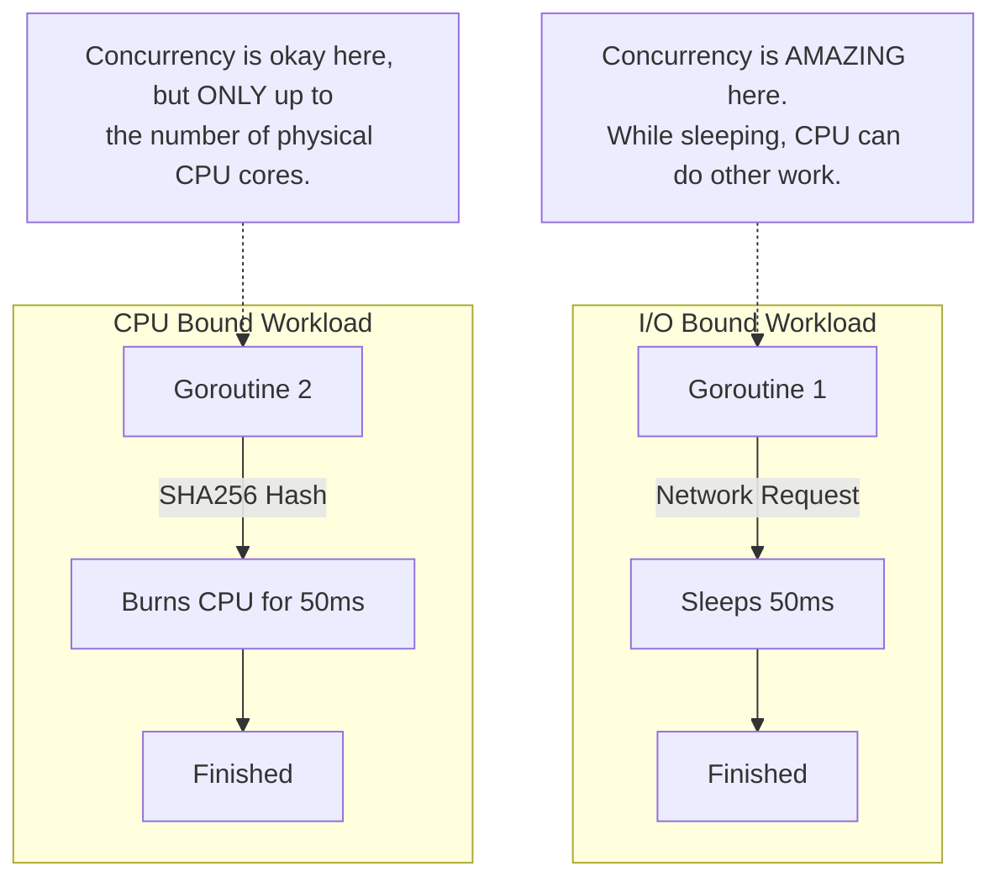

# Concurrency Performance

---

# Table of Contents

* Introduction
* Learning Objectives
* Prerequisites
* Why This Topic Exists
* Real-World Analogy
* Core Concepts
* Architecture Diagram
* Benchmarking Concurrency
* CPU-Bound vs I/O-Bound
* False Sharing
* Mutex Contention
* Channel Overhead
* Production Use Cases
* Best Practices
* Common Mistakes
* Debugging Guide
* Exercises
* Quiz
* Interview Questions
* Cheat Sheet
* Summary
* Key Takeaways
* Further Reading
* Next Chapter

---

# Introduction

Just because you *can* use concurrency doesn't mean you *should*. Adding Goroutines and Channels to a program adds overhead. The Go runtime has to allocate memory for the Goroutine stack, schedule it on an OS thread, and manage the locks internal to Channels.

If your task is too small, the overhead of managing the concurrency will actually make your program *slower* than if you had just run it synchronously in a simple `for` loop. Understanding **Concurrency Performance** is about knowing when the juice is worth the squeeze.

---

# Learning Objectives

After completing this chapter you will be able to:

* Identify when concurrency makes a program slower.
* Distinguish between CPU-bound and I/O-bound workloads.
* Write standard Go benchmarks to test concurrent code.
* Identify Mutex contention and Channel overhead.
* Understand the concept of "False Sharing" at the CPU cache level.

---

# Prerequisites

Before reading this chapter you should know:

* Goroutines (`08-Goroutines.md`)
* Channels (`10-Channels.md`)
* Mutexes (`21-Mutex.md`)

---

# Why This Topic Exists

Junior developers often think: "This `for` loop processes 10,000 items. I will spawn a Goroutine for each item, and it will be 10,000 times faster!" 
When they run it, they discover it is actually 5x slower. Why? Because the work inside the loop was simply adding two numbers (`a + b`). The CPU can add two numbers in 1 nanosecond. Spawning a Goroutine takes roughly 2,000 nanoseconds. They spent 2,000ns of overhead to save 1ns of work. 

---

# Real-World Analogy

### The Envelope Stuffing Assembly Line

You need to put 100 letters into 100 envelopes.
* **Synchronous (1 Worker)**: You just do it yourself. It takes 2 minutes.
* **Over-Engineered Concurrency**: You hire 100 people. You spend 15 minutes calling them on the phone, 10 minutes giving them instructions, and 5 minutes organizing them in the room (Overhead). Each person takes 1 second to stuff their envelope. The actual work took 1 second, but the total time was 30 minutes!

Concurrency is only useful if the work (stuffing the envelope) takes *longer* than the overhead (hiring the worker).

---

# Core Concepts

* **Overhead**: The time and memory required by the Go runtime to create a Goroutine, pass data through a channel, or acquire a Mutex.
* **CPU-Bound**: A task limited by the speed of the processor (e.g., math, hashing, image resizing).
* **I/O-Bound**: A task limited by waiting for input/output (e.g., network requests, reading from a hard drive, waiting on a database).
* **Context Switching**: When the CPU stops running Goroutine A, saves its state, and starts running Goroutine B.

---

# Architecture Diagram



---

# Benchmarking Concurrency

To prove performance, we use Go's built-in benchmarking tool. 
Create a file named `perf_test.go`:

```go
package main

import (
	"sync"
	"testing"
)

// The tiny task: A simple math operation
func doWork() int {
	return 1 + 1
}

// Benchmark 1: Synchronous Loop
func BenchmarkSync(b *testing.B) {
	for i := 0; i < b.N; i++ {
		doWork()
	}
}

// Benchmark 2: Concurrent Goroutines
func BenchmarkAsync(b *testing.B) {
	for i := 0; i < b.N; i++ {
		var wg sync.WaitGroup
		wg.Add(1)
		go func() {
			doWork()
			wg.Done()
		}()
		wg.Wait()
	}
}
```
Run it: `go test -bench .`
*Result: `BenchmarkSync` will run in ~0.3 ns/op. `BenchmarkAsync` will run in ~300 ns/op. Concurrency was 1000x slower!*

---

# CPU-Bound vs I/O-Bound

### I/O-Bound (Network, Disk, DB)
* **Characteristics**: The Goroutine spends 99% of its time asleep waiting for a response.
* **Rule**: Go crazy. You can easily run 10,000 I/O-bound Goroutines concurrently. The Go scheduler will park the sleeping Goroutines, requiring almost zero CPU.

### CPU-Bound (Math, Crypto, Image Processing)
* **Characteristics**: The Goroutine is actively doing math, locking the CPU core at 100% utilization.
* **Rule**: Limit concurrency to `runtime.NumCPU()`. If you have 8 cores, you can only do 8 mathematical operations simultaneously. Spawning 100 CPU-bound Goroutines forces the OS to constantly context-switch them, which drastically degrades performance.

---

# Mutex Contention

If you have 1,000 Goroutines all trying to `Lock()` the exact same `sync.Mutex` inside a tight loop, your program will slow to a crawl. The OS spends more time managing the lock queue than executing your code.

**Solution**: 
1. Use a `sync.RWMutex` if there are many readers and few writers.
2. Use sharding (e.g., an array of 16 Mutexes protecting 16 different maps).
3. Use lock-free atomics (`sync/atomic`) for simple counters.

---

# Channel Overhead

Channels are not magical wormholes; they are backed by an internal Mutex and a ring buffer. Sending a value to a channel involves acquiring a lock, copying the data, and releasing the lock. 

For extremely high-throughput systems (millions of ops/sec), passing small values through a channel one-by-one is a massive bottleneck.
**Solution**: Pass *batches* of data. Instead of `chan int`, use `chan []int`. Copying an array of 100 ints through a channel requires exactly 1 channel lock, whereas passing them individually requires 100 channel locks.

---

# False Sharing (Advanced)

When multi-core CPUs read from RAM, they load data in 64-byte chunks called "Cache Lines". 
If Goroutine 1 (on Core 1) is updating `struct.A`, and Goroutine 2 (on Core 2) is updating `struct.B`, but `A` and `B` are right next to each other in memory (sharing the same 64-byte cache line), the CPU hardware will lock and invalidate the cache line for *both* cores continuously. 
This is called **False Sharing** and can silently destroy performance by 10x.

**Solution**: Add padding to force variables onto different cache lines.
```go
type Counters struct {
    A uint64
    _ [56]byte // Padding (64 bytes total)
    B uint64
}
```

---

# Production Use Cases

### 1. The Right Time to use Concurrency
You need to call 5 different microservices to render a user's dashboard (Profile, Billing, Notifications, Friends, Settings). Each HTTP call takes 100ms. 
* Synchronously: `100ms * 5 = 500ms`.
* Concurrently: `Max(100ms) = 100ms`. 
Because HTTP calls are I/O bound, concurrency provides a massive 5x speedup.

### 2. The Wrong Time to use Concurrency
You need to calculate the sum of an array of 1,000 integers. 
* Do not split it into 10 Goroutines adding 100 integers each. 
* The cost of spawning 10 Goroutines and passing the data via channels will take 10x longer than just running a standard `for` loop on a single thread.

---

# Best Practices

* **Measure, Don't Guess**: Use Go benchmarks (`go test -bench .`) before adding complex concurrency. 
* **Batching**: To reduce channel lock contention, send slices (`chan []MyStruct`) rather than individual items.
* **Worker Pools for CPU**: For heavy computational tasks, use a Worker Pool sized exactly to `runtime.NumCPU()`.

---

# Common Mistakes

### Optimizing the Wrong Thing
Spending days writing a lock-free queue using `sync/atomic` to save 50 nanoseconds per operation, while your database query takes 50,000,000 nanoseconds (50ms). Focus your performance efforts on I/O boundaries first.

---

# Debugging Guide

* **pprof**: Use Go's built-in profiler (`import _ "net/http/pprof"`). 
* **Block Profiler**: Look at the "block" profile to see exactly which Mutexes or Channels are causing Goroutines to wait the most.
* **Mutex Profiler**: Identifies highly contested Mutexes.

---

# Exercises

## Beginner
Write a benchmark that compares appending 1000 items to a slice synchronously vs using 1000 Goroutines with a `sync.Mutex`. Observe the massive overhead of the concurrent approach.

## Intermediate
Write a CPU-bound benchmark (calculating prime numbers up to 10,000). Compare the performance of using a Worker Pool of size `runtime.NumCPU()` vs a Worker Pool of size `1000`. You will see that 1000 workers actually run slower due to context-switching overhead.

---

# Quiz

## Multiple Choice Questions
**1. Why is passing 1 million individual integers through a Go channel slow?**
A) Channels use network sockets internally.
B) Channels are backed by an internal Mutex, causing lock contention 1 million times.
C) The garbage collector cannot handle integers.
*Answer*: B

## True or False
**For an I/O-bound workload (like HTTP requests), you should limit your Goroutine count to `runtime.NumCPU()`.**
*Answer*: False. I/O-bound Goroutines sleep while waiting for the network, meaning they consume almost 0 CPU. You can run thousands of them concurrently regardless of your core count.

---

# Interview Questions

## Beginner
**Q**: What is the difference between CPU-bound and I/O-bound workloads?
*Answer*: CPU-bound tasks rely entirely on the processor's speed (math, hashing). I/O-bound tasks rely on waiting for external systems (network, disk, database).

## Intermediate
**Q**: When should you NOT use Goroutines?
*Answer*: You should not use Goroutines when the work being done inside the Goroutine takes less time than the overhead of creating the Goroutine itself (e.g., simple array iteration or basic arithmetic).

## Advanced
**Q**: Explain "False Sharing" in the context of CPU caches and Go concurrency.
*Answer*: False Sharing occurs when two different Goroutines running on two different physical CPU cores repeatedly update two independent variables that happen to sit right next to each other in memory (sharing the same 64-byte L1 cache line). The CPU hardware aggressively invalidates the cache for both cores, causing a severe performance penalty. It is fixed by adding byte padding between the variables in the struct.

---

# Cheat Sheet

* **Benchmark Command**: `go test -bench . -benchmem`
* **CPU-Bound Limit**: `runtime.NumCPU()` workers.
* **I/O-Bound Limit**: Limited by RAM and external system limits (e.g., DB max connections).
* **Channel Optimization**: Pass `[]T` instead of `T` to reduce locks.

---

# Summary

Concurrency is a tool, not a magic wand. By understanding the mechanical reality of how Goroutines, Channels, and Mutexes are implemented by the runtime, you can make intelligent architectural decisions. Always benchmark your assumptions, and remember that sometimes, a simple synchronous `for` loop is the fastest solution of all.

---

# Key Takeaways

* ✔ Concurrency has overhead (memory and CPU time).
* ✔ Only use concurrency if the task duration > the overhead.
* ✔ I/O bound = High concurrency; CPU bound = Low concurrency.
* ✔ Batch data in channels to reduce Mutex contention.

---

# Further Reading
* [Go Blog: Profiling Go Programs](https://go.dev/blog/pprof)
* [Dave Cheney: High Performance Go Workshop](https://dave.cheney.net/high-performance-go-workshop/dotgo-paris.html)

---

# Next Chapter
➡️ **Next:** `39-Error-Handling.md`
