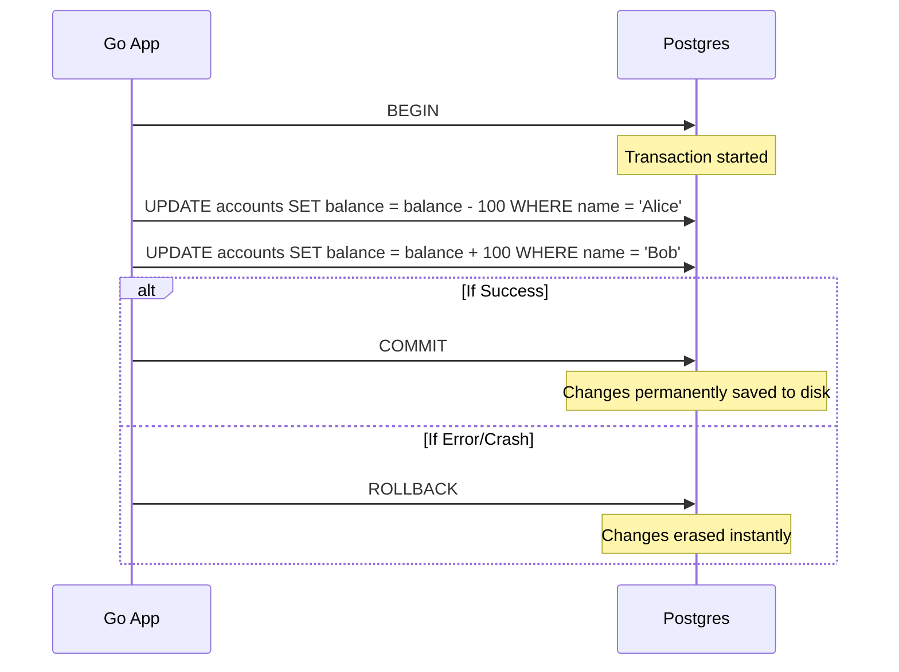

# Database Transactions & ACID

## 1. Learning Objectives
* **What you'll learn**: The mechanics of ACID properties, Database Transactions in Go, and isolation levels.
* **Why it matters**: Without transactions, concurrent requests will silently overwrite each other's data (Race Conditions), leading to corrupted financial ledgers and destroyed business logic.
* **Where it's used**: Financial transfers, e-commerce checkout flows, and any multi-step database write operation.

---

## 2. Real-world Story
Imagine transferring $100 from Alice to Bob. The bank must do two things:
1. Deduct $100 from Alice.
2. Add $100 to Bob.
If the server crashes exactly between step 1 and step 2, $100 has vanished into thin air! 
A **Transaction** wraps both steps into a single, unbreakable vault. If the server crashes at step 1.5, the database automatically detects the failure and **Rolls Back** the entire operation, restoring Alice's money. It is "All or Nothing."

---

## 3. Visual Learning (Execution Flow & Architecture)


---

## 4. Internal Working (Under the Hood)
Transactions enforce the **ACID** properties:
* **Atomicity**: All or nothing. (No partial saves).
* **Consistency**: The database rules (like Foreign Keys or `balance > 0`) are never violated.
* **Isolation**: If two transactions happen at the exact same millisecond, they do not interfere with each other.
* **Durability**: Once a transaction is `COMMIT`ted, the data is safe even if someone unplugs the server 1 millisecond later (thanks to the WAL).

---

## 5. Compiler Behavior
* **Exclusive Connections**: In Go's `database/sql`, running `db.BeginTx()` literally locks a single physical TCP connection from the connection pool and assigns it exclusively to your Goroutine. No other Goroutine can use this connection until you call `Commit()` or `Rollback()`.

---

## 6. Memory Management
* **Connection Leaks**: If you open a transaction and forget to call `Commit()` or `Rollback()`, that database connection is lost forever. If this happens 50 times, your pool will empty, and your entire Go server will freeze, waiting for a connection that will never return.

---

## 7. Code Examples

### 🔹 Example 1: Simple
```go
// A basic transaction
func Transfer(ctx context.Context, db *sql.DB) error {
    tx, err := db.BeginTx(ctx, nil)
    if err != nil { return err }
    
    // ALWAYS defer a rollback. If the function returns early or panics, it rolls back!
    // If tx.Commit() is called first, the Rollback becomes a no-op (does nothing).
    defer tx.Rollback() 

    _, err = tx.ExecContext(ctx, "UPDATE accounts SET balance = balance - 100 WHERE id = 1")
    if err != nil { return err }

    _, err = tx.ExecContext(ctx, "UPDATE accounts SET balance = balance + 100 WHERE id = 2")
    if err != nil { return err }

    // Finally, commit!
    return tx.Commit()
}
```

### 🔹 Example 2: Intermediate
```go
// Handling Isolation Levels
// Setting Serializable ensures absolute mathematical correctness at the cost of concurrency speed.
opts := &sql.TxOptions{
    Isolation: sql.LevelSerializable,
}
tx, _ := db.BeginTx(ctx, opts)
```

### 🔹 Example 3: Advanced
```go
// The Unit of Work Pattern (Clean Architecture)
// Passing a generic function into a transaction wrapper.
func (repo *Repo) RunInTx(ctx context.Context, fn func(tx *sql.Tx) error) error {
    tx, _ := repo.db.BeginTx(ctx, nil)
    defer tx.Rollback()
    
    if err := fn(tx); err != nil {
        return err // Rolls back via defer
    }
    return tx.Commit()
}
```

### 🔹 Example 4: Production
```go
// Retrying Serializable Transactions
// In Serializable mode, Postgres will actively abort one transaction if a conflict occurs.
// Your Go code MUST detect this error (code 40001) and retry the entire transaction!
```

### 🔹 Example 5: Interview
```go
// Q: Why do we use `defer tx.Rollback()`?
// A: It acts as a safety net. If a panic occurs, or if we hit a `return err` midway, 
// the defer fires and cleans up the transaction. If `tx.Commit()` succeeds, `tx.Rollback()` safely ignores it.
```

---

## 8. Production Examples
1. **Inventory Management**: Reserving a seat on an airplane. You must deduct the seat count and assign it to a user in one atomic transaction, ensuring the flight is never overbooked.
2. **Audit Trails**: Deleting a user and inserting a row into the `audit_logs` table simultaneously.

---

## 9. Performance & Benchmarking
* **Lock Contention**: Transactions hold row-level locks. If 1,000 Goroutines try to update the exact same `product_id` inside a transaction, 999 of them will queue up and wait, absolutely crushing throughput. Keep transactions as short and fast as humanly possible. Do not make HTTP calls inside a transaction!

---

## 10. Best Practices
* ✅ **Do**: Keep transactions incredibly brief. Fetch data -> Process in Go RAM -> Open Tx -> Write Data -> Commit.
* ❌ **Don't**: Execute a 5-second external API call (like charging a credit card) while holding a database transaction open!
* 🏢 **Google / Uber / Netflix Style**: Use Idempotency Keys so that if a transaction times out on the network (but succeeded in the DB), the client can safely retry without duplicating the action.

---

## 11. Common Mistakes
1. **Using `db.Query` inside a Transaction**: If you do `tx, _ := db.Begin()` but then accidentally run `db.Query()` instead of `tx.Query()`, the query will execute *outside* the transaction on a completely different connection!
2. **Deadlocks**: Transaction A locks User 1 then User 2. Transaction B locks User 2 then User 1. Both freeze forever waiting for the other to release the lock. (Always lock rows in a consistent alphabetical/numerical order!).

---

## 12. Debugging
How to troubleshoot Transactions in production:
* **pg_locks**: Run `SELECT * FROM pg_locks WHERE NOT granted;` in Postgres to see which transactions are currently frozen, waiting for locks held by other transactions.

---

## 13. Exercises
1. **Easy**: Write a Go function that inserts two rows into a table atomically.
2. **Medium**: Intentionally trigger a Rollback in the middle of a function and verify the database didn't save the first step.
3. **Hard**: Create a Deadlock by running two concurrent Goroutines that update the same two rows in opposite orders.
4. **Expert**: Implement an automatic retry mechanism in Go that intercepts Postgres `SerializationFailure` errors and retries the function 3 times.

---

## 14. Quiz
1. **MCQ**: What does Isolation in ACID mean?
   * (A) The database is isolated from the internet (B) Concurrent transactions do not interfere with each other (C) Data is saved to an isolated disk. *(Answer: B)*
2. **Code Review**: `tx.Commit(); defer tx.Rollback()`. What is wrong with the order here? *(If `Commit()` panics, the defer wasn't registered in time. ALWAYS `defer` immediately after `Begin()`!)*

---

## 15. FAANG Interview Questions
* **Beginner**: Explain Atomicity.
* **Intermediate**: What is a "Dirty Read" and which Isolation level prevents it?
* **Senior (Google/Meta)**: Explain exactly how MVCC (Multi-Version Concurrency Control) implements Isolation without using heavy table locks.

---

## 16. Mini Project
**The Bank Transfer Simulator**
* Seed a Postgres database with 2 accounts ($1000 each).
* Spin up 100 Goroutines that constantly transfer random amounts of money between them using transactions.
* Prove that after 10 seconds, the sum of both accounts is STILL exactly $2000.

---

## 17. Enterprise Features & Observability
* **Savepoints**: Within a massive transaction, you can issue `SAVEPOINT my_save`. If a minor step fails, you can `ROLLBACK TO my_save` without aborting the entire massive transaction.

---

## 18. Source Code Reading
Walkthrough of `database/sql`.
* **The `Tx` struct**: Look at how `*sql.Tx` holds a direct reference to a `*driverConn`, ensuring that every query executed on that `Tx` is mathematically guaranteed to run over the exact same TCP socket.

---

## 19. Architecture
* **Saga Pattern**: In a Microservices architecture, you cannot have a single Postgres transaction span across the Billing DB and the Shipping DB. You must use the Saga Pattern (Distributed Transactions via compensating events) instead.

---

## 20. Summary & Cheat Sheet
* **ACID**: Atomicity, Consistency, Isolation, Durability.
* **Start**: `tx, err := db.BeginTx(ctx, nil)`
* **Defer**: `defer tx.Rollback()`
* **Finish**: `return tx.Commit()`
