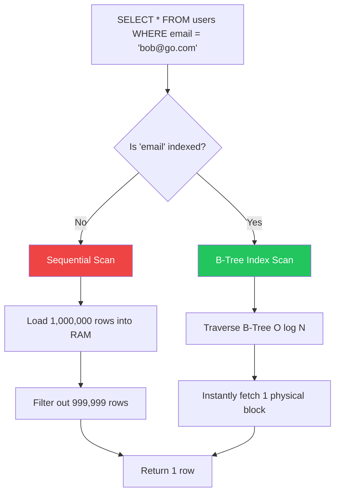

# Database Indexes & Performance

## 1. Learning Objectives
* **What you'll learn**: The internal B-Tree mechanics of PostgreSQL Indexes and how they turn O(N) sequential scans into O(log N) lightning-fast lookups.
* **Why it matters**: Without indexes, your Go application's API latency will degrade from 10ms to 5000ms as your tables grow from 10,000 rows to 10,000,000 rows.
* **Where it's used**: Every single database table in production must be meticulously indexed based on the specific `WHERE` clauses executed by the Go backend.

---

## 2. Real-world Story
Imagine walking into a library with 1,000,000 books looking for a specific title. Without a catalog, you must walk down every single aisle, reading every single book spine until you find it (A **Sequential Scan**). This takes hours.
An Index is the library's Alphabetical Card Catalog. By looking at the catalog, you instantly know the book is in Aisle 5, Shelf B. You jump directly to it (An **Index Scan**). This takes seconds.

---

## 3. Visual Learning (Execution Flow & Architecture)


---

## 4. Internal Working (Under the Hood)
PostgreSQL indexes default to a **B-Tree** (Balanced Tree) data structure.
When you index the `email` column, Postgres creates a separate binary tree mapping the sorted emails to their exact physical disk location (the CTID / Block pointer). 
Because the tree is balanced, finding 1 row out of 1 billion rows requires navigating only ~4 levels of the tree.

---

## 5. Compiler Behavior
* **The Postgres Query Planner**: When your Go app sends a SQL string, the Postgres "Compiler" (Query Planner) intercepts it, calculates statistics, and mathematically determines if using an Index is faster than doing a Sequential Scan. (Sometimes, if a table is very small, a sequential scan is actually faster because reading the index adds an extra disk hop!).

---

## 6. Memory Management
* **Index Bloat**: Indexes are not free. They take up physical RAM (Shared Buffers). If you have 50 indexes on a table, writing an `INSERT` command becomes 50x slower, because Postgres must update the table AND all 50 B-Trees in memory.

---

## 7. Code Examples

### 🔹 Example 1: Simple
```sql
-- Creating a standard B-Tree Index
CREATE INDEX idx_users_email ON users(email);
```
```go
// The Go code doesn't change! The database magically speeds up.
db.QueryRow("SELECT id FROM users WHERE email = $1", req.Email)
```

### 🔹 Example 2: Intermediate
```sql
-- Unique Indexes (Enforcing Business Logic at the DB layer)
CREATE UNIQUE INDEX idx_users_username ON users(username);
```
```go
// Go Error Handling for Unique Constraint Violations
_, err := db.Exec("INSERT INTO users(username) VALUES($1)", "bob")
var pgErr *pgconn.PgError
if errors.As(err, &pgErr) && pgErr.Code == "23505" {
    return fmt.Errorf("username already exists")
}
```

### 🔹 Example 3: Advanced
```sql
-- Composite Index (Indexing multiple columns together)
CREATE INDEX idx_orders_status_date ON orders(status, created_at);

-- This makes the following Go query blazing fast:
-- SELECT * FROM orders WHERE status = 'pending' ORDER BY created_at DESC;
```

### 🔹 Example 4: Production
```sql
-- Partial Indexes (Save massive amounts of RAM!)
-- Only index active users. We don't care about searching deleted users.
CREATE INDEX idx_active_users ON users(email) WHERE deleted_at IS NULL;
```

### 🔹 Example 5: Interview
```sql
-- Q: Why did this query not use the index on 'name'?
-- SELECT * FROM users WHERE lower(name) = 'alice';
-- A: Because the index is on "name", not "lower(name)". 
-- You must create a Functional Index: CREATE INDEX idx_lower_name ON users(lower(name));
```

---

## 8. Production Examples
1. **Pagination**: An index on `(created_at, id)` is absolutely mandatory for fast Keyset (Cursor-based) pagination in Go APIs.
2. **Text Search**: Using a GIN (Generalized Inverted Index) for lightning-fast full-text search engines built on Postgres JSONB or tsvector columns.

---

## 9. Performance & Benchmarking
* **EXPLAIN ANALYZE**: The ultimate tool.
```sql
EXPLAIN ANALYZE SELECT * FROM users WHERE email = 'test@test.com';
-- Output BEFORE Index: Seq Scan on users (cost=0.00..1845.00 rows=1) (Execution Time: 45.2 ms)
-- Output AFTER Index: Index Scan using idx_email (cost=0.28..8.29) (Execution Time: 0.05 ms)
```
* **Result**: Latency dropped from 45,000 microseconds to 50 microseconds. A 900x speedup!

---

## 10. Best Practices
* ✅ **Do**: Use `CONCURRENTLY` when creating indexes in production (`CREATE INDEX CONCURRENTLY idx_name ON users`). This builds the index in the background without locking the table and crashing your Go app!
* ❌ **Don't**: Over-index. Every index slows down `INSERT`, `UPDATE`, and `DELETE`.
* 🏢 **Google / Uber / Netflix Style**: Periodically monitor `pg_stat_user_indexes`. If an index has `idx_scan = 0`, it means it's never being used by the Query Planner. Drop it to save RAM!

---

## 11. Common Mistakes
1. **The Left-to-Right Rule**: If you have a composite index on `(A, B, C)`, a query `WHERE B = 1` will **NOT** use the index! B-Trees only work if you filter from left to right (e.g., `WHERE A = 1 AND B = 1`).
2. **LIKE '%term%'**: A standard B-Tree index cannot speed up wildcards at the *start* of a string. It will force a Sequential Scan.

---

## 12. Debugging
How to troubleshoot slow queries in production:
* **pg_stat_statements**: A Postgres extension that records the execution time of every single SQL query your Go app executes. Sort it by `total_time` to find the missing indexes instantly!

---

## 13. Exercises
1. **Easy**: Write a SQL statement to create an index on a `status` column.
2. **Medium**: In Go, execute an `INSERT` that violates a `UNIQUE INDEX` and correctly parse the `pgx` error code to return a user-friendly message.
3. **Hard**: Create a table with 1,000,000 rows. Run `EXPLAIN ANALYZE` before and after adding an index.
4. **Expert**: Design a Partial Composite Index for an e-commerce `orders` table to optimize searching for unfulfilled orders by a specific `user_id`.

---

## 14. Quiz
1. **MCQ**: What happens to your Go app if you run `CREATE INDEX` without the `CONCURRENTLY` keyword on a 50GB table?
   * (A) It runs in the background (B) It locks the table for writes, causing all Go `INSERT` Goroutines to block and timeout. *(Answer: B)*
2. **System Design Follow-up**: Why do UUIDs make B-Tree indexes severely fragmented compared to auto-incrementing Integers? *(Because UUIDs are random, they insert data all over the B-Tree, causing massive page splits and disk thrashing).*

---

## 15. FAANG Interview Questions
* **Beginner**: What is the difference between a Clustered and Non-Clustered index?
* **Intermediate**: Explain how a Composite Index works under the hood.
* **Senior (Google/Meta)**: Your Postgres CPU is at 100%. `pg_stat_statements` shows that a specific `SELECT` query is doing an "Index Scan", but it's still taking 2 seconds. How do you optimize it further using an "Index-Only Scan"?

---

## 16. Mini Project
**The Query Optimizer**
* Build a Go API with a `GET /users?company=Apple&active=true` endpoint.
* Seed the database with 5 million mock users.
* Analyze the request latency using a standard Go benchmark.
* Add the correct Composite Index to the database and watch the benchmark latency drop by 99%.

---

## 17. Enterprise Features & Observability
* **Continuous Profiling**: Modern platforms integrate tools like Datadog or pganalyze to automatically parse Postgres logs, identify missing indexes, and suggest the exact `CREATE INDEX` SQL command to run.

---

## 18. Source Code Reading
Walkthrough of the `btree` implementation.
* While written in C inside Postgres, the fundamental concepts of B-Trees can be studied in pure Go using `github.com/google/btree`, an incredibly elegant in-memory B-Tree implementation.

---

## 19. Architecture
* **Migration Files**: Indexes should NEVER be created manually via a SQL GUI in production. They must be defined in your Go application's schema migration files (e.g., `golang-migrate`) and version-controlled in Git.

---

## 20. Summary & Cheat Sheet
* **B-Tree**: Default, great for `<`, `=`, `>`.
* **GIN / GiST**: Great for Full-Text Search and JSONB.
* **Composite**: Multi-column `(A, B)`.
* **Partial**: `WHERE deleted_at IS NULL`.
* **Golden Rule**: Always use `CONCURRENTLY` in production.
