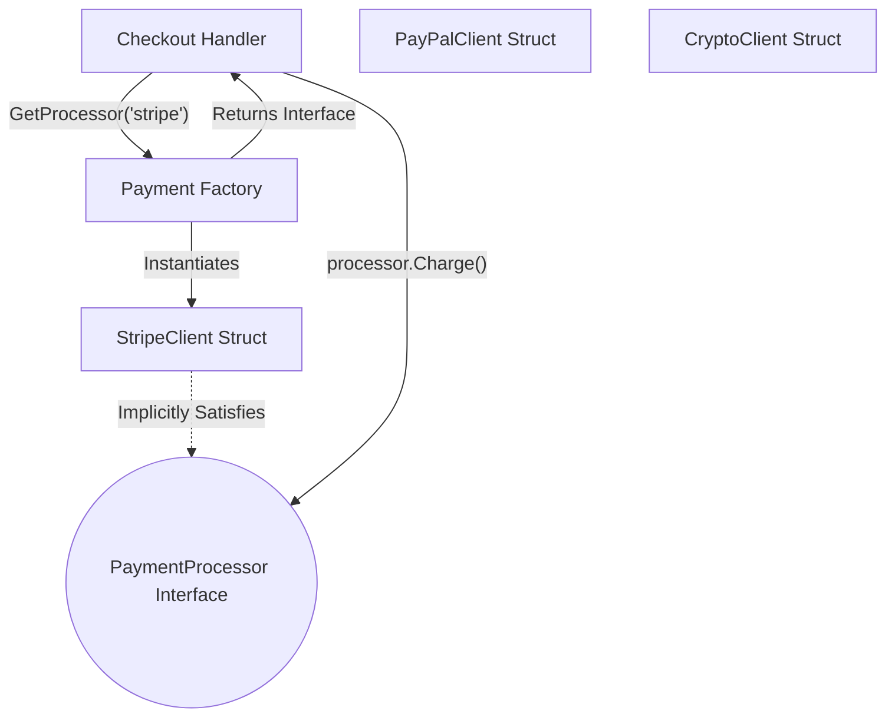

# Factory Method Pattern

---

# Table of Contents

* Introduction
* Learning Objectives
* Prerequisites
* Why This Topic Exists
* Real-World Analogy
* Core Concepts
* Architecture Diagram
* Step-by-Step Implementation
* Syntax
* Beginner Example
* Intermediate Example
* Advanced Example
* Production Use Cases
* Performance Analysis
* Best Practices
* Common Mistakes
* Debugging Guide
* Exercises
* Quiz
* Interview Questions
* Cheat Sheet
* Summary
* Key Takeaways
* Further Reading
* Next Chapter

---

# Introduction

The **Factory Method Pattern** is a Creational Design Pattern that provides an interface for creating objects in a superclass, but allows subclasses to alter the type of objects that will be created.

In Go (which lacks classes and inheritance), this pattern is adapted to use **Interfaces** and **Factory Functions**. Instead of the caller instantiating a struct directly, they call a Factory function, passing in a configuration or type flag. The Factory decides which underlying concrete struct to instantiate and returns it as a shared Interface type.

---

# Learning Objectives

After completing this chapter you will be able to:

* Understand when to use a Factory instead of a standard `New()` constructor.
* Hide concrete struct implementations behind interfaces.
* Decouple your business logic from specific data storage or transportation implementations.
* Build extensible systems where new types can be added without modifying existing consumer code.

---

# Prerequisites

Before reading this chapter you should know:

* Structs and Methods.
* Interfaces (`02-Accept-Interfaces-Return-Structs.md`).

*(Note: While the proverb says "Return Structs", the Factory Pattern is the intentional exception to that rule when you explicitly need polymorphic behavior).*

---

# Why This Topic Exists

Imagine you are building a payment processing system. Today, you support Stripe. You write `stripe := NewStripeClient()`. Tomorrow, the business adds PayPal. Now your checkout code looks like this:
```go
if method == "stripe" {
    stripe := NewStripeClient()
    stripe.Charge(amount)
} else if method == "paypal" {
    paypal := NewPayPalClient()
    paypal.Charge(amount)
}
```
This is a violation of the Open-Closed Principle. Every time a new payment method is added, you must modify the core checkout logic. 

With a Factory, the checkout logic simply says:
```go
paymentProcessor := PaymentFactory.GetProcessor(method)
paymentProcessor.Charge(amount)
```
The checkout logic never changes again.

---

# Real-World Analogy

### The Logistics Company

A logistics company needs to deliver goods. 
* At first, they only do land deliveries. They write a `Truck` struct.
* Later, they expand to sea deliveries. They write a `Ship` struct.
* Instead of the delivery manager checking the map and manually deciding to buy a Truck or a Ship, they call the `TransportFactory`. 
* The manager says, "I need to deliver to England." The Factory internally creates a `Ship` and hands it back to the manager as a generic `Transport` vehicle. The manager just presses the generic "Deliver" button, completely unaware of how the vehicle operates.

---

# Core Concepts

* **The Product Interface**: A common interface (e.g., `PaymentProcessor`) that all returned objects must satisfy.
* **Concrete Products**: The hidden structs that actually implement the interface (e.g., `StripeClient`, `PayPalClient`).
* **The Factory Function**: A function (usually `Get...` or `New...`) that takes a parameter (string, enum, or config) and returns the Product Interface.

---

# Architecture Diagram



---

# Step-by-Step Implementation

1. Define the shared **Product Interface** that your concrete structs will implement.
2. Define the **Concrete Structs** and implement the interface methods on them.
3. Keep the concrete structs *unexported* (lowercase name) so callers cannot instantiate them directly.
4. Create a **Factory Function** that accepts a parameter (like a string or an enum).
5. Use a `switch` statement inside the factory to instantiate and return the correct concrete struct as the interface type.

---

# Syntax

```go
type Document interface { Print() }

type pdf struct{}
func (p *pdf) Print() {}

type word struct{}
func (w *word) Print() {}

// The Factory
func GetDocument(docType string) Document {
    switch docType {
    case "pdf":
        return &pdf{}
    case "word":
        return &word{}
    default:
        return nil
    }
}
```

---

# Beginner Example

A simple notification system supporting Email and SMS.

```go
package main

import (
	"errors"
	"fmt"
)

// 1. The Product Interface
type Notifier interface {
	Send(message string)
}

// 2. Concrete Product A (unexported)
type emailNotifier struct{}
func (e *emailNotifier) Send(message string) {
	fmt.Printf("Sending Email: %s\n", message)
}

// 3. Concrete Product B (unexported)
type smsNotifier struct{}
func (s *smsNotifier) Send(message string) {
	fmt.Printf("Sending SMS: %s\n", message)
}

// 4. The Factory Function
func GetNotifier(notifierType string) (Notifier, error) {
	switch notifierType {
	case "email":
		return &emailNotifier{}, nil
	case "sms":
		return &smsNotifier{}, nil
	default:
		return nil, errors.New("unknown notifier type")
	}
}

func main() {
	// The client doesn't know about emailNotifier or smsNotifier structs!
	notifier1, _ := GetNotifier("email")
	notifier1.Send("Hello via Email!")

	notifier2, _ := GetNotifier("sms")
	notifier2.Send("Hello via SMS!")
}
```

---

# Intermediate Example

Using a Configuration Struct to drive the Factory. This is common when loading settings from a `config.json` file.

```go
package main

import (
	"fmt"
)

// Database Interface
type DataStore interface {
	Save(data string)
}

// Concrete Implementations
type PostgresStore struct { connString string }
func (p *PostgresStore) Save(data string) {
	fmt.Printf("Saving to Postgres at %s: %s\n", p.connString, data)
}

type RedisStore struct { address string }
func (r *RedisStore) Save(data string) {
	fmt.Printf("Saving to Redis at %s: %s\n", r.address, data)
}

// Configuration struct mapping
type DBConfig struct {
	Type     string
	Host     string
	Port     string
}

// Factory
func NewDataStore(cfg DBConfig) (DataStore, error) {
	switch cfg.Type {
	case "postgres":
		conn := fmt.Sprintf("postgres://%s:%s", cfg.Host, cfg.Port)
		return &PostgresStore{connString: conn}, nil
	case "redis":
		addr := fmt.Sprintf("%s:%s", cfg.Host, cfg.Port)
		return &RedisStore{address: addr}, nil
	default:
		return nil, fmt.Errorf("unsupported database type: %s", cfg.Type)
	}
}

func main() {
	// Simulate loading from JSON
	cfg := DBConfig{Type: "postgres", Host: "localhost", Port: "5432"}
	
	db, err := NewDataStore(cfg)
	if err != nil {
		panic(err)
	}

	// Business logic knows nothing about postgres!
	db.Save("User Data")
}
```

---

# Advanced Example

The Registry Pattern (Dynamically extensible Factory). 
Instead of hardcoding a `switch` statement, we use a map to register new factory functions at runtime (often inside the `init()` function of imported packages). This allows third-party developers to add new plugins without touching the core code!

```go
package main

import (
	"fmt"
	"sync"
)

// The interface
type Plugin interface {
	Execute()
}

// The Registry (Map of string to constructor functions)
var (
	registryMu sync.RWMutex
	registry   = make(map[string]func() Plugin)
)

// Register is called by plugins to add themselves to the factory
func RegisterPlugin(name string, constructor func() Plugin) {
	registryMu.Lock()
	defer registryMu.Unlock()
	registry[name] = constructor
}

// The Factory dynamically looks up the constructor
func GetPlugin(name string) (Plugin, error) {
	registryMu.RLock()
	constructor, exists := registry[name]
	registryMu.RUnlock()

	if !exists {
		return nil, fmt.Errorf("plugin %s not found", name)
	}
	return constructor(), nil
}

// --- PLUGIN A IMPLEMENTATION ---
type AnalyticsPlugin struct{}
func (a *AnalyticsPlugin) Execute() { fmt.Println("Running Analytics") }

func init() {
	// Automatically registers itself when the package is loaded!
	RegisterPlugin("analytics", func() Plugin { return &AnalyticsPlugin{} })
}

func main() {
	plugin, err := GetPlugin("analytics")
	if err != nil {
		fmt.Println(err)
		return
	}
	plugin.Execute()
}
```

---

# Production Use Cases

### 1. Database Drivers (`database/sql`)
The Go standard library uses the Registry Factory pattern for SQL drivers. When you write `sql.Open("postgres", "conn_string")`, the `sql` package looks up "postgres" in its internal registry (which was registered by `import _ "github.com/lib/pq"`). It calls the specific postgres driver factory and returns a generic `sql.DB` interface.

### 2. Multi-Cloud Storage Abstractions
If your app allows users to upload files to either AWS S3, Google Cloud Storage, or Local Disk, you use a Factory. The user provides a configuration string `"s3"`. The Factory returns a generic `StorageBackend` interface. Your file upload code just calls `backend.Upload(file)`.

---

# Performance Analysis

The overhead of the Factory Method in Go is minimal. It involves a single function call containing a `switch` statement or a map lookup, followed by returning an interface. Returning an interface causes an allocation on the heap (escape analysis), which introduces a tiny amount of garbage collection pressure, but for long-lived objects like Database Clients or Payment Processors, this cost is completely irrelevant.

---

# Best Practices

* **Return Interfaces**: This is the one place where returning an interface from a constructor is the correct and idiomatic thing to do.
* **Keep Concrete Types Private**: If you are using a Factory to return an interface, make the underlying structs unexported (e.g., `type stripeClient struct{}`). This forces developers to use your Factory and prevents them from tightly coupling their code to the concrete struct.
* **Use Enums, not Strings**: Instead of passing `"stripe"` or `"paypal"`, define a custom type (e.g., `type Provider string`) and export constants (`const Stripe Provider = "stripe"`) to prevent typos in the factory parameter.

---

# Common Mistakes

### Over-Engineering
Do not use a Factory if you only have one implementation! If you only use PostgreSQL, do not build a `DatabaseFactory` that returns a `DataStore` interface. Just build a `NewPostgresClient()` function that returns a concrete `*PostgresClient`. Introduce the factory *only* when you actually need to support a second database type.

---

# Debugging Guide

* **"interface conversion: interface is nil"**: The Factory received an unknown string parameter, hit the `default` case of the switch statement, and returned `nil`. Ensure you are checking the `error` returned by the factory before attempting to use the interface.

---

# Exercises

## Beginner
Create an interface `Shape` with a method `Draw()`. Create two unexported structs `circle` and `square`. Create a `GetShape(shapeType string) Shape` factory. Test it in main.

## Intermediate
Refactor the Beginner exercise to use custom defined string types for the factory parameter (e.g., `type ShapeType string`) with exported constants (`CircleType`, `SquareType`) to prevent users from passing invalid strings.

---

# Quiz

## Multiple Choice Questions
**1. Why do we keep the concrete structs (like `emailNotifier`) unexported when using a Factory?**
A) To save memory.
B) To force the consumer to use the Factory function and interact only with the Interface, ensuring loose coupling.
C) Because Go requires all structs to be lowercase.
*Answer*: B

## True or False
**The Factory Pattern violates the Go proverb "Accept interfaces, return structs".**
*Answer*: True. It is a specific architectural exception used when you absolutely require polymorphic behavior and dependency abstraction at the creation level.

---

# Interview Questions

## Beginner
**Q**: What is the primary benefit of the Factory Method pattern?
*Answer*: It decouples the creation of objects from the business logic that uses them. The business logic only knows about a shared interface, allowing you to swap or add new underlying implementations without changing the core logic.

## Intermediate
**Q**: Explain how the Go `database/sql` package uses the Factory and Registry patterns.
*Answer*: The `sql` package does not contain any database-specific code. Drivers (like postgres or mysql) use an `init()` function to call `sql.Register("name", driver)`. When the user calls `sql.Open("name", ds)`, the `sql` package acts as a factory, looking up the registered driver in its map and returning a standardized interface that can communicate with that specific database.

## Advanced
**Q**: How does returning an interface from a Factory affect Go's Escape Analysis and Garbage Collection?
*Answer*: In Go, if a constructor returns a concrete struct value, the compiler might allocate it on the stack (which is fast and GC-free). However, interfaces are dynamic sizes. If a factory returns a struct wrapped in an interface, the compiler cannot determine the size at compile time, so it must allocate the object on the Heap. This adds overhead to the Garbage Collector. For long-lived singletons, this doesn't matter, but for high-throughput, short-lived object creation, a Factory might cause performance degradation.

---

# Cheat Sheet

* **The Interface**: `type Vehicle interface { Drive() }`
* **The Unexported Structs**: `type car struct{}` / `type truck struct{}`
* **The Factory**:
```go
func GetVehicle(t string) Vehicle {
    switch t {
    case "car": return &car{}
    case "truck": return &truck{}
    default: return nil
    }
}
```

---

# Summary

The Factory Method pattern is a powerful tool for hiding complexity and managing dependencies. By combining it with Go's implicit interfaces and unexported structs, you can create highly robust libraries and APIs that are open for extension but closed for modification.

---

# Key Takeaways

* ✔ Use Factories when you have multiple implementations of the same interface.
* ✔ Keep concrete structs unexported to enforce interface usage.
* ✔ Use a `switch` statement for static factories, or a Map Registry for dynamic factories.
* ✔ Do not use a Factory if you only have one implementation!

---

# Further Reading
* [Refactoring.guru: Factory Method](https://refactoring.guru/design-patterns/factory-method)

---

# Next Chapter
➡️ **Next:** `06-Builder.md`
