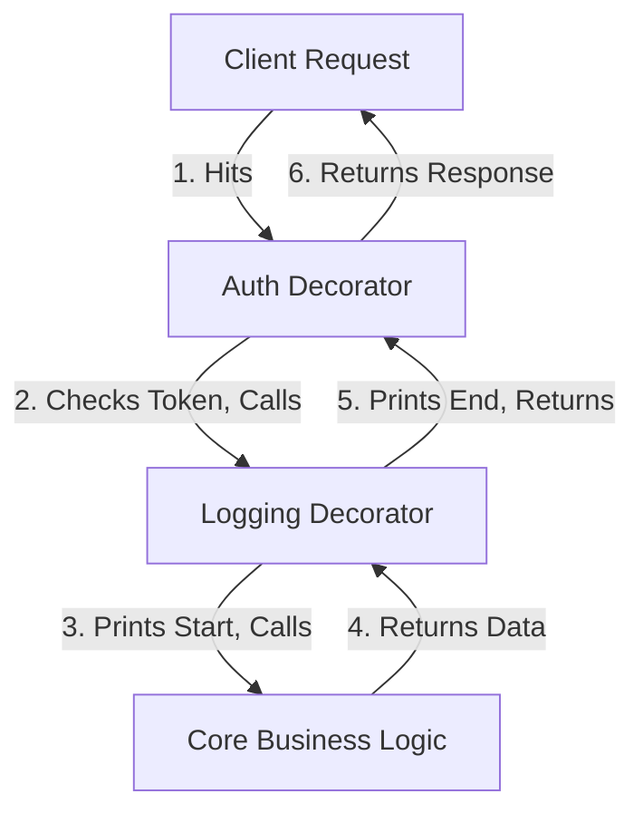

# Decorator Pattern

---

# Table of Contents

* Introduction
* Learning Objectives
* Prerequisites
* Why This Topic Exists
* Real-World Analogy
* Core Concepts
* Architecture Diagram
* Step-by-Step Implementation
* Syntax
* Beginner Example
* Intermediate Example
* Advanced Example
* Production Use Cases
* Performance Analysis
* Best Practices
* Common Mistakes
* Debugging Guide
* Exercises
* Quiz
* Interview Questions
* Cheat Sheet
* Summary
* Key Takeaways
* Further Reading
* Next Chapter

---

# Introduction

The **Decorator Pattern** is a Structural Design Pattern that lets you attach new behaviors to objects dynamically by placing them inside special wrapper objects that contain the behaviors.

In Go, the Decorator pattern is most famously known as the **Middleware Pattern**. Because Go treats functions as first-class citizens, we usually implement Decorators using higher-order functions (functions that take a function and return a function). This allows you to "wrap" core logic with logging, authentication, or metrics without modifying the core logic itself.

---

# Learning Objectives

After completing this chapter you will be able to:

* Understand how wrapping functions allows you to execute code before and after the core logic.
* Implement the HTTP Middleware pattern in Go.
* Use struct embedding to decorate objects with new methods dynamically.

---

# Prerequisites

Before reading this chapter you should know:

* First-Class Functions and Closures.
* HTTP Handlers in Go.
* Struct Embedding.

---

# Why This Topic Exists

Imagine you have 20 HTTP routes in your API. You need to add logging to every single route. 
You could copy and paste `log.Println("Request started")` at the beginning of all 20 functions, and `log.Println("Request ended")` at the end. 
But what if you also need to add authentication? And gzip compression? And rate limiting? Your core business logic will be buried under 100 lines of boilerplate infrastructure code.

The Decorator (Middleware) pattern solves this by extracting the infrastructure code into wrapper functions. You wrap your clean business logic in layers of decorators, perfectly separating concerns.

---

# Real-World Analogy

### The Custom Pizza

* **The Core Object**: A basic Margherita Pizza (Business Logic).
* **Decorator 1**: You add Pepperoni. The pizza now has Pepperoni behavior + Margherita behavior.
* **Decorator 2**: You add Extra Cheese. The pizza now has Cheese + Pepperoni + Margherita behavior.
* **Execution**: You eat the pizza. You bite through the Cheese, then the Pepperoni, and finally hit the Margherita base.

The core pizza never changed its recipe. It was simply wrapped in layers of additional toppings.

---

# Core Concepts

* **Component Interface**: The shared interface for both the core object and the decorators.
* **Concrete Component**: The core object (or function) being wrapped.
* **Decorator**: The wrapper object (or function) that adds behavior before and/or after calling the inner Component.
* **Middleware**: The Go community's term for the Decorator pattern when applied to HTTP handlers.

---

# Architecture Diagram



---

# Step-by-Step Implementation (Functional Approach)

1. Define a standard function signature (e.g., `type Handler func(string) string`).
2. Write your core business logic matching that signature.
3. Write a Decorator function that accepts a `Handler` and returns a `Handler`.
4. Inside the returned closure, write your "Before" logic.
5. Call the inner `Handler`.
6. Write your "After" logic.
7. In `main`, wrap the core function with the decorators.

---

# Syntax

```go
type Executable func()

func LogDecorator(next Executable) Executable {
    // Return a closure that matches the signature
    return func() {
        fmt.Println("Before Execution")
        next() // Call the inner function
        fmt.Println("After Execution")
    }
}
```

---

# Beginner Example

Decorating a simple function with logging and metrics.

```go
package main

import (
	"fmt"
	"time"
)

// 1. The Component Signature
type Operation func(int) int

// 2. The Concrete Component (Core Logic)
func Double(n int) int {
	fmt.Println("Executing core logic...")
	time.Sleep(50 * time.Millisecond)
	return n * 2
}

// 3. Decorator 1: Logging
func WithLogging(next Operation) Operation {
	return func(n int) int {
		fmt.Printf("LOG: Called with input %d\n", n)
		result := next(n)
		fmt.Printf("LOG: Returned %d\n", result)
		return result
	}
}

// 4. Decorator 2: Metrics/Timing
func WithTiming(next Operation) Operation {
	return func(n int) int {
		start := time.Now()
		result := next(n)
		fmt.Printf("METRICS: Execution took %v\n", time.Since(start))
		return result
	}
}

func main() {
	// Wrap the core logic in layers
	// Execution order goes outside-in! (Timing -> Logging -> Double)
	decoratedOp := WithTiming(WithLogging(Double))

	// Execute
	decoratedOp(5)
}
```

---

# Intermediate Example

The classic HTTP Middleware pattern. This is used in literally every production Go web server.

```go
package main

import (
	"fmt"
	"net/http"
	"time"
)

// The Core HTTP Handler
func homeHandler(w http.ResponseWriter, r *http.Request) {
	fmt.Fprintln(w, "Welcome to the API!")
}

// Decorator: Auth Middleware
func requireAuth(next http.HandlerFunc) http.HandlerFunc {
	return func(w http.ResponseWriter, r *http.Request) {
		token := r.Header.Get("Authorization")
		if token != "secret-token" {
			http.Error(w, "Forbidden", http.StatusForbidden)
			return // ABORT: Do not call next()
		}
		// Token is valid, proceed to the next layer
		next(w, r)
	}
}

// Decorator: Logging Middleware
func loggingMiddleware(next http.HandlerFunc) http.HandlerFunc {
	return func(w http.ResponseWriter, r *http.Request) {
		start := time.Now()
		fmt.Printf("--> %s %s\n", r.Method, r.URL.Path)
		
		next(w, r)
		
		fmt.Printf("<-- Completed in %v\n", time.Since(start))
	}
}

func main() {
	// Wrap the handler: Logging surrounds Auth, Auth surrounds Home
	protectedHome := loggingMiddleware(requireAuth(homeHandler))

	http.HandleFunc("/", protectedHome)
	fmt.Println("Server running on :8080...")
	http.ListenAndServe(":8080", nil)
}
```

---

# Advanced Example

Using Struct Embedding to decorate an Object, not just a function. We want to take an existing `RedisClient` and dynamically add Caching behavior to it, without modifying the Redis package.

```go
package main

import "fmt"

// 1. The Interface
type DataStore interface {
	GetData(key string) string
}

// 2. Concrete Component
type Database struct{}
func (db *Database) GetData(key string) string {
	fmt.Println("Fetching from slow database...")
	return "DB_DATA_FOR_" + key
}

// 3. The Struct Decorator
type CacheDecorator struct {
	// It holds a reference to the inner component
	inner DataStore
	// Decorator state
	cache map[string]string
}

// It implements the exact same interface
func (c *CacheDecorator) GetData(key string) string {
	// "Before" behavior: Check cache
	if val, exists := c.cache[key]; exists {
		fmt.Println("Cache hit!")
		return val
	}

	// Pass-through to inner component
	val := c.inner.GetData(key)

	// "After" behavior: Save to cache
	c.cache[key] = val
	return val
}

func main() {
	// Base object
	db := &Database{}

	// Decorated object
	cachedDB := &CacheDecorator{
		inner: db,
		cache: make(map[string]string),
	}

	// Request 1: Hits DB
	fmt.Println(cachedDB.GetData("user_1"))
	
	// Request 2: Hits Cache! The DB is never touched.
	fmt.Println(cachedDB.GetData("user_1"))
}
```

---

# Production Use Cases

### 1. HTTP Routers (Chi, Echo, Gin)
Modern Go routers utilize `Use(middleware...)` to apply array chains of decorators to entire groups of HTTP routes. You write standard core logic, and attach `Use(Recoverer, Logger, RateLimiter)` at the router level.

### 2. gRPC Interceptors
In gRPC, Decorators are called "Interceptors". You can attach Unary Interceptors to a gRPC server to automatically log every incoming RPC call, validate JWT tokens, or inject OpenTelemetry tracing spans before the actual Protobuf handler is executed.

---

# Performance Analysis

Wrapping functions in closures adds a tiny amount of overhead due to the extra function calls (a few nanoseconds). However, this overhead is effectively zero compared to the massive architectural benefits of separating infrastructure code from business logic. Struct-based decorators have identical performance to normal interface method calls.

---

# Best Practices

* **Keep Decorators Independent**: A logging decorator should not depend on data created by an auth decorator. They should be completely agnostic of what is wrapping them and what they are wrapping.
* **Fail Fast**: If a decorator performs validation (like Auth), return an error immediately and *do not* call `next()`. This short-circuits the chain and protects the inner layers.
* **Pass Data via Context**: If the Auth decorator authenticates a user and needs to pass the `UserID` to the core logic, it should inject it into the `context.Context` (see `03-Context-Propagation.md`).

---

# Common Mistakes

### Forgetting to call `next()`
If you write a middleware and forget to write `next(w, r)`, the chain stops dead. The core handler will never execute, and the client will likely receive an empty 200 OK response.

### Mutating Arguments Dangerously
If a decorator mutates the arguments passed to it before passing them to `next()`, it can cause severe confusion for the core handler which expects raw inputs. Use `Context` for passing metadata instead of mutating payloads.

---

# Debugging Guide

* **"Execution order is confusing"**: Remember that decorators wrap *outside-in*. `Log(Auth(Home))` means `Log` starts first, then calls `Auth`, which checks the token and calls `Home`. When `Home` finishes, control flows back up: `Auth` finishes, then `Log` finishes.

---

# Exercises

## Beginner
Create a function type `func() string`. Create a core function that returns `"World"`. Write a decorator that appends `"Hello "` to the result of the inner function.

## Intermediate
Write an HTTP middleware `recoverPanic` that uses `defer recover()` to catch any panics that happen in the core HTTP handler. If a panic occurs, it should log the error and return an `http.StatusInternalServerError` instead of crashing the server.

---

# Quiz

## Multiple Choice Questions
**1. How do you prevent the inner core function from running if a Decorator (like an Auth Middleware) fails?**
A) You pass a special `false` flag to `next()`.
B) You simply use `return` and do not execute `next()`.
C) You panic the application.
*Answer*: B. Short-circuiting the chain by not calling the inner function is a core feature of the pattern.

## True or False
**In Go, Decorators must be implemented using Structs and Interfaces.**
*Answer*: False. While you can use structs (as seen in the Cache example), Go's first-class functions make functional wrappers (closures) the most common and idiomatic way to implement decorators, especially for HTTP Middlewares.

---

# Interview Questions

## Beginner
**Q**: What is the Decorator pattern?
*Answer*: It is a structural pattern that allows you to dynamically wrap objects or functions in layers of new behavior (like a Russian nesting doll) without modifying the original code.

## Intermediate
**Q**: In the context of Go HTTP servers, what is a Middleware?
*Answer*: A middleware is simply a Decorator for an `http.HandlerFunc`. It is a higher-order function that takes a handler, wraps it in a closure containing "Before" and "After" logic (like checking auth headers or timing the request), and returns a new `http.HandlerFunc`.

## Advanced
**Q**: If an HTTP Middleware authenticates a user, what is the idiomatic way to pass the user's ID to the inner business logic handler?
*Answer*: The Middleware should extract the `context.Context` from the `http.Request`, use `context.WithValue` to inject the user ID, create a new request using `r.WithContext(newCtx)`, and then pass this new request into the `next(w, r)` function. The inner handler can then extract the user ID from the context.

---

# Cheat Sheet

* **HTTP Middleware Boilerplate**:
```go
func MyMiddleware(next http.Handler) http.Handler {
    return http.HandlerFunc(func(w http.ResponseWriter, r *http.Request) {
        // --- BEFORE LOGIC ---
        
        next.ServeHTTP(w, r)
        
        // --- AFTER LOGIC ---
    })
}
```

---

# Summary

The Decorator (Middleware) pattern is the foundation of clean, scalable Go web applications. By aggressively stripping infrastructure logic (logging, tracing, auth, caching) out of your core business functions and into wrapping decorators, your code becomes modular, highly testable, and deeply satisfying to write.

---

# Key Takeaways

* ✔ Decorators wrap objects/functions to add behavior dynamically.
* ✔ Implemented in Go using Higher-Order Functions (Closures).
* ✔ The standard pattern for HTTP Middlewares and gRPC Interceptors.
* ✔ Execution flows outside-in, and then inside-out.

---

# Further Reading
* [Refactoring.guru: Decorator Pattern](https://refactoring.guru/design-patterns/decorator)
* [JustForFunc: HTTP Middlewares](https://www.youtube.com/watch?v=xyDkyFjzFVc)

---

# Next Chapter
➡️ **Next:** `11-Facade.md`
