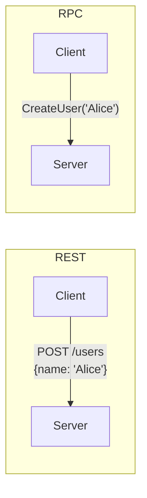

# RPC vs REST

---

# Table of Contents

* Introduction
* Learning Objectives
* Prerequisites
* Why This Topic Exists
* Real-World Analogy
* Understanding REST
* Understanding RPC
* Architecture Comparison
* Step-by-Step Implementation (Go RPC)
* Syntax
* Beginner Example
* Intermediate Example
* Advanced Example
* Production Use Cases
* Performance Analysis
* Best Practices
* Common Mistakes
* Debugging Guide
* Exercises
* Quiz
* Interview Questions
* Cheat Sheet
* Summary
* Key Takeaways
* Further Reading
* Next Chapter

---

# Introduction

When building microservices, the most fundamental question is: How do they talk to each other? For the last decade, **REST (Representational State Transfer)** over HTTP/1.1 with JSON has been the undisputed king of web APIs.

However, as systems scaled into hundreds of internal microservices, engineers realized that using REST for internal server-to-server communication was slow, verbose, and difficult to maintain. Enter **RPC (Remote Procedure Call)**, a paradigm that makes executing a function on a remote server look exactly like calling a local function in your Go code.

---

# Learning Objectives

After completing this chapter you will be able to:

* Contrast the resource-oriented nature of REST with the action-oriented nature of RPC.
* Understand the performance implications of JSON over HTTP/1.1 vs binary over HTTP/2.
* Use Go's built-in `net/rpc` package to build a basic RPC server and client.
* Decide when to use REST and when to use RPC in a production architecture.

---

# Prerequisites

Before reading this chapter you should know:

* Basic HTTP Concepts (Verbs, Status Codes).
* JSON encoding/decoding in Go.

---

# Why This Topic Exists

If you want to create a user in REST, you send a `POST` request to the `/users` endpoint. This is clean and semantic.
But what if you want to ban a user?
In REST, you might send a `PATCH /users/123` with a JSON payload `{"status": "banned"}`. What if you want to calculate a user's taxes? Do you `GET /users/123/taxes` or `POST /taxes`? 

REST forces you to map every single business action to a "Resource" (a noun). This causes massive friction when building action-oriented backend systems. 

RPC abandons resources. In RPC, if you want to ban a user, you literally just call a function named `BanUser(123)`. It aligns perfectly with how developers actually write code.

---

# Real-World Analogy

### The Restaurant Drive-Thru

* **REST (The Menu Board)**: You pull up to a speaker. There is a strict menu (Endpoints). You can say "Give me Item #1" (GET). You can say "Here is a custom burger, add it to the menu" (POST). The interaction is strictly based on *Nouns* (Burgers, Fries).
* **RPC (The Private Chef)**: You walk into the kitchen and tell the chef, "Chop these onions," or "Cook this steak medium-rare." You are commanding specific *Verbs* (Actions). You don't have to pretend that "chopping an onion" is a resource you are GETting.

---

# Understanding REST

* **Resource-Oriented**: Everything is a Noun (e.g., `/accounts`, `/payments`).
* **Stateless**: Every request contains all necessary information.
* **Standardized Verbs**: Uses HTTP methods strictly (GET, POST, PUT, PATCH, DELETE).
* **Payload**: Usually human-readable JSON.
* **Best For**: Public-facing APIs, Web Browsers, Mobile Apps.

# Understanding RPC

* **Action-Oriented**: Everything is a Verb/Function (e.g., `ChargeCreditCard`, `CalculateRoute`).
* **Location Transparency**: The client code looks like it is calling a local function `client.Charge(100)`, hiding the complex network request underneath.
* **Transport Agnostic**: Can run over HTTP, TCP, or UDP.
* **Payload**: Often binary (Protobuf, MessagePack, Gob) for extreme speed.
* **Best For**: Internal microservice-to-microservice communication.

---

# Architecture Comparison



---

# Step-by-Step Implementation (Go's built-in RPC)

Go has a built-in `net/rpc` package. It is rarely used in modern production (gRPC is the standard), but it perfectly illustrates the concept of RPC.

1. **Define the Args and Reply structs**: Both the server and client need to agree on the data shapes.
2. **Define an exported Struct**: This will be the RPC Service.
3. **Write exported Methods**: They must follow this exact signature: `func (t *T) MethodName(args *Args, reply *Reply) error`.
4. **Register the Service**: Use `rpc.Register(service)`.
5. **Serve**: Listen on a TCP port and call `rpc.Accept()`.
6. **Client**: Connect using `rpc.Dial()`, then call `client.Call("Service.Method", args, &reply)`.

---

# Beginner Example

A simple Math RPC Server using Go's built-in `net/rpc` and `gob` encoding.

**The Server:**
```go
package main

import (
	"fmt"
	"net"
	"net/rpc"
)

// 1. Args and Reply definitions
type MultiplyArgs struct {
	A, B int
}
type MultiplyReply struct {
	Result int
}

// 2. The Service Struct
type MathService struct{}

// 3. The RPC Method (Must match the exact signature rules)
func (m *MathService) Multiply(args *MultiplyArgs, reply *MultiplyReply) error {
	fmt.Printf("Server received request to multiply %d * %d\n", args.A, args.B)
	reply.Result = args.A * args.B
	return nil
}

func main() {
	// 4. Register
	mathService := &MathService{}
	rpc.Register(mathService)

	// 5. Listen and Serve
	listener, err := net.Listen("tcp", ":1234")
	if err != nil {
		panic(err)
	}
	fmt.Println("RPC Server listening on port 1234...")
	
	// Accept connections forever
	rpc.Accept(listener)
}
```

**The Client:**
```go
package main

import (
	"fmt"
	"net/rpc"
)

type MultiplyArgs struct {
	A, B int
}
type MultiplyReply struct {
	Result int
}

func main() {
	// Connect to the RPC Server
	client, err := rpc.Dial("tcp", "localhost:1234")
	if err != nil {
		panic(err)
	}

	args := &MultiplyArgs{A: 7, B: 6}
	var reply MultiplyReply

	// Make the Remote Procedure Call!
	// Notice how it looks like a standard function call, not an HTTP request.
	err = client.Call("MathService.Multiply", args, &reply)
	if err != nil {
		fmt.Println("RPC Error:", err)
		return
	}

	fmt.Println("Result from server:", reply.Result) // 42
}
```

---

# Production Use Cases

### 1. Internal Microservice Communication
If the `CheckoutService` needs to talk to the `InventoryService`, they don't use REST. They use RPC. It is significantly faster because the payload is compressed binary (Protobuf), and the connection uses HTTP/2 multiplexing, completely bypassing the massive overhead of JSON parsing and HTTP/1.1 connection setups.

### 2. Public APIs (REST)
External developers building third-party integrations (like a Slack bot or a Shopify plugin) expect REST. They can easily debug REST with `curl` or Postman. Exposing an RPC endpoint to the public is generally discouraged because it tightly couples the client to the server's specific binary schema.

---

# Performance Analysis

REST relies on JSON. JSON is a text-based format. To send the number `1000000`, JSON sends 7 separate bytes (one for each character). The CPU must parse these strings.
RPC often relies on binary protocols (like Protobuf or Go's Gob). It sends `1000000` as a raw 32-bit integer (4 bytes). 
In high-throughput systems, binary RPC is often 10x faster and uses a fraction of the CPU and bandwidth compared to JSON REST.

---

# Best Practices

* **Use REST for the Edge**: When browsers or mobile apps talk to your API Gateway, use REST/GraphQL.
* **Use RPC for the Backend**: When the API Gateway talks to the internal microservices, translate the request to RPC.
* **Don't use `net/rpc` in production**: Go's built-in `net/rpc` uses the `gob` format, which means both the server and client *must* be written in Go. In reality, you want polyglot systems (Go talking to Python talking to Java). Always use **gRPC** for production.

---

# Common Mistakes

### Forgetting Network Realities (Location Transparency Trap)
Because RPC makes a remote network call look exactly like a local function call (`client.ChargeUser()`), developers often forget the 8 Fallacies of Distributed Computing. They assume the function will return instantly. *Never* hide the network completely; always pass a `context.Context` to your RPC calls so you can handle timeouts!

---

# Quiz

## Multiple Choice Questions
**1. Which of the following best describes the difference between REST and RPC?**
A) REST is for databases, RPC is for web servers.
B) REST treats everything as a Noun (Resource) using standard HTTP verbs, while RPC treats everything as a Verb (Action/Function).
C) REST is faster than RPC.
*Answer*: B

## True or False
**You should use Go's built-in `net/rpc` package to build microservices that need to communicate with a frontend React application.**
*Answer*: False. `net/rpc` uses Go-specific binary encoding (`gob`). A browser running Javascript cannot natively decode it. Furthermore, browsers communicate via HTTP, not raw TCP. You should use REST or gRPC-Web for frontend communication.

---

# Interview Questions

## Beginner
**Q**: What does RPC stand for, and what is its primary goal?
*Answer*: Remote Procedure Call. Its goal is to allow a program to execute a subroutine on another computer across a network, without the programmer having to explicitly code the details for the network interaction.

## Intermediate
**Q**: Why is REST often preferred for public APIs, while RPC is preferred for internal microservices?
*Answer*: REST is highly standardized, uses human-readable JSON, and relies on standard HTTP semantics, making it incredibly easy for any third-party developer to integrate with using standard tools like `curl`. Internal microservices, however, require massive throughput, low latency, and strict type safety, which binary RPC frameworks provide far better than REST.

## Advanced
**Q**: Explain the "Location Transparency" trap in RPC.
*Answer*: RPC was designed to make remote calls look exactly like local function calls. This is dangerous because local function calls rarely fail and have zero latency, while remote calls suffer from the 8 Fallacies of Distributed Computing (latency, packet loss, server crashes). If a developer treats an RPC call like a local call (e.g., omitting timeouts or retries), the system will easily deadlock or crash during a network partition.

---

# Summary

REST is the language of the public internet, beautifully mapping CRUD operations to HTTP verbs. RPC is the language of the datacenter, allowing high-performance, action-oriented communication between machines. Understanding when to use which is the first step in architecting a modern cloud system.

---

# Next Chapter
➡️ **Next:** `05-gRPC-and-Protobuf.md`
