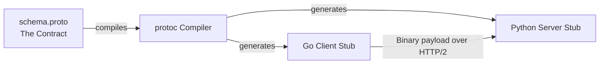

# gRPC and Protobuf

---

# Table of Contents

* Introduction
* Learning Objectives
* Prerequisites
* Why This Topic Exists
* Real-World Analogy
* Core Concepts
* Architecture Diagram
* Step-by-Step Implementation
* Protocol Buffers (.proto) Syntax
* Beginner Example
* Production Use Cases
* Performance Analysis
* Best Practices
* Common Mistakes
* Debugging Guide
* Exercises
* Quiz
* Interview Questions
* Cheat Sheet
* Summary
* Key Takeaways
* Further Reading
* Next Chapter

---

# Introduction

**gRPC** (gRPC Remote Procedure Calls) is an open-source, high-performance RPC framework developed by Google. It has become the undisputed industry standard for microservice communication.

It solves the polyglot problem of traditional RPC by using **Protocol Buffers (Protobuf)** as its Interface Definition Language (IDL) and underlying message interchange format. It runs on HTTP/2, enabling features like bidirectional streaming, multiplexing, and incredibly low latency.

---

# Learning Objectives

After completing this chapter you will be able to:

* Write a `.proto` file to strictly define your API contracts.
* Use the `protoc` compiler to automatically generate Go code from Protobuf definitions.
* Understand the performance benefits of HTTP/2 and Protobuf over JSON/HTTP1.1.
* Build a basic gRPC Server and Client in Go.

---

# Prerequisites

Before reading this chapter you should know:

* RPC vs REST (`04-RPC-vs-REST.md`).
* The Go `context` package (`03-Context-Propagation.md`).
* You must install the `protoc` compiler and the Go gRPC plugins to run the examples.

---

# Why This Topic Exists

When building microservices, the "Billing Service" might be written in Go, the "Data Science Service" in Python, and the "Legacy Service" in Java.
How do you guarantee that when the Python service sends data to the Go service, it sends the exact correct fields?

With JSON REST, you rely on Word documents or Swagger UI, and hope developers don't make a typo. Bugs happen constantly.

With gRPC, you write a single `.proto` file defining exactly what the requests and responses look like. You run a compiler, and it automatically generates strongly-typed structs and network code for Go, Python, and Java. If a developer makes a typo, their code literally will not compile. You get compile-time safety across different programming languages over a network.

---

# Real-World Analogy

### The United Nations Translators

* **JSON (REST)**: An ambassador gives a speech in English. Every other ambassador listens, pulls out an English dictionary, and tries to parse the meaning word by word. It is slow, prone to misinterpretation, and highly inefficient.
* **Protobuf (gRPC)**: The UN issues a highly optimized, universally agreed-upon shorthand script (The `.proto` contract). The ambassador speaks. Professional translators instantly convert it into the strict shorthand and send it through earpieces. The receiving translators instantly convert the shorthand into their native language (Go, Python, Java). It is blazing fast and impossible to misunderstand.

---

# Core Concepts

* **Protocol Buffers (Protobuf)**: Google's language-neutral, platform-neutral mechanism for serializing structured data. It compiles down to highly compressed binary.
* **`.proto` File**: The source-of-truth file where you define your data structures (Messages) and functions (Services).
* **Code Generation**: The `protoc` tool reads the `.proto` file and generates thousands of lines of boilerplate networking code for you.
* **HTTP/2**: The underlying transport layer gRPC uses. It allows multiple requests to be sent simultaneously over a single TCP connection (Multiplexing) and supports Server Push and Streaming.

---

# Architecture Diagram



---

# Step-by-Step Implementation

1. **Install Tools**: Install the `protoc` compiler, `protoc-gen-go`, and `protoc-gen-go-grpc`.
2. **Define the Contract**: Write a `.proto` file containing your `message` structs and `service` interface.
3. **Compile**: Run `protoc --go_out=. --go-grpc_out=. myapi.proto` to generate the `.pb.go` files.
4. **Build the Server**: Create a Go struct that implements the generated interface. Register it with a `grpc.NewServer()`.
5. **Build the Client**: Use `grpc.Dial()` to connect to the server, create a client stub using the generated code, and make your calls!

---

# Protocol Buffers (.proto) Syntax

Create a file named `calculator.proto`:

```protobuf
// Use version 3 of the syntax
syntax = "proto3";

// Where the generated Go code should be placed
option go_package = "./pb";

// Define the Data Structures
message AddRequest {
  int64 a = 1; // '1' is the unique field tag, NOT the value!
  int64 b = 2;
}

message AddResponse {
  int64 result = 1;
}

// Define the Service (The RPC interface)
service CalculatorService {
  // A standard Unary RPC call (One request, One response)
  rpc Add(AddRequest) returns (AddResponse);
}
```

*Note: The numbers `= 1`, `= 2` are tag identifiers used during binary serialization. Once you release a proto file to production, NEVER change the tag numbers for existing fields, or you will break backwards compatibility!*

---

# Beginner Example

Assuming you ran `protoc` and generated the `pb` package from the file above.

**The gRPC Server (`server.go`):**
```go
package main

import (
	"context"
	"fmt"
	"log"
	"net"

	"google.golang.org/grpc"
	// Import the generated code
	"yourproject/pb" 
)

// 1. Create a struct to implement the generated Server interface
type server struct {
	pb.UnimplementedCalculatorServiceServer
}

// 2. Implement the Add method defined in the proto file
func (s *server) Add(ctx context.Context, req *pb.AddRequest) (*pb.AddResponse, error) {
	fmt.Printf("Received request: %d + %d\n", req.GetA(), req.GetB())
	
	result := req.GetA() + req.GetB()
	
	// Return the generated response struct
	return &pb.AddResponse{Result: result}, nil
}

func main() {
	// Listen on a TCP port
	lis, err := net.Listen("tcp", ":50051")
	if err != nil {
		log.Fatalf("failed to listen: %v", err)
	}

	// Create a new gRPC server instance
	s := grpc.NewServer()
	
	// Register our implementation with the gRPC server
	pb.RegisterCalculatorServiceServer(s, &server{})

	fmt.Println("gRPC Server listening on port 50051...")
	if err := s.Serve(lis); err != nil {
		log.Fatalf("failed to serve: %v", err)
	}
}
```

**The gRPC Client (`client.go`):**
```go
package main

import (
	"context"
	"fmt"
	"log"
	"time"

	"google.golang.org/grpc"
	"google.golang.org/grpc/credentials/insecure"
	"yourproject/pb"
)

func main() {
	// 1. Connect to the server
	// (Using insecure credentials for local testing)
	conn, err := grpc.Dial("localhost:50051", grpc.WithTransportCredentials(insecure.NewCredentials()))
	if err != nil {
		log.Fatalf("did not connect: %v", err)
	}
	defer conn.Close()

	// 2. Create the client stub using generated code
	c := pb.NewCalculatorServiceClient(conn)

	// 3. Set a timeout context (CRITICAL for distributed systems!)
	ctx, cancel := context.WithTimeout(context.Background(), time.Second)
	defer cancel()

	// 4. Make the RPC call!
	res, err := c.Add(ctx, &pb.AddRequest{A: 10, B: 25})
	if err != nil {
		log.Fatalf("could not add: %v", err)
	}
	
	fmt.Printf("Result: %d\n", res.GetResult()) // Output: Result: 35
}
```

---

# Production Use Cases

### 1. The Service Mesh (Istio / Envoy)
Modern Kubernetes environments heavily utilize a Service Mesh. Envoy proxies are injected as sidecars next to your Go applications. These proxies communicate almost exclusively via gRPC because of its low latency and ability to stream massive amounts of telemetry data over long-lived HTTP/2 connections.

### 2. Bidirectional Streaming (Chat Apps / Real-time metrics)
gRPC isn't just for Request/Response. You can define a `.proto` service like `rpc Chat(stream Message) returns (stream Message)`. This opens a persistent HTTP/2 connection where both the client and server can push messages to each other simultaneously, completely eliminating the need for WebSockets.

---

# Performance Analysis

* **Serialization**: JSON uses Reflection and heavy string parsing at runtime. Protobuf generates hardcoded, strongly-typed parsing logic at compile time. Protobuf serialization is magnitudes faster and incredibly CPU efficient.
* **Payload Size**: A JSON payload `{ "id": 12345, "name": "Alice" }` might be 40 bytes. Protobuf strips all the keys and brackets, sending only raw binary values mapped to their tag numbers, resulting in a payload of ~10 bytes.
* **Multiplexing**: HTTP/1.1 requires setting up a new TCP handshake for every request (or suffering through Head-of-Line blocking). HTTP/2 opens a single TCP connection and multiplexes thousands of concurrent gRPC requests over it, massively reducing latency.

---

# Best Practices

* **Always use `GetField()`**: The generated Go structs will have fields like `req.A`. Do not access them directly. Use `req.GetA()`. If `req` is a nil pointer, accessing `req.A` will panic the server! `req.GetA()` safely checks for nil and returns the zero-value (0) instead of panicking.
* **Embed `Unimplemented<Service>Server`**: Always embed the `pb.Unimplemented...` struct in your server implementation. This ensures forward compatibility. If someone adds a new method to the `.proto` file, your code will still compile (it will just return "Unimplemented" for the new method until you write it).
* **Never alter tag numbers**: If you delete a field from a `.proto` file, use the `reserved` keyword so no one accidentally reuses that tag number in the future, which would cause catastrophic data corruption.

---

# Common Mistakes

### Ignoring the Context
Every gRPC method signature requires a `context.Context` as the first argument. If the client disconnects or times out, that context is cancelled. If your server is doing heavy database queries, you *must* pass that context down to your database library (`sql.QueryContext`). If you don't, your server will continue burning CPU on a dead request (See `03-Context-Propagation.md`).

---

# Exercises

## Beginner
Create a `.proto` file with a `UserService`. Define a `GetUser` RPC that takes a `UserRequest` (containing an `int64 id`) and returns a `UserResponse` (containing a `string name` and `string email`). Compile it using `protoc`.

## Intermediate
Implement the Server and Client in Go for the `UserService` you defined above. Add a `time.Sleep(3 * time.Second)` in the Server to simulate a slow database. In the Client, use `context.WithTimeout(..., 1 * time.Second)`. Verify that the client correctly aborts with a "Deadline Exceeded" error.

---

# Quiz

## Multiple Choice Questions
**1. What is the primary purpose of the numbers (tags) in a Protobuf message, e.g., `string name = 1;`?**
A) They define the default value of the field.
B) They determine the visual ordering of fields in the generated code.
C) They uniquely identify the field in the compressed binary format, allowing the parser to know what data it is reading without needing to send the actual string key "name".
*Answer*: C

## True or False
**If a client sends a gRPC request, and closes their laptop before the server finishes, the Go server will automatically kill the running Goroutine handling that request.**
*Answer*: False. The Goroutine is not killed automatically. The `context.Context` provided to the handler will be cancelled. It is entirely *your responsibility* as a developer to check `ctx.Done()` or pass the context to your I/O libraries to halt execution.

---

# Interview Questions

## Beginner
**Q**: What is the main advantage of gRPC over JSON REST?
*Answer*: gRPC uses Protocol Buffers (binary serialization) and HTTP/2, making it vastly faster, smaller, and more CPU-efficient. Furthermore, it generates strongly-typed client and server code across multiple languages, eliminating manual routing and serialization bugs.

## Intermediate
**Q**: Explain how backward and forward compatibility is maintained in Protocol Buffers.
*Answer*: Compatibility is maintained through the numbered field tags. You can add new fields to a message; old clients will simply ignore the new tags they don't recognize. You can remove fields, but you must mark their tag numbers as `reserved` so they are never reused. As long as you never change the tag number or type of an existing field, old clients and new servers can communicate flawlessly.

## Advanced
**Q**: What is HTTP/2 Multiplexing, and why is it critical for gRPC performance?
*Answer*: In HTTP/1.1, you can only send one request at a time over a TCP connection (Head-of-Line blocking). To send 10 requests concurrently, you need 10 expensive TCP handshakes. HTTP/2 divides data into binary frames and interleaves them. This allows gRPC to send thousands of concurrent RPC calls back and forth over a single, long-lived TCP connection, drastically reducing latency and connection overhead.

---

# Summary

gRPC and Protobuf represent the maturation of microservice architecture. By forcing developers to define strict, language-agnostic contracts, and relying on high-performance binary over HTTP/2, gRPC eliminates entire classes of bugs (typos, parsing errors) and performance bottlenecks associated with REST.

---

# Key Takeaways

* ✔ Write `.proto` files to define data and services.
* ✔ Run `protoc` to generate Go code.
* ✔ Never change or reuse Protobuf field tag numbers.
* ✔ Always use `GetField()` to avoid nil pointer panics.
* ✔ Always pass the `context` down the stack.

---

# Further Reading
* [gRPC Official Go Basics Tutorial](https://grpc.io/docs/languages/go/basics/)
* [Protocol Buffers Language Guide (proto3)](https://protobuf.dev/programming-guides/proto3/)

---

# Next Chapter
➡️ **Next:** `06-Message-Queues.md`
