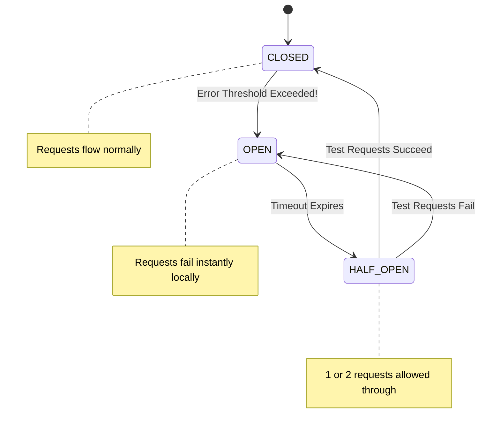

# Circuit Breaker Pattern

---

# Table of Contents

* Introduction
* Learning Objectives
* Prerequisites
* Why This Topic Exists
* Real-World Analogy
* Core Concepts: The Three States
* Architecture Diagram
* Step-by-Step Implementation
* Syntax (Using Sonygo)
* Production Use Cases
* Performance Analysis
* Best Practices
* Common Mistakes
* Debugging Guide
* Exercises
* Quiz
* Interview Questions
* Cheat Sheet
* Summary
* Key Takeaways
* Further Reading
* Next Chapter

---

# Introduction

The **Circuit Breaker Pattern** is a foundational reliability pattern for distributed systems. It prevents an application from repeatedly trying to execute an operation that is highly likely to fail, allowing the system to recover gracefully rather than suffering cascading failures.

When Service A depends on Service B, and Service B begins to struggle (due to high load or database locks), Service A must stop sending traffic to Service B. If it doesn't, Service A will exhaust all of its own resources (threads, connections) waiting for Service B, causing Service A to crash as well. The Circuit Breaker protects both the caller and the callee.

---

# Learning Objectives

After completing this chapter you will be able to:

* Understand the mechanism of cascading failures in microservice architectures.
* Define the Three States of a Circuit Breaker (Closed, Open, Half-Open).
* Implement the Circuit Breaker pattern in Go using a popular open-source library (`sony/gobreaker`).
* Provide fallback responses when a circuit is Open.

---

# Prerequisites

Before reading this chapter you should know:

* RPC vs REST (`04-RPC-vs-REST.md`).
* The Fallacies of Distributed Computing (`02-Fallacies-of-Distributed-Computing.md`).

---

# Why This Topic Exists

Imagine a highly trafficked E-Commerce API (Service A) that calls a Recommendation Engine (Service B) for every homepage load.
Service B's database gets slow. A request to Service B now takes 30 seconds instead of 0.1 seconds.

Service A keeps receiving 1,000 users per second. Because Service B is so slow, Service A opens 30,000 TCP connections waiting for responses. Service A runs out of memory and crashes. Now the entire E-Commerce site is down. This is a **Cascading Failure**.

A Circuit Breaker solves this. It wraps the network call to Service B. After noticing that 5 calls in a row timed out, the Circuit Breaker "Trips". For the next 60 seconds, any request to Service B is instantly aborted locally by the Circuit Breaker, returning a fallback response ("Trending Items"). 
1. Service A's memory is saved.
2. Service B is given 60 seconds of breathing room to recover from its database lock without being hammered by more traffic.

---

# Real-World Analogy

### The Electrical Circuit Breaker

* **The Problem**: You plug a microwave, a toaster, and a space heater into the same wall outlet. The wires in your walls get dangerously hot and could start a fire (Cascading Failure).
* **The Solution**: The electrical panel in your basement detects the massive surge in current. The physical switch *flips Open*. 
* **The Result**: Power to that room is instantly cut off. The house doesn't burn down. You wait a few minutes, unplug the heater, and manually flip the switch back to *Closed* to restore normal operation.

---

# Core Concepts: The Three States

A software circuit breaker operates as a Finite State Machine with three states:

1. **CLOSED (Normal Operation)**: The circuit is closed, electricity (requests) flows normally. The breaker monitors failures. If the failure rate exceeds a threshold (e.g., 5 errors in a row), it trips to OPEN.
2. **OPEN (Failing Fast)**: The circuit is broken. Electricity (requests) cannot pass. Any attempt to call the external service immediately returns an error locally without touching the network. It stays in this state for a predefined timeout (e.g., 30 seconds).
3. **HALF-OPEN (Testing Recovery)**: After the timeout expires, the breaker lets a limited number of test requests pass through to the external service. 
    * If the test requests succeed, the service is healthy again! The breaker switches to CLOSED.
    * If the test requests fail, the service is still broken. The breaker switches back to OPEN and resets the timer.

---

# Architecture Diagram



---

# Step-by-Step Implementation

Writing a highly concurrent, thread-safe Circuit Breaker from scratch requires complex Mutexes and timers. In Go, the industry standard is to use `github.com/sony/gobreaker` (developed by Sony for the PlayStation Network).

1. Import `gobreaker`.
2. Define the `gobreaker.Settings`, including the Name, the Error Threshold, and the Timeout duration.
3. Instantiate the Breaker: `cb := gobreaker.NewCircuitBreaker(settings)`.
4. Wrap your fragile network call inside `cb.Execute(func() (interface{}, error) { ... })`.
5. Handle the result. If the error returned is `gobreaker.ErrOpenState`, implement a fallback response.

---

# Syntax (Using `sony/gobreaker`)

```go
import "github.com/sony/gobreaker"

var cb *gobreaker.CircuitBreaker

func init() {
    cb = gobreaker.NewCircuitBreaker(gobreaker.Settings{
        Name:        "HTTP GET",
        MaxRequests: 1,               // Requests allowed in Half-Open state
        Interval:    0,               // Never clear counts while Closed
        Timeout:     30 * time.Second, // Time to stay in Open state
        ReadyToTrip: func(counts gobreaker.Counts) bool {
            return counts.ConsecutiveFailures > 3 // Trip after 3 fails
        },
    })
}
```

---

# Beginner Example

Wrapping an unreliable HTTP call.

```go
package main

import (
	"errors"
	"fmt"
	"io"
	"net/http"
	"time"

	"github.com/sony/gobreaker"
)

var cb *gobreaker.CircuitBreaker

func init() {
	// Configure the Circuit Breaker
	cb = gobreaker.NewCircuitBreaker(gobreaker.Settings{
		Name:    "UnreliableService",
		Timeout: 5 * time.Second, // Stay open for 5 seconds before testing Half-Open
		ReadyToTrip: func(counts gobreaker.Counts) bool {
			// Trip the breaker if 2 requests fail in a row
			return counts.ConsecutiveFailures >= 2
		},
		OnStateChange: func(name string, from gobreaker.State, to gobreaker.State) {
			fmt.Printf("\n[CIRCUIT BREAKER] State changed from %s to %s\n", from, to)
		},
	})
}

// The fragile network call wrapped by the breaker
func fetchRecommendations() (string, error) {
	// Execute takes a function that returns (interface{}, error)
	result, err := cb.Execute(func() (interface{}, error) {
		// Simulate hitting an external API
		resp, err := http.Get("http://localhost:9999/unreliable-endpoint")
		if err != nil {
			return nil, err // Returning an error tells the breaker it failed
		}
		defer resp.Body.Close()
		
		if resp.StatusCode >= 500 {
			return nil, errors.New("server error")
		}

		body, _ := io.ReadAll(resp.Body)
		return string(body), nil
	})

	if err != nil {
		return "", err
	}
	
	// Type assert the generic interface{} back to a string
	return result.(string), nil
}

func main() {
	// Simulate hitting the endpoint 5 times in a row
	for i := 1; i <= 5; i++ {
		fmt.Printf("\nRequest %d:\n", i)
		
		data, err := fetchRecommendations()
		
		if err != nil {
			// Check if the error is because the breaker is OPEN
			if err == gobreaker.ErrOpenState {
				fmt.Println("FALLBACK: Returning Default Recommendations (Circuit is Open!)")
			} else {
				fmt.Println("NETWORK ERROR:", err)
			}
		} else {
			fmt.Println("SUCCESS:", data)
		}
		
		time.Sleep(1 * time.Second)
	}
}
```

*Output (if localhost:9999 is offline):*
```text
Request 1:
NETWORK ERROR: dial tcp [::1]:9999: connect: connection refused

Request 2:
NETWORK ERROR: dial tcp [::1]:9999: connect: connection refused
[CIRCUIT BREAKER] State changed from closed to open

Request 3:
FALLBACK: Returning Default Recommendations (Circuit is Open!)

Request 4:
FALLBACK: Returning Default Recommendations (Circuit is Open!)
```
Notice how Request 3 and 4 return instantly without even attempting a network connection!

---

# Production Use Cases

### 1. Payment Gateways
If your application depends on Stripe or PayPal, and their API experiences an outage, attempting to continually process thousands of checkouts will lock up your database transactions. A Circuit Breaker trips, instantly rejecting checkouts with a friendly "Payment Gateway Offline, try again in 5 minutes" message, protecting your local database.

### 2. Service Meshes (Istio)
Modern architectures often move the Circuit Breaker out of Go code entirely and into the infrastructure. Istio/Envoy proxies can be configured via YAML to automatically trip circuits between microservices based on 5xx error rates, providing resiliency without writing a single line of application code.

---

# Performance Analysis

Wrapping a function in a software circuit breaker adds a tiny amount of overhead (a few Mutex locks and atomic counter increments). This takes nanoseconds. Compared to the massive latency of waiting for a network timeout (thousands of milliseconds), the performance cost of a Circuit Breaker is effectively zero, and the architectural benefits are immense.

---

# Best Practices

* **Implement Meaningful Fallbacks**: When `cb.Execute` returns `ErrOpenState`, don't just return a 500 Error to the user. Try to provide a degraded experience. If the Recommendation Engine is down, return a hardcoded list of the "Top 10 Best Sellers."
* **Don't wrap Business Errors**: If an API returns `400 Bad Request` or `401 Unauthorized`, that is a user error, NOT a system failure. You should *not* return these errors to the `cb.Execute` wrapper, because user errors shouldn't trip the breaker! Only return 5xx errors or network timeouts to the breaker.

---

# Common Mistakes

### Setting the Timeout too short
If a database is experiencing heavy locking, it might take 2 minutes to recover. If you set the Circuit Breaker timeout to 2 seconds, the Breaker will constantly switch to Half-Open, send test traffic, fail, and go back to Open. You aren't giving the downstream service enough time to actually recover.

---

# Debugging Guide

* **"The circuit never closes"**: You probably configured the `ReadyToTrip` logic too aggressively (e.g., tripping after 1 error). In a distributed system, 1 error is normal network jitter. Configure thresholds based on percentages (e.g., "Trip if 50% of the last 100 requests fail").

---

# Exercises

## Beginner
Using the `sony/gobreaker` library, configure a breaker that trips after exactly 5 consecutive failures and stays open for 10 seconds. Write a loop that executes a function returning an error 10 times, printing the result of each call.

## Intermediate
Implement the "Business Error vs System Error" best practice. Write a wrapped HTTP call. If the status code is `404`, return the error to the caller, but return `nil` to the breaker wrapper (so it doesn't count as a system failure). If the status code is `500`, return the error to both.

---

# Quiz

## Multiple Choice Questions
**1. What is the purpose of the HALF-OPEN state?**
A) To allow 50% of all traffic to pass through.
B) To permanently operate the system in a degraded mode.
C) To allow a very small number of test requests to pass through to determine if the downstream service has recovered.
*Answer*: C

## True or False
**A Circuit Breaker is primarily designed to fix the broken downstream service.**
*Answer*: False. A Circuit Breaker cannot fix a broken database. Its primary purpose is to protect the *caller* from exhausting its resources by failing fast, and to protect the broken downstream service by removing traffic load so it has a chance to self-heal.

---

# Interview Questions

## Beginner
**Q**: What is a cascading failure?
*Answer*: It is when a failure in one microservice causes a ripple effect, overwhelming and crashing the healthy services that depend on it because they exhaust their resources waiting for the failed service to respond.

## Intermediate
**Q**: Explain the three states of a Circuit Breaker.
*Answer*: 
1. **Closed**: Normal state, traffic flows freely. If failure thresholds are met, it trips to Open.
2. **Open**: Fault state, all traffic is instantly rejected locally to fail fast. Starts a timeout timer.
3. **Half-Open**: Transition state. After the timeout, a few requests are allowed through. If they succeed, the circuit resets to Closed. If they fail, it trips back to Open.

## Advanced
**Q**: If an API gateway calls a backend service, how does implementing a Circuit Breaker improve the user experience during an outage?
*Answer*: Without a circuit breaker, the API gateway will wait until the TCP timeout (often 30-60 seconds) for every single user request. The user stares at a loading screen for a minute before getting an error. With a circuit breaker, after the initial trip, subsequent users instantly receive a fallback response or a fast failure (0 seconds), providing a vastly superior, snappy user experience even during a massive outage.

---

# Summary

The Circuit Breaker pattern embraces the reality that distributed systems fail. By failing fast, shedding load, and providing fallback mechanisms, Circuit Breakers act as bulkheads in a submarine—ensuring that a leak in one compartment doesn't sink the entire ship.

---

# Key Takeaways

* ✔ Prevents cascading failures across microservices.
* ✔ States: Closed (Healthy), Open (Failing Fast), Half-Open (Testing).
* ✔ Always provide a Fallback response when the circuit is Open.
* ✔ Only trip the circuit on systemic errors (Timeouts, 5xx), not user errors (4xx).

---

# Further Reading
* [Martin Fowler: Circuit Breaker](https://martinfowler.com/bliki/CircuitBreaker.html)
* [Sony gobreaker GitHub Repository](https://github.com/sony/gobreaker)

---

# Next Chapter
➡️ **Next:** `08-Retries-and-Exponential-Backoff.md`
