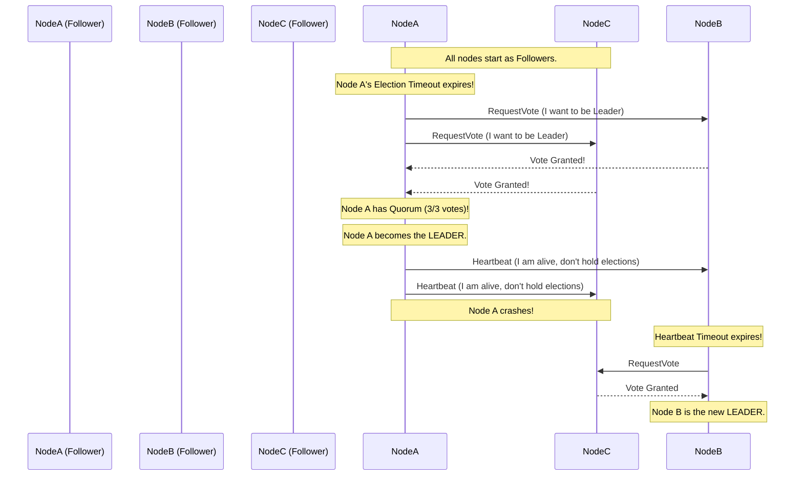

# Consensus Algorithms

---

# Table of Contents

* Introduction
* Learning Objectives
* Prerequisites
* Why This Topic Exists
* Real-World Analogy
* Core Concepts
* Split-Brain Problem
* Quorum (The Magic Formula)
* Paxos vs Raft
* Architecture Diagram: Raft Leader Election
* Production Use Cases (etcd / Consul)
* Best Practices
* Exercises
* Quiz
* Interview Questions
* Summary
* Key Takeaways
* Further Reading
* Next Chapter

---

# Introduction

In a distributed system, relying on a single database server creates a Single Point of Failure. If that server crashes, the system goes down. To achieve High Availability, we replicate data across 3 or 5 servers.

But when you have multiple servers, a new, terrifying problem emerges: **How do they agree on what the truth is?** 
If the network splits in half, and 2 servers think the database should say "A", and 1 server thinks it should say "B", who wins? **Consensus Algorithms** (like Paxos and Raft) solve this problem, guaranteeing that a cluster of machines can mathematically agree on a single truth, even when servers crash and networks fail.

---

# Learning Objectives

After completing this chapter you will be able to:

* Understand the "Split-Brain" problem in distributed systems.
* Explain why an odd number of nodes (3, 5, 7) is required for consensus clusters.
* Define Quorum and how it prevents data corruption.
* Understand the high-level mechanics of the Raft consensus algorithm.

---

# Prerequisites

Before reading this chapter you should know:

* The CAP Theorem (`01-CAP-Theorem.md`).
* Fallacies of Distributed Computing (`02-Fallacies-of-Distributed-Computing.md`).

---

# Why This Topic Exists

Imagine a highly available banking system with 2 database servers. One in New York (A), one in London (B). They constantly sync with each other.

The transatlantic cable is cut. A network partition occurs.
* User 1 connects to Node A and deposits $100.
* User 2 connects to Node B and withdraws $100.

Because Node A and Node B cannot communicate, they both accept the writes locally. 
When the cable is fixed, Node A and Node B sync up. They realize they have conflicting ledgers. The data is corrupted. This is called **Split-Brain**.

To prevent Split-Brain, you need a **Consensus Algorithm**. The algorithm dictates that a cluster cannot accept a write unless a *strict majority* of nodes agree to it. If you only have 2 nodes, and the network splits, neither node can achieve a majority (1 out of 2 is only 50%, not a majority). Therefore, a 2-node cluster is physically incapable of safely surviving a network partition!

---

# Real-World Analogy

### The Jury Verdict

* **The Problem**: A jury of 12 people must agree on a verdict. But 4 jurors are locked out of the courthouse, and 2 are asleep.
* **The Rule of Quorum**: The judge states a rule: "A verdict is only valid if a strict majority (7 out of 12) agree." 
* **The Outcome**: Even if 5 jurors are missing or asleep, if the remaining 7 jurors can talk to each other and agree, the verdict is legally binding. The sleeping jurors will simply read the verdict in the newspaper when they wake up. If only 6 jurors are awake, they cannot issue a verdict. They must halt the trial (rejecting writes) to maintain the integrity of the court.

---

# Core Concepts

* **Consensus**: The process of multiple nodes agreeing on a single data value or state.
* **Quorum**: The minimum number of nodes that must be healthy and communicating to achieve a majority vote. Formula: `(N / 2) + 1`.
* **Leader Election**: Most consensus algorithms simplify the process by electing a single "Leader" node. All writes go to the Leader. If the Leader crashes, the remaining nodes vote to elect a new Leader.

---

# Split-Brain Problem

Split-Brain occurs when a cluster divides into two or more independent sub-clusters that can no longer communicate with each other, but each sub-cluster *believes* it is the true cluster and continues to accept writes. This results in divergent, corrupted data.

**How Quorum prevents Split-Brain:**
Assume a 5-node cluster. The network splits, isolating 2 nodes on the East Coast and 3 nodes on the West Coast.
* The West Coast sub-cluster has 3 nodes. `3 >= (5/2)+1`. It has Quorum! It continues accepting writes.
* The East Coast sub-cluster has 2 nodes. `2 < 3`. It does *not* have Quorum. It immediately locks itself down in Read-Only mode (or rejects all requests) to prevent corrupting the data.

---

# Paxos vs Raft

### Paxos (1989)
Invented by Leslie Lamport, Paxos was the first mathematically proven consensus algorithm. It is incredibly robust, but famously incomprehensible to humans. Implementing it in code is notoriously difficult, leading to many subtle bugs in early distributed systems.

### Raft (2013)
Raft was explicitly designed to be understandable. It achieves the exact same safety as Paxos but breaks the problem down into distinct, logical steps (Leader Election, Log Replication, Safety). Because it is easier to implement, Raft has become the modern standard in the cloud-native ecosystem.

---

# Architecture Diagram: Raft Leader Election

---

# Production Use Cases

If you are a backend developer writing Go, you will rarely write a consensus algorithm yourself. Instead, you use infrastructure built in Go that utilizes Raft under the hood.

### 1. etcd (The Brain of Kubernetes)
`etcd` is a strongly consistent, distributed key-value store built in Go using the Raft algorithm. It is the absolute source of truth for every Kubernetes cluster in the world. If you want to know what Pods are running, Kubernetes checks `etcd`. Because it is the source of truth, it MUST be strongly consistent (CP in the CAP theorem), making Raft necessary.

### 2. HashiCorp Consul
Consul provides Service Discovery and Configuration Management. It uses Raft to ensure that if a microservice is registered as "Healthy", all nodes in the datacenter agree on that status.

---

# Best Practices

* **Always use odd numbers**: A cluster should have 3, 5, or 7 nodes. Adding a 4th node to a 3-node cluster actually *decreases* your fault tolerance! 
    * In a 3-node cluster, Quorum is 2. You can survive 1 failure.
    * In a 4-node cluster, Quorum is `(4/2)+1 = 3`. You can still only survive 1 failure! But now you have 4 machines that can potentially crash, increasing the probability of a failure without increasing your fault tolerance.
* **Keep clusters small**: Because Raft requires the Leader to replicate data to a majority of nodes before confirming a write, adding more nodes increases latency. A 5-node cluster is usually optimal (survives 2 failures). 7 nodes is the practical maximum for high-throughput systems.

---

# Quiz

## Multiple Choice Questions
**1. Why does a consensus cluster require a strict majority (Quorum) to accept a write?**
A) Because it makes the database faster.
B) To guarantee that if the network splits into two pieces, only one piece can possibly have a majority, preventing Split-Brain data corruption.
C) To save bandwidth.
*Answer*: B

## True or False
**Raft is considered superior to Paxos because it is mathematically proven to be faster.**
*Answer*: False. Raft is not inherently faster than Paxos. It is considered superior because it was explicitly designed for understandability, making it much easier for developers to implement correctly in code without introducing catastrophic bugs.

---

# Interview Questions

## Beginner
**Q**: What is the "Split-Brain" problem?
*Answer*: It occurs in a distributed system when a network partition separates the cluster into isolated groups. If multiple groups believe they are the active primary cluster and continue accepting writes, the data will diverge and become irreparably corrupted.

## Intermediate
**Q**: Explain how a Quorum works and calculate the Quorum for a 7-node cluster.
*Answer*: Quorum is the minimum number of nodes required to agree on an operation to make it permanent. It ensures that only one isolated group can ever exist during a network partition. The formula is `(N / 2) + 1`. For a 7-node cluster, `(7 / 2) + 1 = 3.5 + 1 = 4.5`, which rounds down to 4. Therefore, 4 nodes must be alive. The cluster can survive 3 simultaneous failures.

## Advanced
**Q**: Explain the role of the "Leader" and the "Heartbeat" in the Raft consensus algorithm.
*Answer*: In Raft, to keep things simple, all client write requests are routed to a single "Leader" node. The Leader appends the write to its log and sends an RPC to all "Follower" nodes to replicate it. To maintain authority, the Leader sends continuous "Heartbeat" messages to the followers. If a follower stops receiving heartbeats for a randomized timeout period, it assumes the Leader is dead, promotes itself to a Candidate, and triggers a new Election to restore the cluster.

---

# Summary

Consensus Algorithms are the heavy lifters of distributed data integrity. By relying on Quorums and Leader Elections, algorithms like Raft allow distributed databases (like `etcd`) to survive chaotic network partitions and hardware failures without ever sacrificing Consistency.

---

# Key Takeaways

* ✔ Consensus ensures all nodes agree on the truth.
* ✔ Quorum `(N/2)+1` prevents Split-Brain data corruption.
* ✔ Always deploy consensus clusters in odd numbers (3, 5, 7).
* ✔ Raft simplifies consensus into Leader Election and Log Replication.
* ✔ Kubernetes relies on Raft via `etcd`.

---

# Further Reading
* [The Secret Lives of Data (Interactive Raft Visualization)](http://thesecretlivesofdata.com/raft/)
* [In Search of an Understandable Consensus Algorithm (Raft Paper)](https://raft.github.io/raft.pdf)

---

# Next Chapter
➡️ **Next:** `13-Distributed-Tracing.md` (Beginning of Part 5: Observability)
