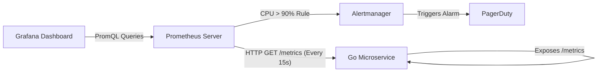

# Metrics and Monitoring

---

# Table of Contents

* Introduction
* Learning Objectives
* Prerequisites
* Why This Topic Exists
* Metrics vs Logs vs Traces
* Core Concepts (The Four Golden Signals)
* Prometheus Architecture (Pull vs Push)
* Metric Types (Counters, Gauges, Histograms)
* Architecture Diagram
* Step-by-Step Implementation (Prometheus in Go)
* Beginner Example
* Production Use Cases (Grafana and Alertmanager)
* Best Practices
* Common Mistakes
* Exercises
* Quiz
* Interview Questions
* Summary
* Key Takeaways
* Further Reading
* Completion of Distributed Systems

---

# Introduction

We have covered Distributed Tracing (for debugging single requests) and Centralized Logging (for tracking specific events). The final pillar of Observability is **Metrics**.

Metrics are numbers measured over time. They don't tell you *why* an individual user failed to log in, but they tell you that the *overall rate* of failed logins just spiked from 1% to 45%. Metrics power the real-time Dashboards (Grafana) that hang on the walls of engineering offices, and they trigger the automated PagerDuty alarms that wake engineers up at 3:00 AM. 

In the cloud-native world, **Prometheus** is the undisputed king of metrics.

---

# Learning Objectives

After completing this chapter you will be able to:

* Differentiate between Logs, Traces, and Metrics.
* Understand the Four Golden Signals of monitoring.
* Explain the Prometheus "Pull" model architecture.
* Instrument a Go web server to expose custom Counters and Histograms.

---

# Prerequisites

Before reading this chapter you should know:

* Centralized Logging (`14-Centralized-Logging.md`).
* HTTP Handlers in Go.

---

# Why This Topic Exists

Imagine you want to monitor your API's latency. 
If you use **Logs**, you log `{"latency_ms": 45}` 10,000 times a second. That is 10,000 strings hitting your hard drive every second. It will destroy your disk and cost a fortune.

If you use **Metrics**, your Go application simply increments a variable in memory: `Sum += 45`, `Count += 1`. Every 15 seconds, Prometheus scrapes your application and reads those two numbers. No matter if you have 10 requests a second or 100,000 requests a second, the metric only uses a few bytes of RAM.

Metrics are incredibly cheap, aggressively aggregated numerical data. They are the only way to monitor system health at a massive scale.

---

# Metrics vs Logs vs Traces (The Three Pillars)

* **Logs**: Granular, detailed records of specific events (e.g., "User Alice failed checkout because card expired"). High storage cost.
* **Traces**: Request-scoped tracking across microservice boundaries (e.g., "Gateway -> Auth -> DB took 1.2s"). High computational cost, usually sampled.
* **Metrics**: Aggregated numerical data over time (e.g., "The CPU is at 80%", "The checkout API returns 500s at a rate of 5/sec"). Very low cost, excellent for alerting.

---

# Core Concepts (The Four Golden Signals)

Google's SRE (Site Reliability Engineering) handbook dictates that if you can only monitor four metrics, they must be:

1. **Latency**: The time it takes to service a request. (Usually measured in Histograms to track the 99th percentile).
2. **Traffic**: A measure of how much demand is being placed on your system (e.g., Requests per second).
3. **Errors**: The rate of requests that fail (e.g., HTTP 5xx responses).
4. **Saturation**: How "full" your service is. (e.g., CPU utilization, RAM usage, Database Connection Pool limits).

---

# Prometheus Architecture (Pull vs Push)

Most legacy monitoring systems (like StatsD) use a **Push** model: your Go application actively sends data over the network to the monitoring server. If the monitoring server crashes, your Go application might block or lose data.

Prometheus uses a **Pull (Scrape)** model. 
Your Go application doesn't send anything anywhere. It simply hosts an HTTP endpoint (usually `/metrics`). When you hit that endpoint, it returns a plain-text document of current numbers. The Prometheus server is configured to hit that endpoint on all your servers every 15 seconds, scraping the data and storing it in its Time-Series Database.

---

# Metric Types

1. **Counter**: A cumulative metric that can *only go up*. (e.g., Total HTTP Requests received, Total bytes sent).
2. **Gauge**: A metric that can go up and down. (e.g., Current Memory Usage, Active WebSockets, Temperature).
3. **Histogram**: Samples observations and counts them in configurable "buckets". Essential for measuring Latency (e.g., "5 requests took < 100ms, 2 requests took < 500ms").

---

# Architecture Diagram



---

# Step-by-Step Implementation (Prometheus in Go)

1. Import `github.com/prometheus/client_golang/prometheus` and `promhttp`.
2. Define your metrics (e.g., `prometheus.NewCounter`).
3. Register the metrics with the global registry: `prometheus.MustRegister(myCounter)`.
4. In your code, update the metrics (e.g., `myCounter.Inc()`).
5. Expose the `/metrics` endpoint using `promhttp.Handler()`.

---

# Beginner Example

Instrumenting a basic Go web server with a Counter and a Gauge.

```go
package main

import (
	"fmt"
	"math/rand"
	"net/http"
	"time"

	"github.com/prometheus/client_golang/prometheus"
	"github.com/prometheus/client_golang/prometheus/promhttp"
)

// 1. Define the Metrics
var (
	// A Counter for total requests (Only goes up)
	requestsTotal = prometheus.NewCounter(
		prometheus.CounterOpts{
			Name: "http_requests_total",
			Help: "Total number of HTTP requests processed.",
		},
	)

	// A Gauge for simulated CPU temp (Goes up and down)
	cpuTemp = prometheus.NewGauge(
		prometheus.GaugeOpts{
			Name: "cpu_temperature_celsius",
			Help: "Current temperature of the CPU.",
		},
	)
)

// 2. Register them on initialization
func init() {
	prometheus.MustRegister(requestsTotal)
	prometheus.MustRegister(cpuTemp)
}

func main() {
	// Background goroutine simulating fluctuating temperature
	go func() {
		for {
			cpuTemp.Set(60 + rand.Float64()*20) // Temp between 60-80
			time.Sleep(2 * time.Second)
		}
	}()

	// The actual business logic endpoint
	http.HandleFunc("/checkout", func(w http.ResponseWriter, r *http.Request) {
		// Increment the counter every time this endpoint is hit!
		requestsTotal.Inc()
		fmt.Fprintf(w, "Checkout complete!")
	})

	// 3. Expose the /metrics endpoint for Prometheus to scrape!
	http.Handle("/metrics", promhttp.Handler())

	fmt.Println("Server listening on :8080")
	fmt.Println("Visit http://localhost:8080/metrics to see the raw data")
	http.ListenAndServe(":8080", nil)
}
```

*If you visit `/metrics`, you will see Prometheus plain-text output:*
```text
# HELP http_requests_total Total number of HTTP requests processed.
# TYPE http_requests_total counter
http_requests_total 12
# HELP cpu_temperature_celsius Current temperature of the CPU.
# TYPE cpu_temperature_celsius gauge
cpu_temperature_celsius 64.321
```

---

# Production Use Cases

### 1. Grafana Dashboards
You deploy the Go application above. You configure Prometheus to scrape it. Then, you spin up Grafana. In Grafana, you write a query: `rate(http_requests_total[5m])`. This calculates the requests-per-second over the last 5 minutes. Grafana turns this into a beautiful, real-time line chart.

### 2. Kubernetes Horizontal Pod Autoscaling (HPA)
In a modern cloud, autoscaling isn't just about CPU usage. You can configure Kubernetes to read your custom Prometheus metrics. If your `jobs_in_queue_total` Gauge goes above 5,000, Kubernetes automatically spins up 10 new instances of your Go application to handle the load, and scales them back down when the queue empties.

---

# Best Practices

* **Use Labels (Tags) Carefully**: You can add labels to metrics (e.g., `status_code="200"`). This is powerful, but beware of **Cardinality Explosion**. Never put a highly unique value (like a `user_id` or `trace_id`) into a metric label! If you have 1 million users, Prometheus will create 1 million separate time-series in memory and instantly crash. Labels must have a small, bounded set of possible values (like HTTP methods: GET, POST, PUT).
* **Don't calculate rates in Go**: Your Go app should just expose raw Counters (Total requests since boot). It is the job of Prometheus (using PromQL `rate()`) to calculate the per-second rate during the query phase. 
* **Measure the 99th Percentile**: Averages lie. If 99 users load your site in 10ms, and 1 user takes 5,000ms (5 seconds), the average is 59ms. You might look at the dashboard and think everything is fine, while that 1 user is having a terrible experience. Always use Histograms to monitor the p99 latency.

---

# Common Mistakes

### Forgetting to handle Application Restarts
Because a Counter tracks total events *since the application booted*, if you deploy a new version of your Go app, the Counter resets to 0! If you are calculating the daily revenue based purely on that counter without using the PromQL `rate()` or `increase()` functions (which are mathematically designed to handle counter resets), your dashboard will show completely inaccurate data.

---

# Quiz

## Multiple Choice Questions
**1. Which metric type would you use to measure the number of active concurrent WebSocket connections on your server?**
A) Counter
B) Gauge
C) Histogram
*Answer*: B. Because active connections go up when users connect, and go *down* when users disconnect, you must use a Gauge. A Counter can only go up.

## True or False
**The Prometheus architecture requires your Go application to constantly push metric data over the network to a central Prometheus server.**
*Answer*: False. Prometheus uses a Pull model. Your Go application simply exposes an HTTP endpoint (`/metrics`) serving current memory state. The Prometheus server reaches out and scrapes it on an interval.

---

# Interview Questions

## Beginner
**Q**: What is the difference between a Counter and a Gauge in Prometheus?
*Answer*: A Counter is a cumulative metric that only ever increases (e.g., total HTTP requests). A Gauge represents a single numerical value that can arbitrarily go up and down (e.g., current CPU usage, or active database connections).

## Intermediate
**Q**: Why is it catastrophic to put a `user_id` as a label on a Prometheus metric?
*Answer*: Prometheus stores every unique combination of metric names and labels as a separate Time-Series in memory. This is called Cardinality. If you use a bounded label like `status="500"`, it creates 1 time-series. If you use `user_id`, and you have 10 million users, you create 10 million time-series in RAM, causing a Cardinality Explosion that will instantly crash the Prometheus server.

## Advanced
**Q**: Explain why you should monitor the 99th percentile (p99) latency using a Histogram rather than just monitoring the Average latency.
*Answer*: Averages (Means) are highly susceptible to being masked by large volumes of fast requests. If you have a tail-latency problem where 1% of your users experience 10-second timeouts, but 99% experience 10ms responses, the average will appear completely healthy. By capturing requests in Histogram buckets and querying the p99, you are explicitly tracking the experience of the slowest 1% of users, ensuring you uncover hidden performance bottlenecks.

---

# Summary

Metrics provide the birds-eye view of your distributed system. By adhering to the Four Golden Signals and leveraging the incredible efficiency of Prometheus, you can monitor the health of thousands of microservices, detect anomalies in real-time, and sleep soundly knowing the automated alarms will catch failures before your customers do.

---

# Key Takeaways

* ✔ Logs are for events; Traces are for debugging; Metrics are for health and alerting.
* ✔ Prometheus uses a highly efficient Pull (Scrape) model.
* ✔ Counters only go up; Gauges go up and down; Histograms measure percentiles.
* ✔ Beware of Cardinality Explosion: never use unbounded data (like User IDs) as metric labels.

---

# Further Reading
* [Prometheus Documentation](https://prometheus.io/docs/introduction/overview/)
* [Google SRE Book: Monitoring Distributed Systems](https://sre.google/sre-book/monitoring-distributed-systems/)

---
---

# 🎉 Curriculum Complete! 🎉

Congratulations! You have completed the **Distributed Systems in Go** module for the GoVerse platform. 

You have journeyed from the theoretical limitations of physics (CAP Theorem, Clocks) through practical network communication (gRPC, Queues), reliability engineering (Circuit Breakers, Retries, Sagas), and finally into modern observability (Tracing, Logs, Metrics). 

You now possess the architectural vocabulary and practical skills required to design, build, and maintain production-grade, globally distributed cloud systems in Go.
