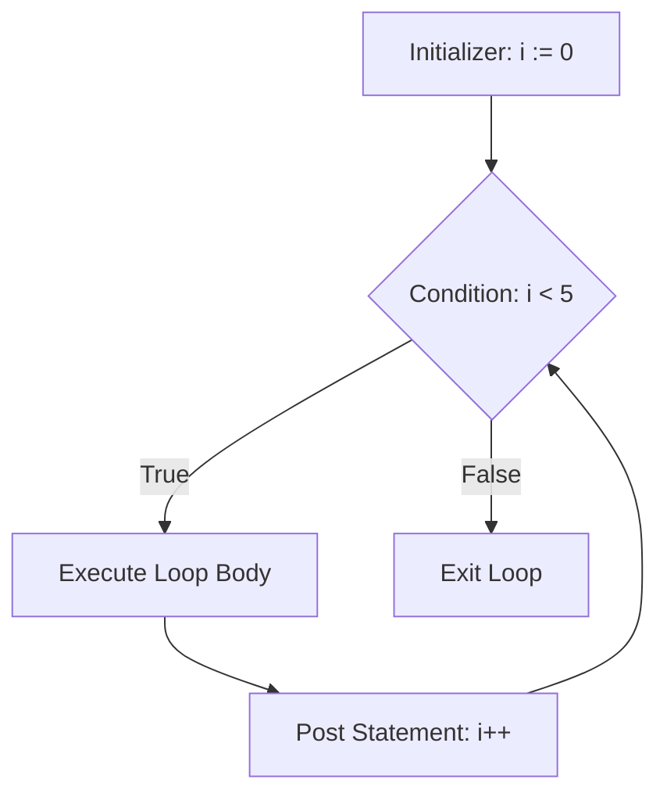

# The `for` Loop

In Go, there is no `while` keyword, no `do-while`, and no `foreach`. The designers of Go radically simplified control flow by making `for` the **only** looping construct in the language.

However, this single keyword is incredibly versatile and can mimic all traditional loop types.

## 1. The Classic C-Style `for` Loop

The most common loop structure contains an initializer, a condition, and a post-statement.

```go
for i := 0; i < 5; i++ {
    fmt.Println(i)
}
```

### 🧠 Under the Hood: Execution Lifecycle



* **Insight**: Variables declared in the initializer (like `i`) are scoped strictly to the loop. They are immediately garbage-collected or popped off the stack when the loop terminates.

## 2. The `while` Loop Equivalent

If you drop the initializer and the post-statement, the `for` loop behaves exactly like a traditional `while` loop.

```go
n := 1
for n < 100 {
    n *= 2
}
fmt.Println(n) // Prints 128
```

## 3. The Infinite Loop

If you drop all three components, you create an infinite loop. This is heavily used in Go for running background workers, listening for network connections, or processing channels.

```go
for {
    // This will run forever until a break, return, or os.Exit()
    fmt.Println("Processing...")
    break
}
```

## 4. The `range` Loop (Iterators)

Go provides the `range` keyword to safely iterate over data structures like Slices, Arrays, Maps, and Channels.

```go
names := []string{"Alice", "Bob", "Charlie"}

for index, value := range names {
    fmt.Printf("Index: %d, Value: %s\n", index, value)
}
```

### ⚡ Performance Comparison: C-Style vs Range

Is `range` slower than a C-style loop? 
When you use `range`, Go creates a **copy** of the value being iterated over. If you are iterating over an array of massive structs, copying them on every iteration can degrade performance.

* **Best Practice**: If you are iterating over large structs, ignore the `value` and use the index to access the original slice by reference.

```go
// Inefficient (Copies a 1MB struct every iteration)
for _, user := range millionUsers { 
    process(user) 
}

// Highly Efficient (Zero allocation, passes pointer)
for i := range millionUsers { 
    process(&millionUsers[i]) 
}
```
