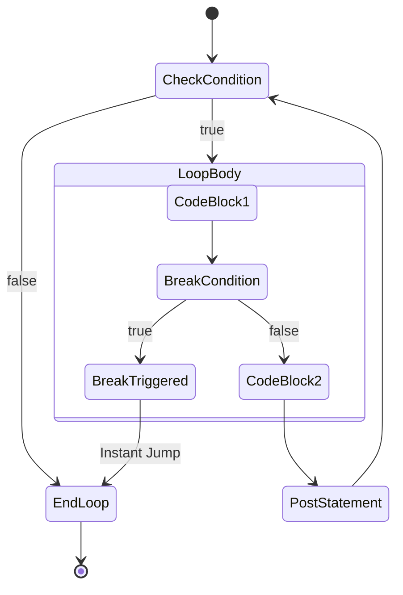

# The `break` Statement

The `break` statement is used to immediately terminate the execution of the innermost `for`, `switch`, or `select` block.

## 1. Breaking out of Loops

When a `break` is encountered, the program instantly jumps to the first line of code following the loop's closing brace `}`.

```go
for i := 0; i < 10; i++ {
    if i == 4 {
        fmt.Println("Breaking at 4")
        break
    }
    fmt.Println(i)
}
// Output: 0, 1, 2, 3, Breaking at 4
```

### 📊 Control Flow Diagram



## 2. Breaking in `switch` and `select`

Unlike languages like C or Java, where `break` is mandatory at the end of every `switch` case to prevent fallthrough, **Go breaks automatically**. 

However, you can still use `break` inside a `switch` if you want to exit the case block *early* based on some dynamic condition.

```go
func process(val int) {
    switch val {
    case 1:
        if !isReady() {
            break // Exits the switch immediately
        }
        fmt.Println("Processing 1")
    }
    fmt.Println("Finished processing")
}
```

## 3. The Nested Loop Trap

A common bug in Go occurs when developers try to break out of a nested loop, but accidentally only break out of an inner `switch` or `select`.

```go
for {
    switch status {
    case "stop":
        break // 🛑 BUG: This only breaks the SWITCH, not the FOR loop!
    }
}
```

**Insight**: A plain `break` always terminates the *innermost* block it belongs to. To break out of the `for` loop from inside a `switch`, you must use **Labels** (which we will cover in upcoming lessons).
