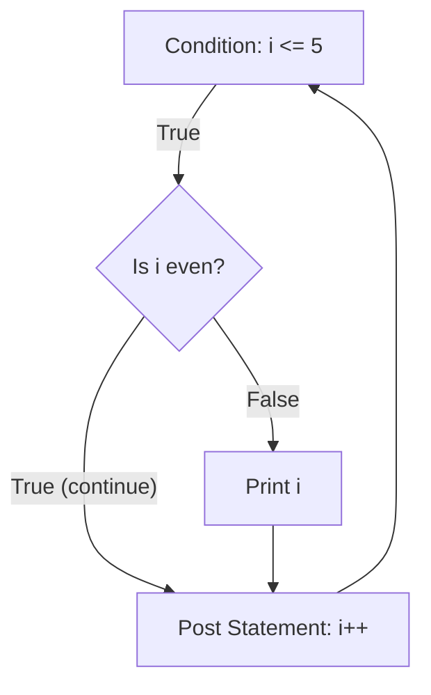

# The `continue` Statement

While `break` completely destroys and exits a loop, `continue` merely skips the rest of the current iteration and instantly jumps to the next one.

## 1. Basic Usage

`continue` is primarily used as a "guard clause" inside a loop. It helps keep the main logic un-indented and highly readable by filtering out invalid data early.

```go
for i := 1; i <= 5; i++ {
    if i%2 == 0 {
        continue // Skip even numbers
    }
    fmt.Println(i) // Only prints 1, 3, 5
}
```

### 🧠 Execution Flow with `continue`

Notice carefully what happens to the post-statement (`i++`).



**Crucial Insight**: When `continue` is triggered, it does **not** bypass the loop's post-statement. In a C-style `for` loop, the `i++` will still execute. If it didn't, the loop would be stuck in an infinite cycle.

## 2. Refactoring for Clean Code (The "Happy Path")

Junior developers often write deeply nested `if` statements inside loops. Senior Go developers use `continue` to flatten the code.

**❌ Bad (Deep Nesting):**
```go
for _, user := range users {
    if user.IsActive {
        if user.HasPaid {
            sendPremiumEmail(user)
        }
    }
}
```

**✅ Good (Guard Clauses with Continue):**
```go
for _, user := range users {
    if !user.IsActive {
        continue
    }
    if !user.HasPaid {
        continue
    }
    // The "Happy Path" is flush left
    sendPremiumEmail(user) 
}
```
**Architecture Insight**: Flattening logic using `continue` reduces the cyclomatic complexity of your functions, making them easier to unit test and maintain.
