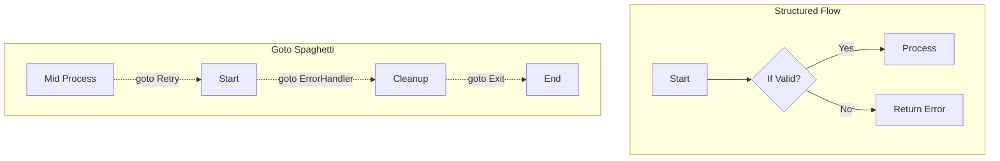

# goto (When NOT to use)

## 1️⃣ Learning Objectives
* **What you'll learn**: Understand the mechanics of the `goto` statement, why it exists, and the severe implications of using it improperly.
* **Why it matters**: Misusing `goto` leads to "Spaghetti Code"—an unreadable, unmaintainable control flow that destroys the structural integrity of your backend system.
* **Where it's used**: Almost strictly isolated to extremely performance-sensitive inner loops, complex state machines, or parsing algorithms generated by lexers/parsers.

---

## 2️⃣ Real-world Story
Imagine a well-organized factory floor (normal control flow). Products move from conveyor belt A to B to C smoothly. Everyone knows the process.

Now imagine a manager yelling, *"If this product is red, teleport it immediately to the shipping dock, bypassing quality control!"* 

This is `goto`. It breaks the established, predictable assembly line (loops, conditionals) and forcefully jumps execution to a completely different part of the codebase. It creates chaos, unpredictability, and makes debugging a nightmare.

---

## 3️⃣ Visual Learning (Execution Flow & Architecture)


---

## 4️⃣ Internal Working (Under the Hood)
At the CPU level, a `goto` statement translates directly into an unconditional `JMP` (jump) instruction in assembly language. 
The Go compiler turns `goto LABEL` into a hard instruction to modify the CPU's Program Counter (PC) to point to the memory address of that label.

There is no structural overhead, no stack frame creation, and no context switching. This makes `goto` computationally identical to a loop iteration under the hood, but syntactically unrestricted.

---

## 5️⃣ Compiler Behavior
* **Static Single Assignment (SSA)**: The Go compiler has to maintain a control flow graph (CFG). `goto` creates highly irregular edges in this graph, making compiler optimizations (like register allocation or dead code elimination) significantly harder.
* **Scope Restrictions**: The Go compiler enforces strict rules: You **cannot** use `goto` to jump *over* a variable declaration into its scope, nor can you jump into a block from outside it.

---

## 6️⃣ Memory Management
`goto` itself has zero impact on memory allocations, garbage collection, or heap/stack dynamics. Its danger lies purely in control flow and logical state corruption.

---

## 7️⃣ Code Examples

### 🔹 Example 1: The Classic "Spaghetti" (Avoid this)
```go
package main
import "fmt"

func badExample() {
    i := 0
LoopStart:
    fmt.Println(i)
    i++
    if i < 5 {
        goto LoopStart // NEVER do this. Use a standard 'for' loop.
    }
}
```

### 🔹 Example 2: Intermediate (Escaping nested loops)
```go
// While better solved with labeled breaks, this is technically valid.
func processMatrix(matrix [][]int) {
    for r := range matrix {
        for c := range matrix[r] {
            if matrix[r][c] == -1 {
                goto ErrorState // Jump entirely out of the nested structure
            }
        }
    }
    return
ErrorState:
    fmt.Println("Critical error found in matrix")
}
```

### 🔹 Example 3: Production (State Machine)
Often used in high-performance networking protocol parsers.
```go
func parsePacket(data []byte) error {
    state := 0
    i := 0
StateReadHeader:
    if i >= len(data) { goto End }
    if data[i] == 0x01 {
        state = 1
        i++
        goto StateReadBody
    }
    
StateReadBody:
    // process body...
    
End:
    return nil
}
```

---

## 8️⃣ Production Examples
1. **The Go Standard Library (`math/big`)**: Core math operations use `goto` for extreme micro-optimizations inside mathematical loops.
2. **Lexers and Parsers (`go/scanner`)**: Generated code (like from `yacc`) heavily relies on `goto` because it strictly models a mathematical Finite State Machine (FSM).

---

## 9️⃣ Performance & Benchmarking
Is `goto` faster than a `for` loop or a labeled `break`?
**No.** The Go compiler optimizes `for` loops and `goto` into the exact same underlying `JMP` assembly instructions. Using `goto` for "speed" is a fundamental misunderstanding of modern compilers.

---

## 🔟 Best Practices
* ✅ **Do**: Use `goto` **only** for complex error cleanup paths that cannot be handled cleanly by `defer` or multiple return statements (very rare in modern Go).
* ❌ **Don't**: Use `goto` to simulate loops.
* 🏢 **Google Style**: The official Go Code Review Comments explicitly advise against `goto` unless absolutely required for auto-generated code or highly specific performance tuning in the standard library.

---

## 11️⃣ Common Mistakes
1. **Jumping over declarations**: 
```go
goto Skip
v := 10 // COMPILER ERROR: goto Skip jumps over declaration of v
Skip:
fmt.Println(v) 
```
2. **Infinite Loops**: Accidentally pointing a `goto` backward without a proper terminating condition, stalling the CPU.

---

## 12️⃣ Debugging
* **Trace**: Visualizing control flow becomes nearly impossible with `goto`.
* **Delve**: Stepping through code with a debugger is highly disorienting when the instruction pointer randomly jumps backward and forward across the function.

---

## 13️⃣ Exercises
1. **Easy**: Run the "Compiler Error" code in Example 11. Read the exact error message the Go compiler throws.
2. **Medium**: Refactor Example 2 to achieve the exact same behavior using a **Labeled Break** instead of `goto`.
3. **Expert**: Read the source code of `math/big/nat.go` in the Go standard library and locate their usage of `goto`.

---

## 14️⃣ Quiz
1. **MCQ**: What underlying assembly instruction does `goto` translate into?
   - A) `CALL`
   - B) `RET`
   - C) `JMP`
2. **Debugging**: Why does jumping over a variable declaration trigger a compiler error in Go?

---

## 15️⃣ FAANG Interview Questions
* **Beginner**: Why is `goto` considered harmful in modern programming?
* **Intermediate**: What is the difference between a labeled `break` and a `goto`?
* **Senior (Google/Meta)**: In what specific scenario (e.g., inside an automated lexer) does `goto` mathematically represent a system state better than standard loops?

---

## 16️⃣ Mini Project
**Custom Lexical Scanner**
Build a simple tokenizer that parses mathematical expressions (e.g., `3 + 5 * 2`). Instead of a massive `switch` statement, implement the tokenization logic using a finite state machine backed purely by `goto` labels to jump between `ReadNumber` and `ReadOperator` states. Compare its readability to a standard `switch`.

---

## 17️⃣ Enterprise Features & Observability
* **Tracing Challenges**: `goto` paths make Distributed Tracing (OpenTelemetry) spans incredibly difficult to wrap naturally, as spans usually rely on predictable function closures or block scopes.

---

## 18️⃣ Source Code Reading
* **Why it was included**: Go's creators (Rob Pike, Ken Thompson) have roots in C and Unix. `goto` is a fundamental primitive in C for error handling and cleanup (prior to Go's invention of `defer`). It was kept in Go for low-level parity, but heavily restricted to prevent abuse.

---

## 19️⃣ Architecture
When designing Clean Architecture, `goto` should **never** cross architectural boundaries. It must remain strictly confined inside single, highly localized handler functions or parser utilities.

---

## 20️⃣ Summary & Cheat Sheet
* **Rule of Thumb**: Pretend `goto` doesn't exist. 
* **If you must**: Use it only for centralized error handling or complex state machines.
* **Alternative**: Use labeled `break` and `continue` to escape nested loops cleanly.
