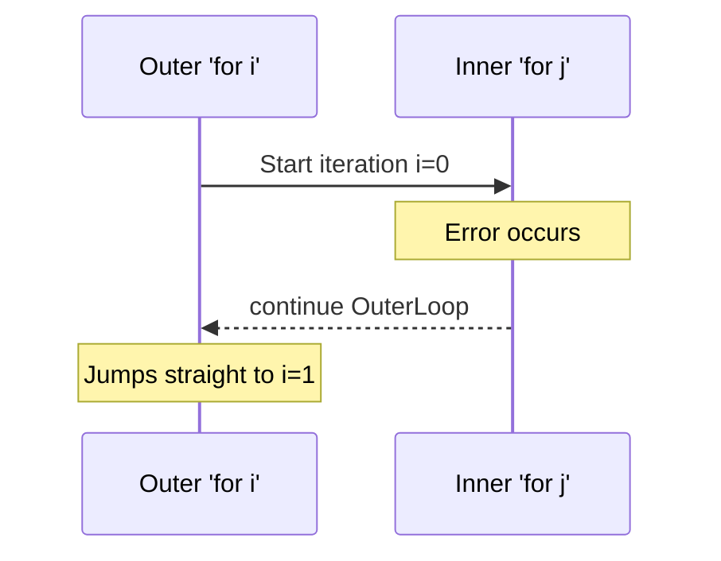

# Labeled Statements

In standard control flow, `break` and `continue` only affect the **innermost** loop or switch they are placed in. But what happens when you have a loop *inside* another loop, and you need to break out of the outer loop entirely?

This is where **Labels** come into play.

## 1. What is a Label?

A label is an identifier followed by a colon (`:`). It acts as a marker for a specific loop. You can then instruct `break` or `continue` to target that specific marker.

```go
OuterLoop: // This is a label
for i := 0; i < 3; i++ {
    for j := 0; j < 3; j++ {
        if i == 1 && j == 1 {
            break OuterLoop // Breaks the top-level loop, not just the inner one!
        }
        fmt.Printf("i:%d j:%d\n", i, j)
    }
}
```

## 2. Real-World Use Case: The `select` Trap

The most critical use case for labels in Go involves concurrency. When you write an infinite `for` loop that listens to channels using `select`, a standard `break` will only break the `select`, causing an infinite loop.

```go
// ❌ DANGEROUS: Infinite Loop Bug
func worker(ch chan int) {
    for {
        select {
        case msg := <-ch:
            if msg == 0 {
                break // BUG: This only breaks the select! The 'for' loop continues forever.
            }
        }
    }
}
```

### The Fix: Labeled Break

```go
// ✅ CORRECT: Clean exit
func worker(ch chan int) {
WorkerLoop:
    for {
        select {
        case msg := <-ch:
            if msg == 0 {
                break WorkerLoop // Safely terminates the entire goroutine
            }
        }
    }
}
```

## 3. Labeled `continue`

Labels can also be used with `continue`. If an inner loop determines that the outer loop needs to skip to its next iteration, a labeled continue is perfect.



```go
MatrixLoop:
for r := 0; r < rows; r++ {
    for c := 0; c < cols; c++ {
        if matrix[r][c] == nil {
            // Row is corrupted, skip to the next row entirely
            continue MatrixLoop 
        }
    }
}
```
