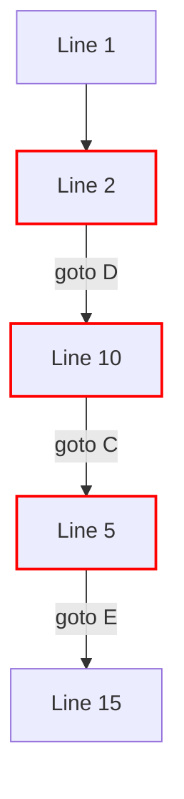

# The `goto` Statement (And When Not to Use It)

The `goto` statement allows you to jump execution arbitrarily to any labeled line in the same function. 

While Go includes `goto`, it is heavily stigmatized in modern software engineering. 

## 1. Syntax

```go
func main() {
    i := 0

LoopStart:
    if i >= 5 {
        goto End
    }
    fmt.Println(i)
    i++
    goto LoopStart

End:
    fmt.Println("Finished")
}
```
*Note: This code manually implements a loop using `goto`. This is considered terrible practice.*

## 2. Why is `goto` Considered Harmful?

In 1968, computer scientist Edsger W. Dijkstra published a famous letter titled *"Go To Statement Considered Harmful"*. 


*The "Spaghetti Code" Problem*

**The issue with `goto`:**
1. **Destroys Control Flow**: Humans read code linearly (top to bottom) or hierarchically (loops and if-statements). `goto` creates erratic, unpredictable jumps.
2. **Breaks Variable Scoping**: Jumping over variable declarations can lead to complex compiler errors or undefined states.
3. **Unmaintainable**: Tracing bugs in code heavily reliant on `goto` is nearly impossible because the execution history is lost.

## 3. The ONLY Valid Use Case in Go

While 99% of developers will never need `goto`, the Go standard library *does* use it in a few highly specific scenarios, mostly for **performance optimization in centralized error handling**.

In highly optimized internal library code (like the `math` or `crypto` packages), you might see `goto` used to jump to a centralized cleanup block instead of repeating cleanup code.

```go
func complexOperation() error {
    file1, err := os.Open("a.txt")
    if err != nil {
        return err
    }
    
    file2, err := os.Open("b.txt")
    if err != nil {
        goto Cleanup1 // Jump to cleanup
    }

    // Do complex work...
    if workFailed {
        goto Cleanup2
    }

    return nil

Cleanup2:
    file2.Close()
Cleanup1:
    file1.Close()
    return fmt.Errorf("operation failed")
}
```
**Modern Go Rule:** Use `defer` for cleanup instead of `goto`. `defer` is safer and more readable. Only use `goto` if `defer` introduces unacceptable performance overhead in microsecond-critical hot paths.
