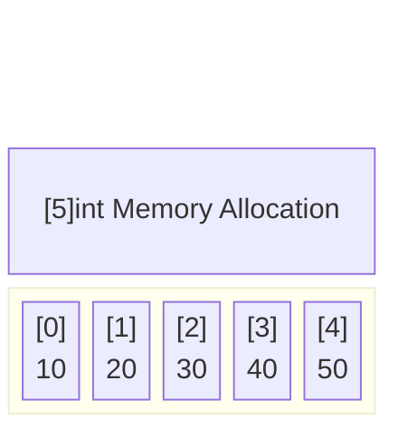

# Arrays: The Fixed Foundation

In Go, an **Array** is a numbered sequence of elements of a single type with a **fixed length**. 

While you will rarely use raw Arrays in everyday Go programming (you will use Slices instead), understanding Arrays is absolutely critical because **Arrays are the underlying memory foundation for Slices**.

## 1. Syntax and Declaration

The length of an array is part of its type. This means `[3]int` and `[4]int` are two completely different, incompatible types.

```go
// 1. Explicit declaration
var primes [5]int
primes[0] = 2
primes[1] = 3

// 2. Short declaration with literal
names := [3]string{"Alice", "Bob", "Charlie"}

// 3. Compiler-inferred length using [...]
colors := [...]string{"Red", "Green", "Blue"} 
// The compiler counts 3 items, making this type [3]string
```

## 2. Memory Layout (Under the Hood)

Arrays in Go are highly efficient because they represent a **contiguous block of memory**. 



Because the memory is contiguous, the CPU can cache array data extremely effectively (spatial locality), making read/write operations incredibly fast compared to linked lists.

## 3. Arrays are Values (Pass by Copy)

Unlike C or C++, where the name of an array acts as a pointer to its first element, **in Go, arrays are values.** 

If you assign an array to a new variable, or pass it into a function, **Go creates a complete byte-for-byte copy of the entire array.**

```go
func main() {
    original := [3]int{1, 2, 3}
    
    // This copies the entire array memory!
    copied := original 
    copied[0] = 99 
    
    fmt.Println(original[0]) // Output: 1 (original is unchanged)
}
```

### ⚠️ Performance Danger
Passing a `[1000000]int` array into a function will literally copy 8 Megabytes of memory every single time the function is called, destroying performance and triggering garbage collection pressure.

This is exactly why Go introduced **Slices**.
