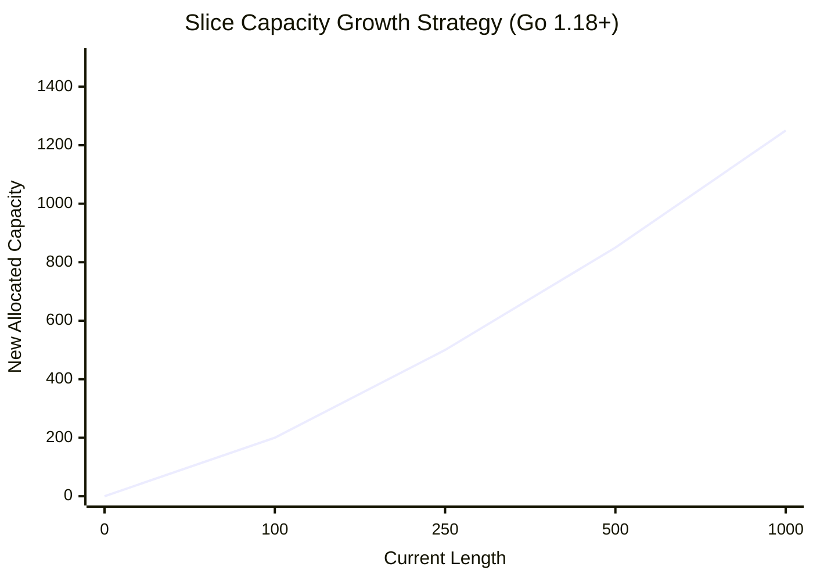

# The `append` Function

Since arrays are fixed in size, how do slices grow? Go provides the built-in `append` function to add elements to the end of a slice.

## 1. Basic Usage

The `append` function takes a slice and one or more elements to add, and returns a **new** slice descriptor.

```go
nums := make([]int, 0, 5) // Len 0, Cap 5
nums = append(nums, 1)    // [1]
nums = append(nums, 2, 3) // [1, 2, 3]

// Append another slice using the spread operator (...)
moreNums := []int{4, 5}
nums = append(nums, moreNums...) // [1, 2, 3, 4, 5]
```
*Notice that we must reassign the result back to `nums`. Why? Because if the slice grows beyond its capacity, `append` must return a brand new slice header.*

## 2. How Growth Actually Works (Under the Hood)

What happens when you try to `append` to a slice that has reached its maximum capacity?

```go
nums := make([]int, 0, 3)
nums = append(nums, 1, 2, 3) // Array is now FULL. (Len 3, Cap 3)

// What happens here?
nums = append(nums, 4) 
```

Since the backing array cannot physically grow in memory, the Go runtime does the following behind the scenes:
1. It requests a brand **new, larger array** from the operating system's heap.
2. It **copies** all existing elements from the old array to the new array.
3. It adds the new element (`4`).
4. It returns a new `SliceHeader` pointing to the new array.
5. The Garbage Collector eventually destroys the old array.

### 📈 The Capacity Growth Algorithm

Go doesn't just increase capacity by 1 (that would be horribly slow). It uses an **Amortized Growth Factor**.



* **Go < 1.18**: If capacity < 1024, it doubles (`2x`). Above 1024, it grows by `1.25x`.
* **Go >= 1.18**: The algorithm was smoothed out. It still doubles for small slices, but slowly transitions to a `1.25x` growth rate for larger slices to prevent massive, sudden memory spikes.

## 3. Performance Optimization: Pre-allocation

Because growing a slice requires requesting new memory and copying data, it is a slow operation.

**❌ Bad (Forces multiple allocations and copies):**
```go
var data []int
for i := 0; i < 10000; i++ {
    data = append(data, i) // Reallocates multiple times!
}
```

**✅ Good (Zero allocations after setup):**
```go
// We know we need 10,000 slots, so allocate them up front!
data := make([]int, 0, 10000)
for i := 0; i < 10000; i++ {
    data = append(data, i) // Blazing fast, never reallocates.
}
```
