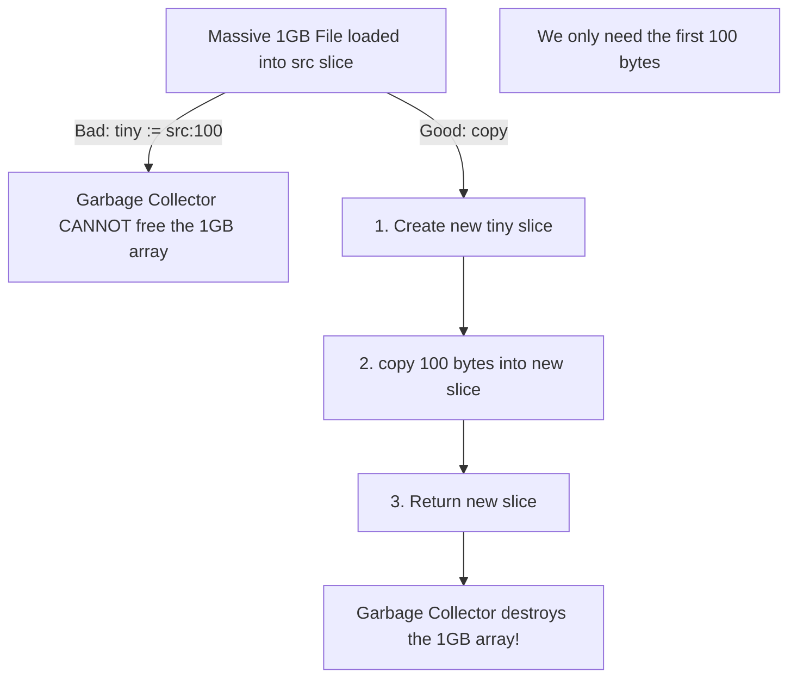

# The `copy` Function

In Go, variables are assigned by value. When you assign one slice to another (`b := a`), you are only copying the 24-byte `SliceHeader`. Both slices end up pointing to the exact same backing array.

To perform a true **Deep Copy** (duplicating the actual underlying data), you must use the built-in `copy` function.

## 1. Syntax and Rules

The `copy(dst, src)` function copies elements from a source slice to a destination slice. 
It returns the number of elements copied, which will be the *minimum* of `len(src)` and `len(dst)`.

```go
src := []int{1, 2, 3, 4, 5}
dst := make([]int, len(src)) // MUST pre-allocate the destination!

// Deep copy the data
elementsCopied := copy(dst, src)

fmt.Println(dst) // [1, 2, 3, 4, 5]
```

**⚠️ Critical Rule**: `copy` only copies into existing length. If you do `dst := make([]int, 0)` (length zero), `copy` will copy zero elements!

## 2. Solving the Memory Leak Trap

In the *Slice Internals* lesson, we mentioned a classic memory leak: loading a massive file into memory, returning a tiny slice of it, and accidentally keeping the massive file in memory forever.

`copy` is the ultimate solution to this problem.



### Code Example: Fixing the Leak

**❌ Bad (Memory Leak):**
```go
func getHeader() []byte {
    rawFile := ioutil.ReadFile("massive_10GB_file.log")
    return rawFile[:50] // Keeps 10GB in memory forever!
}
```

**✅ Good (Deep Copy):**
```go
func getHeader() []byte {
    rawFile := ioutil.ReadFile("massive_10GB_file.log")
    
    // Allocate exactly 50 bytes of fresh memory
    header := make([]byte, 50) 
    
    // Copy the data over
    copy(header, rawFile[:50]) 
    
    // rawFile drops out of scope, GC frees the 10GB!
    return header 
}
```

## 3. Deleting Elements from a Slice

Go does not have a built-in `delete` function for slices. Instead, we use a combination of slicing and `append` (which uses `copy` under the hood) to overwrite the deleted element.

```go
letters := []string{"A", "B", "C", "D", "E"}

// Let's delete index 2 ("C")
// 1. Take everything up to index 2: ["A", "B"]
// 2. Append everything after index 2: ["D", "E"]
letters = append(letters[:2], letters[3:]...)

fmt.Println(letters) // ["A", "B", "D", "E"]
```
