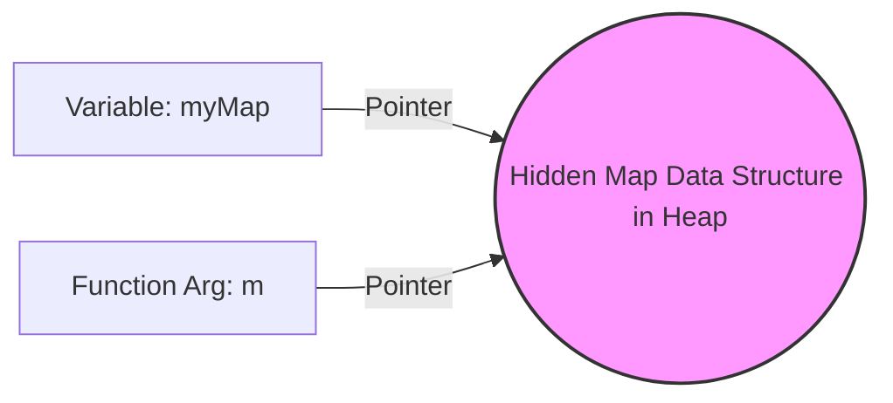

# Maps

A map in Go is an unordered collection of key-value pairs. It provides average `O(1)` time complexity for lookups, insertions, and deletions, making it one of the most powerful and frequently used data structures.

## 1. Declaration and Initialization

Just like slices, maps must be initialized before use. An uninitialized map is `nil`, and writing to a `nil` map will cause a **runtime panic**.

```go
// ❌ DANGEROUS: This is a nil map. 
var nilMap map[string]int
// nilMap["Alice"] = 25 // PANIC: assignment to entry in nil map

// ✅ GOOD: Initialized with a literal
users := map[string]int{
    "Alice": 25,
    "Bob":   30,
}

// ✅ GOOD: Initialized with make()
cache := make(map[string]string)
```

## 2. Reading, Writing, and Deleting

```go
scores := make(map[string]int)

// Write
scores["Alice"] = 100

// Read
fmt.Println(scores["Alice"]) // 100

// Delete
delete(scores, "Alice")
```

## 3. The "Comma Ok" Idiom (Existence Check)

What happens if you read a key that doesn't exist? Go will **not** throw an error. Instead, it returns the **zero value** for the map's value type.

```go
scores := make(map[string]int)
fmt.Println(scores["Charlie"]) // Prints 0
```
But wait—did Charlie score a `0`, or does Charlie not exist in the map? 

To differentiate, Go uses the "comma ok" idiom. When reading from a map, you can optionally request a second boolean value that tells you if the key actually exists.

```go
score, exists := scores["Charlie"]
if !exists {
    fmt.Println("Charlie is not in the system.")
} else {
    fmt.Println("Charlie's score:", score)
}
```

## 4. Maps are References

Like slices, maps are passed by reference. When you pass a map to a function, you are passing a pointer to the underlying data structure. 



```go
func modifyMap(m map[string]int) {
    m["Alice"] = 999 // This modifies the original map!
}
```
**Concurrency Warning:** Maps are **not** thread-safe. If two goroutines attempt to read and write to the exact same map simultaneously, your program will fatally crash with a `fatal error: concurrent map read and map write`. (We will solve this later with `sync.RWMutex` or `sync.Map`).
