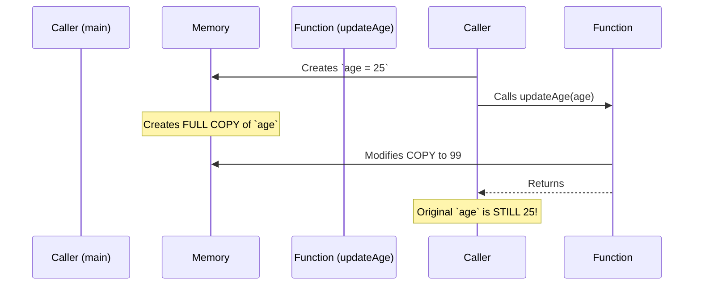

# Parameters: Value vs Pointer

Understanding how data is passed into functions is the most critical concept for memory management in Go. 

By default, **Go is entirely Pass-By-Value**.

## 1. Pass-by-Value (The Default)

When you pass a variable to a function, Go creates a brand new copy of that variable in the computer's memory. Any modifications made inside the function apply only to the copy, leaving the original intact.



```go
func updateAge(a int) {
    a = 99 // Only modifies the local copy
}

func main() {
    age := 25
    updateAge(age)
    fmt.Println(age) // Prints 25!
}
```

## 2. Pass-by-Pointer (By Reference)

If you *want* the function to modify the original variable, you must pass a **pointer** (the exact memory address of the variable). 

You use `&` to get the address, and `*` to dereference it (access the value at that address).

```go
func updateAge(a *int) {
    *a = 99 // Dereferences the pointer and modifies the original memory!
}

func main() {
    age := 25
    updateAge(&age) // Pass the memory address
    fmt.Println(age) // Prints 99!
}
```

## 3. The Performance Trade-off

Pointers aren't just for mutation; they are critical for performance.

Imagine you have a massive `User` struct containing megabytes of data.

**❌ Pass-by-Value (Terrible Performance):**
```go
// Every time this is called, Go allocates 1MB of new memory 
// and copies the entire struct byte-by-byte!
func processUser(u User) { ... } 
```

**✅ Pass-by-Pointer (Instantaneous):**
```go
// Go only copies an 8-byte memory address. 
// Nearly zero allocation cost!
func processUser(u *User) { ... } 
```

**Rule of Thumb:**
* For small, primitive types (`int`, `bool`, `float64`), pass by value. It's faster because it avoids heap allocation.
* For large structs, or when mutation is required, pass by pointer.
* **Slices, Maps, and Channels** act like pointers internally. Passing them by value is inherently cheap and mutations will affect the original underlying data.
