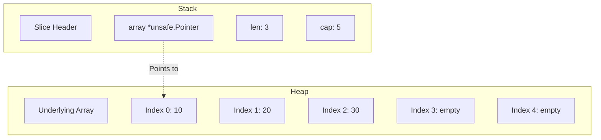

# Slices in Go: The Ultimate Guide

## 1️⃣ Learning Objectives
* **What you'll learn**: Master the internal mechanics of Slices, Go's dynamic array abstraction. Understand capacity, length, and underlying arrays.
* **Why it matters**: Slices are the most commonly used data structure in Go. Misunderstanding them leads to catastrophic memory leaks, race conditions, and severe performance bottlenecks.
* **Where it's used**: Literally everywhere—from buffering TCP streams to parsing JSON responses and managing worker pools.

---

## 2️⃣ Real-world Story
Imagine you own a cinema. An **Array** is the physical building with exactly 100 bolted-down seats. You cannot add a 101st seat without demolishing the building and building a new one. 

A **Slice** is your cinema manager holding a clipboard. The clipboard only contains three things:
1. The address of the cinema (Pointer to array).
2. How many tickets are currently sold (Length).
3. The total maximum seats the cinema has (Capacity).

When you sell 100 tickets, and the 101st person arrives, the slice manager silently buys a brand new cinema with 200 seats, moves everyone over, and updates the clipboard. The users never even notice!

---

## 3️⃣ Visual Learning (Execution Flow & Architecture)


---

## 4️⃣ Internal Working (Under the Hood)
Deep dive into the Go runtime source code (`src/runtime/slice.go`).

When you create a slice, you are creating a 24-byte struct (on 64-bit systems).
```go
type slice struct {
	array unsafe.Pointer // 8 bytes: Pointer to the contiguous memory block
	len   int            // 8 bytes: Number of elements actively used
	cap   int            // 8 bytes: Total allocated capacity
}
```
**Key Takeaway**: A slice is passed **by value** in Go. When you pass a slice to a function, you are copying the 24-byte header, NOT the underlying data. However, since the copied header still points to the same underlying array, mutations to the elements will affect the original slice!

---

## 5️⃣ Compiler Behavior
* **Escape Analysis**: Slices created with literal syntax `[]int{1, 2}` or small `make` sizes often stay on the stack. If the capacity is unknown at compile time, or it gets passed to an interface (`fmt.Println`), it escapes to the heap.
* **SSA Bounds Checking**: Go's compiler inserts automatic boundary checks before array accesses. The SSA optimization pass attempts to eliminate redundant bounds checks within loops (`BCE - Bounds Check Elimination`).

---

## 6️⃣ Memory Management
* **Heap vs Stack**: Slices themselves (the header) live on the stack. The underlying array often lives on the heap (if it escapes or is large).
* **Garbage Collection (The Slice Leak)**: If you slice a massive array (e.g., `small := massive[:10]`), the underlying array CANNOT be garbage collected because the `small` slice header still holds a pointer to the start of the massive array!

---

## 7️⃣ Code Examples

### 🔹 Example 1: Simple
```go
package main
import "fmt"

func main() {
    // Literal
    nums := []int{1, 2, 3}
    
    // make(type, len, cap)
    words := make([]string, 0, 10)
    words = append(words, "Hello")
    
    fmt.Println(len(nums), cap(words))
}
```

### 🔹 Example 2: Intermediate (Subslicing)
```go
func process() {
    original := []int{10, 20, 30, 40, 50}
    sub := original[1:4] // [20, 30, 40]
    
    sub[0] = 99 // Mutates 'original' too!
    // original is now [10, 99, 30, 40, 50]
}
```

### 🔹 Example 3: Advanced (Zero-Allocation Filtering)
Filtering a slice in-place without allocating a new underlying array.
```go
func filterEven(nums []int) []int {
    n := 0
    for _, x := range nums {
        if x%2 == 0 {
            nums[n] = x
            n++
        }
    }
    // Prevent memory leak for pointers by nil-ing out the rest
    // for i := n; i < len(nums); i++ { nums[i] = nil } (if pointers)
    return nums[:n]
}
```

### 🔹 Example 4: Production
Pre-allocating capacity to prevent expensive runtime re-allocations when fetching database rows.
```go
func fetchUsers(db *sql.DB, userIDs []int) ([]User, error) {
    // PRE-ALLOCATE! Avoids growing the slice during the loop.
    users := make([]User, 0, len(userIDs))
    
    for _, id := range userIDs {
        u, _ := db.GetUser(id)
        users = append(users, u)
    }
    return users, nil
}
```

### 🔹 Example 5: Interview (Nil vs Empty)
```go
var a []int          // nil slice. len=0, cap=0, array=nil. (Preferred)
b := []int{}         // empty slice. len=0, cap=0, array!=nil. (Allocates an empty struct memory address)
```
JSON encoding treats `nil` as `null` and `[]int{}` as `[]`.

---

## 8️⃣ Production Examples
1. **Worker Pools**: Distributing chunks of a massive slice to different goroutines using `data[start:end]`.
2. **Batch Processing**: Using slices to accumulate Kafka messages until `len(batch) == 100`, then flushing to a database.
3. **TCP Buffers**: Using `make([]byte, 4096)` to read data directly off network sockets.

---

## 9️⃣ Performance & Benchmarking
**The Growth Algorithm** (As of Go 1.18+):
When `append` exceeds capacity:
* If current capacity < 256, double it.
* If >= 256, grow smoothly using a formula `(cap + 3*256) / 4`.

**Benchmarking Pre-allocation vs Append:**
```bash
go test -bench=. -benchmem
```
```go
func BenchmarkNoAlloc(b *testing.B) {
    for i := 0; i < b.N; i++ {
        var s []int
        for j := 0; j < 10000; j++ { s = append(s, j) } // 19 allocations
    }
}
func BenchmarkAlloc(b *testing.B) {
    for i := 0; i < b.N; i++ {
        s := make([]int, 0, 10000)
        for j := 0; j < 10000; j++ { s = append(s, j) } // 1 allocation
    }
}
```

---

## 🔟 Best Practices
* ✅ **Do**: Always use `make([]T, 0, cap)` when the maximum size is known.
* ✅ **Do**: Use `var s []int` instead of `s := []int{}` to declare empty slices (nil is a valid slice).
* ❌ **Don't**: Pass large slices by pointer `func do(s *[]int)`. Just pass the slice by value `func do(s []int) []int`, the array pointer is already inside!
* 🏢 **Google Style**: Return a copy of a subslice if returning a small subset of a massive array to prevent GC leaks.

---

## 11️⃣ Common Mistakes
1. **The Append Trap**:
```go
func modify(s []int) {
    s = append(s, 4) // Local copy of header gets updated, caller's slice doesn't!
}
```
2. **The Memory Leak**:
```go
func getHeader(file []byte) []byte {
    return file[:50] // The ENTIRE file stays in memory!
}
// Fix:
func getHeader(file []byte) []byte {
    res := make([]byte, 50)
    copy(res, file[:50])
    return res
}
```

---

## 12️⃣ Debugging
* **Trace Allocations**: Run `go build -gcflags="-m"` to see if your slice escapes to the heap.
* **Data Races**: If multiple goroutines append to the same slice, it triggers a catastrophic data race. Always use a `sync.Mutex` or channels.

---

## 13️⃣ Exercises
1. **Easy**: Write a function that reverses a slice in-place.
2. **Medium**: Implement a stack using a slice (Push and Pop methods).
3. **Hard**: Write a generic function `func Chunk[T any](slice []T, size int) [][]T` that breaks a slice into chunks.
4. **Expert**: Recreate the `runtime.slice` behavior using `unsafe.Pointer` directly.

---

## 14️⃣ Quiz
**Output Prediction**: What does this print?
```go
a := make([]int, 2, 5)
a[0] = 10
a[1] = 20
b := append(a, 30)
a[0] = 99
fmt.Println(b[0])
```
*Answer*: `99`. Because `append` did not trigger a reallocation (cap is 5), `b` and `a` share the same underlying array!

---

## 15️⃣ FAANG Interview Questions
* **Beginner**: What is the difference between length and capacity?
* **Intermediate**: Why shouldn't you pass a slice by a pointer?
* **Senior (Google/Meta)**: Explain exactly how a memory leak occurs when subslicing, and how the garbage collector views the `runtime.slice` pointer fields. How would you design a memory-safe custom slice manager for an ultra-low latency trading system?

---

## 16️⃣ Mini Project
**Real-Time Log Parser**
Build an application that reads a massive 10GB log file in chunks. Use buffered slices `make([]byte, 4096)` to read the bytes, parse them into structured JSON slices, and dispatch them to worker goroutines. Keep allocations at strictly 0 during the read loop!

---

## 17️⃣ Enterprise Features & Observability
* **Logging**: When logging slices, truncate them! `slog.Any("ids", ids[:min(len(ids), 10)])` to prevent OOM errors in your logging pipeline.
* **Testing**: Use `cmp.Diff` (from `github.com/google/go-cmp/cmp`) to compare complex slices in unit tests.

---

## 18️⃣ Source Code Reading
Open your terminal and type:
`cat $(go env GOROOT)/src/runtime/slice.go`
* **Why it was implemented this way**: The 3-word slice header allows slices to be extremely lightweight and passed efficiently via CPU registers without dereferencing pointers.
* **Trade-offs**: Shared memory by default. This makes Go fast, but requires developers to understand memory safety and copying explicitly.

---

## 19️⃣ Architecture
When passing slices between your Clean Architecture layers:
* **Repository -> Service**: The repository should allocate the exact slice capacity from the database rows.
* **Service -> Handler**: If the service filters the slice, return the filtered subset to the handler.

---

## 20️⃣ Summary & Cheat Sheet
* **Make**: `s := make([]int, len, cap)`
* **Append**: `s = append(s, 1)`
* **Copy**: `copy(dst, src)`
* **Subslice**: `s[start:end]`
* **Clear (Go 1.21+)**: `clear(s)` sets all elements to zero value without changing length.
