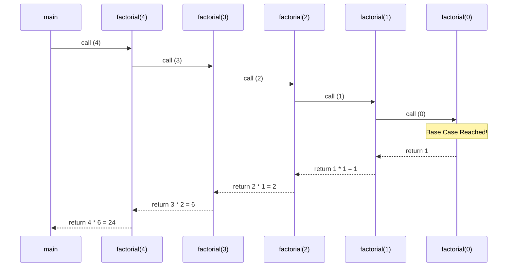

# Recursion

Recursion occurs when a function calls itself in order to solve a smaller instance of the same problem. 

## 1. The Anatomy of Recursion

Every valid recursive function must have two parts:
1. **The Base Case**: A condition that stops the recursion.
2. **The Recursive Step**: The part of the function that calls itself with a modified parameter.

```go
func factorial(n int) int {
    // 1. Base Case
    if n == 0 {
        return 1
    }
    // 2. Recursive Step
    return n * factorial(n-1)
}

func main() {
    fmt.Println(factorial(4)) // 24
}
```

## 2. The Call Stack

When `factorial(4)` runs, the function doesn't instantly return 24. Instead, it pauses execution and places a new "Stack Frame" on top of the computer's memory stack for `factorial(3)`.



## 3. Go's Dynamic Stacks & Stack Overflow

If you forget a base case, you create infinite recursion. In C or Java, this quickly causes a `StackOverflowError` because threads have fixed-size stacks (usually 1-2 MB).

Go handles stacks differently. A Goroutine starts with a microscopic **2KB stack**. As your recursion goes deeper, if the stack runs out of room, Go dynamically pauses your program, allocates a larger stack, copies the memory over, and resumes. 

However, even Go has limits. If you recurse infinitely, Go will eventually hit its maximum stack size limit (usually 1GB on 64-bit systems) and crash with a `runtime: goroutine stack exceeds 1000000000-byte limit`.

## 4. Tail Call Optimization (TCO)

In functional languages like Haskell or Elixir, compilers use "Tail Call Optimization". If the recursive call is the very last instruction in the function, the compiler turns it into a `for` loop under the hood to prevent stack memory from growing.

**Crucial Insight: Go does NOT support Tail Call Optimization.**
Because Go is designed for fast compilation and clear stack traces (for debugging panics), the Go compiler will not flatten your recursive calls. 

**Best Practice:** In Go, if a problem can be easily solved with a simple `for` loop, you should use the loop instead of recursion to save memory and CPU overhead.
