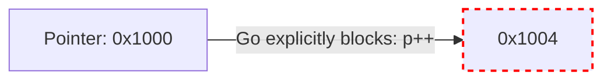

# Pointers

A pointer is simply a variable that stores the memory address of another variable. Instead of holding a value (like `42`), it holds a hexadecimal coordinate in your computer's RAM (like `0x14000112018`).

## 1. Syntax: `&` and `*`

There are two operators you must memorize:
* `&` (Address-Of): Retrieves the memory address of a variable.
* `*` (Dereference): Follows a memory address to retrieve or modify the actual value stored there.

```go
func main() {
    age := 25
    
    // Create a pointer to 'age'
    var ptr *int = &age 
    
    fmt.Println(age)  // 25
    fmt.Println(ptr)  // 0x140000a4018 (Memory address)
    fmt.Println(*ptr) // 25 (Dereferencing the pointer)
    
    // Modify the value via the pointer
    *ptr = 99
    
    fmt.Println(age)  // 99
}
```

## 2. Nil Pointers and Panics

If you declare a pointer but do not assign it to an address, its value is `nil`. 

```go
var userPtr *string

// fmt.Println(*userPtr) // 🛑 PANIC: runtime error: invalid memory address or nil pointer dereference
```
Dereferencing a `nil` pointer is the most common reason Go applications crash. You must always ensure a pointer is valid before dereferencing it:

```go
if userPtr != nil {
    fmt.Println(*userPtr)
}
```

## 3. Why No Pointer Arithmetic?

If you come from C or C++, you are used to manipulating pointers using math.
```c
// C Code
int arr[] = {10, 20, 30};
int *p = arr;
p++; // Move pointer 4 bytes forward to point at '20'
```

**Go absolutely forbids Pointer Arithmetic.** 



Why? Memory safety. Pointer arithmetic is the root cause of buffer overflows, security vulnerabilities, and memory corruption in C/C++. By banning it, Go guarantees memory safety while still giving you the performance benefits of passing data by reference.

## 4. Escaping the Sandbox: The `unsafe` Package

What if you are building an ultra-high-performance game engine or database in Go, and you *desperately* need pointer arithmetic to manually parse a block of raw bytes?

Go provides the `unsafe` package. It gives you a special type called `unsafe.Pointer` which allows you to bypass the compiler's type system and memory protections.

```go
import "unsafe"

func main() {
    arr := [2]int{10, 20}
    
    // 1. Get address of first element
    ptr := unsafe.Pointer(&arr[0]) 
    
    // 2. Perform math by converting to uintptr, adding 8 bytes, and converting back
    nextPtr := (*int)(unsafe.Pointer(uintptr(ptr) + 8))
    
    fmt.Println(*nextPtr) // Prints 20
}
```
**Warning:** Only use `unsafe` if you are writing low-level systems code. It breaks Go's compatibility guarantees and garbage collection safety nets.
