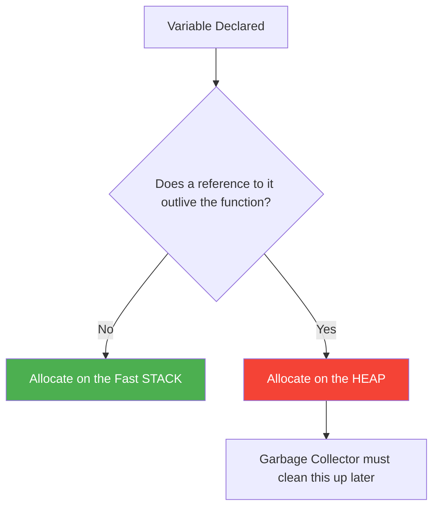

# Memory Layout and Escape Analysis

To write blazing-fast Go applications, you must understand exactly how Go structures its memory and how it decides where your variables live.

## 1. The Stack vs. The Heap

Your application uses two distinct areas of memory:

* **The Stack**: Fast, rigid, and localized. Variables are pushed onto the stack when a function starts, and instantly popped off (destroyed) when the function returns. Allocation here is practically free.
* **The Heap**: A massive pool of global memory. Variables here survive function returns. However, the Heap is messy. The **Garbage Collector (GC)** must constantly scan the Heap to find unused memory and clean it up. Too much Heap allocation causes GC pauses (lag).

## 2. Escape Analysis

In C, the developer decides where memory goes (`malloc` goes to the Heap). In Go, the compiler decides automatically using **Escape Analysis**.

If a variable "escapes" the function it was created in, it moves to the Heap.



```go
// STACK ALLOCATION
func calculate() int {
    x := 10 // Stays on stack. Destroyed when calculate() ends.
    return x 
}

// HEAP ESCAPE
func createUser() *User {
    u := User{Name: "Alice"} // 'u' is created here
    return &u // 🛑 Pointer returned! 'u' escapes to the Heap!
}
```
*Pro Tip: You can run `go build -gcflags="-m"` in your terminal to see exactly which variables the compiler is moving to the heap!*

## 3. CPU Cache Lines (Why Arrays beat Linked Lists)

When your CPU reads a variable from RAM, it doesn't just read that one byte. It reads a whole block of surrounding memory (usually 64 bytes) into its ultra-fast L1 Cache. This is called a **Cache Line**.

Because Arrays and Slices are contiguous in memory, traversing them is incredibly fast because the CPU caches the next elements automatically.

Linked lists or arrays of pointers (which point to random places in the Heap) cause **Cache Misses**, forcing the CPU to wait for RAM, which is 100x slower.

## 4. Struct Padding and Alignment

Go aligns variables in memory based on their size to make CPU reads efficient. Because of this, **the order of fields in a struct actually changes how much memory the struct consumes!**

```go
// ❌ BAD LAYOUT: 24 Bytes Total!
type BadStruct struct {
    A bool   // 1 byte (+ 7 bytes of wasted padding)
    B int64  // 8 bytes
    C bool   // 1 byte (+ 7 bytes of wasted padding)
}

// ✅ GOOD LAYOUT: 16 Bytes Total!
type GoodStruct struct {
    B int64  // 8 bytes
    A bool   // 1 byte
    C bool   // 1 byte (+ 6 bytes of padding at the end)
}
```
*Architecture Insight: Always order struct fields from largest to smallest (e.g., int64 -> int32 -> bool). This minimizes padding waste and packs your memory tightly!*
