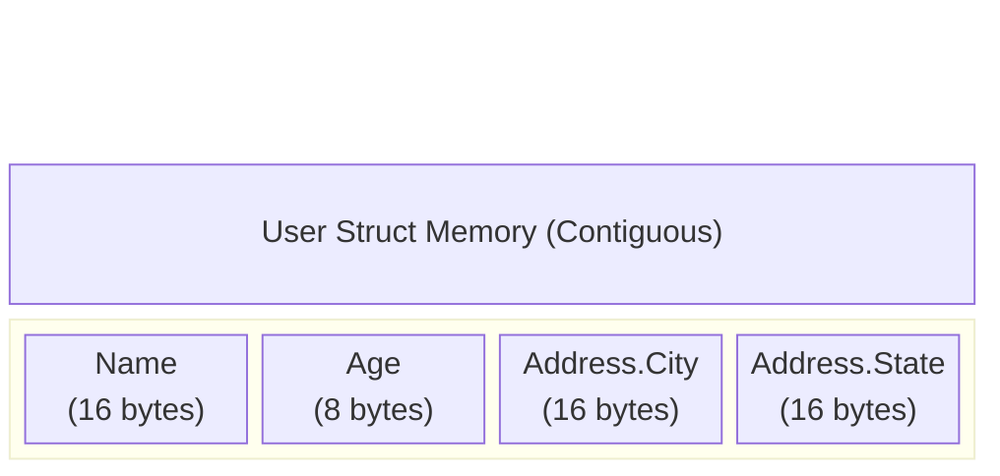

# Nested Structs

Because structs are just types, a struct can contain other structs as fields. This allows you to build complex, hierarchical data models.

## 1. Basic Nesting

```go
type Address struct {
    City  string
    State string
}

type User struct {
    Name    string
    Age     int
    Address Address // Nested struct
}
```

To instantiate a nested struct, you must explicitly declare the inner struct literal:

```go
alice := User{
    Name: "Alice",
    Age:  25,
    Address: Address{
        City:  "Seattle",
        State: "WA",
    },
}

// Accessing fields uses chain notation
fmt.Println(alice.Address.City) // "Seattle"
```

## 2. Memory Layout of Nested Structs

When a struct is nested, it is **not** a pointer to another place in memory (unless you specifically use `*Address`). 

The nested struct is flattened directly into the parent struct's contiguous memory block.



This is incredibly important for performance. Because the memory is contiguous, loading a `User` into the CPU Cache automatically loads their `Address` as well, resulting in zero cache misses.

## 3. Nesting with Anonymous Structs

If a nested component is only used inside one specific parent struct and nowhere else in your application, you can use an anonymous struct directly inside the field definition.

```go
type Server struct {
    Host   string
    Port   int
    Config struct { // Anonymous nested struct
        Timeout int
        Retries int
    }
}
```
While this keeps the package namespace clean, it can make instantiating the `Server` slightly more verbose, as you must define the anonymous struct inline during creation.
