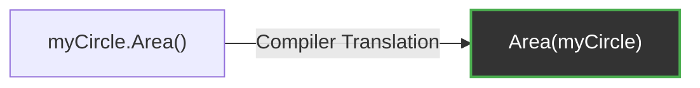

# Methods

Go does not have classes, but it does allow you to define behavior on data using **Methods**. 

A method is simply a function that has a special "receiver" argument attached to it.

## 1. Syntax

The receiver argument sits directly between the `func` keyword and the method name.

```go
type Circle struct {
    Radius float64
}

// 'c' is the receiver of type Circle
func (c Circle) Area() float64 {
    return 3.14159 * c.Radius * c.Radius
}

func main() {
    myCircle := Circle{Radius: 5}
    
    // Calling the method using dot notation
    fmt.Println(myCircle.Area()) // 78.53975
}
```

## 2. Methods are just Syntactic Sugar

Under the hood, the Go compiler literally translates methods into standard functions where the receiver is just the first parameter.


There is zero performance penalty for using methods over standard functions. They simply exist to make code more readable and to enable Interfaces (which we will cover soon).

## 3. Defining Methods on Non-Struct Types

You can attach a method to **any type** you define in your package, not just structs! 

This allows you to add powerful behavior to standard primitives like integers or strings.

```go
// Create a custom type based on int
type Counter int

// Attach a method to the integer!
func (c Counter) Print() {
    fmt.Println("The count is:", c)
}

func main() {
    var myCount Counter = 10
    myCount.Print() // Outputs: The count is: 10
}
```

**Rule:** You can only define a method on a type if the type was defined in the *same package* as the method. You cannot attach a method to the built-in `int` type directly, which is why we had to create the `Counter` alias first.
