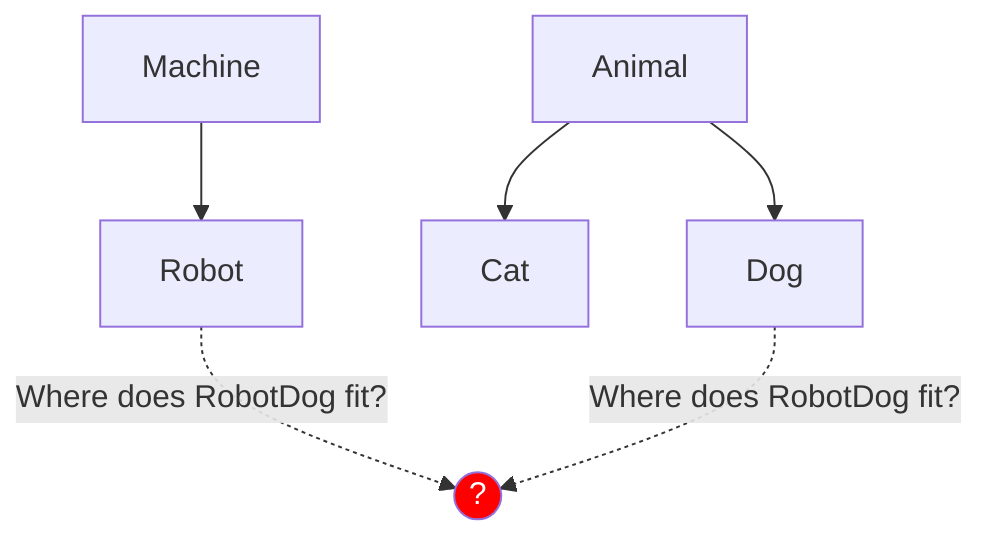

# Composition Over Inheritance

Languages like Java, C++, and Python rely heavily on **Inheritance**. You create a base class (`Animal`), and then inherit from it (`Dog extends Animal`). 

**Go explicitly does not support Inheritance.** 
There is no `extends` keyword, and there is no class hierarchy. 

Instead, Go enforces a design principle advocated by software architects for decades: **Favor Composition over Inheritance.**

## 1. The Problem with Inheritance (Is-A)

Inheritance relies on an "Is-A" relationship (A Dog *is an* Animal). 

This leads to the notorious "Fragile Base Class" problem. If you need a `RobotDog` that barks like a dog but uses a battery, where does it fit? Does it extend `Animal`? Does it extend `Machine`? You end up writing complex, deeply nested class hierarchies that are impossible to refactor later.



## 2. The Power of Composition (Has-A)

Composition relies on a "Has-A" relationship. Instead of building rigid family trees, you build small, independent Lego blocks and snap them together inside a parent struct.

```go
type Engine struct {
    BatteryLevel int
}

func (e *Engine) Recharge() { e.BatteryLevel = 100 }

type Speaker struct {
    Sound string
}

func (s *Speaker) Play() { fmt.Println(s.Sound) }

// RobotDog doesn't inherit anything. It just HAS an engine and a speaker.
type RobotDog struct {
    Power   Engine
    Voice   Speaker
}
```

Now, if we want the `RobotDog` to bark and charge, we simply call the components:

```go
func main() {
    rd := RobotDog{
        Power: Engine{BatteryLevel: 10},
        Voice: Speaker{Sound: "BZZZ-Woof!"},
    }

    rd.Voice.Play()
    rd.Power.Recharge()
}
```

By keeping components isolated, you can reuse `Engine` inside a `RobotVacuum`, or reuse `Speaker` inside an `AlarmClock`, without ever worrying about confusing family hierarchies!
