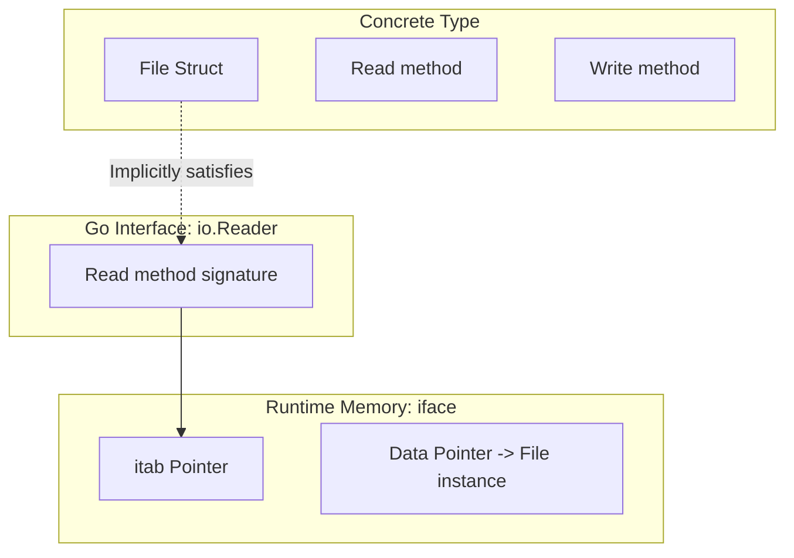

# Interfaces in Go

## 1️⃣ Learning Objectives
* **What you'll learn**: Master the concept of implicit implementation, the internal `runtime.iface` and `runtime.eface` structs, and dynamic dispatch.
* **Why it matters**: Interfaces are the only way to achieve polymorphism in Go. Without them, you cannot write mockable, testable, or decoupled architecture.
* **Where it's used**: Standard library (`io.Reader`, `io.Writer`), Dependency Injection, Mocking, and Clean Architecture boundaries.

---

## 2️⃣ Real-world Story
Imagine a standard wall power outlet (the **Interface**). The outlet doesn't care if you plug in a toaster, a TV, or a laptop (the **Concrete Types**). As long as the plug has exactly two prongs and draws 120V (the **Method Signature**), it works.

In Java or C++, the toaster has to explicitly sign a contract saying `class Toaster implements PowerOutlet` (Explicit implementation). 
In Go, the toaster just happens to have two prongs. The wall outlet looks at the toaster and says, *"You have the right prongs, you can plug in here!"* (Implicit implementation / Duck Typing).

---

## 3️⃣ Visual Learning (Execution Flow & Architecture)


---

## 4️⃣ Internal Working (Under the Hood)
When you assign a concrete value to an interface, the Go compiler allocates a 16-byte struct (on 64-bit systems).
There are two internal interface representations in `src/runtime/runtime2.go`:
1. **eface (Empty Interface `any`)**:
```go
type eface struct {
    _type *_type         // Pointer to the type information (e.g., int, string)
    data  unsafe.Pointer // Pointer to the actual value
}
```
2. **iface (Interface with methods)**:
```go
type iface struct {
    tab  *itab           // Pointer to the interface table (method pointers)
    data unsafe.Pointer  // Pointer to the actual value
}
```
The `itab` holds the mapping of the interface methods to the concrete type's actual memory addresses.

---

## 5️⃣ Compiler Behavior
* **Dynamic Dispatch**: When you call a method on an interface (`r.Read()`), the compiler cannot know exactly which concrete method to jump to at compile time. It must perform a lookup in the `itab` at runtime and then jump. This is slightly slower than a direct method call.
* **Boxing**: If you pass a primitive value (like `int`) to an `interface{}`, the compiler must allocate memory on the heap to store the integer so that the `data` pointer in the `eface` has an address to point to.

---

## 6️⃣ Memory Management
* **Heap Escape via Interfaces**: Passing value types into functions that accept `any` (like `fmt.Println(5)`) will almost always cause the value to escape to the heap. Avoid using `any` on hot paths!

---

## 7️⃣ Code Examples

### 🔹 Example 1: Simple (Implicit Implementation)
```go
type Speaker interface {
    Speak() string
}

type Dog struct{}
// Notice: No "implements" keyword!
func (d Dog) Speak() string { return "Woof!" }

func MakeSound(s Speaker) {
    fmt.Println(s.Speak())
}
// main: MakeSound(Dog{})
```

### 🔹 Example 2: Intermediate (Type Assertions)
```go
var i any = "Hello World"

// Safe assertion
if str, ok := i.(string); ok {
    fmt.Println("It is a string:", str)
}

// Type Switch
switch v := i.(type) {
case int:
    fmt.Println("Integer:", v)
case string:
    fmt.Println("String:", v)
}
```

### 🔹 Example 3: Advanced (Interface Composition)
```go
type Reader interface { Read(p []byte) (n int, err error) }
type Writer interface { Write(p []byte) (n int, err error) }

// Composing interfaces
type ReadWriter interface {
    Reader
    Writer
}
```

### 🔹 Example 4: Production (Dependency Injection)
```go
// Interface defines the behavior
type UserRepository interface {
    GetUser(id int) (*User, error)
}

// Concrete Postgres implementation
type PostgresRepo struct { db *sql.DB }
func (p *PostgresRepo) GetUser(id int) (*User, error) { /* ... */ }

// Service depends on INTERFACE, not Postgres directly!
type UserService struct {
    repo UserRepository
}
```

---

## 8️⃣ Production Examples
1. **The `io.Reader`**: The single most powerful interface in Go. It unifies File I/O, Network Sockets, HTTP Bodies, and Cryptography decoders into a single streamable abstraction.
2. **Mocking in Tests**: Passing a `MockRepo` into a service during unit tests instead of a real database connection.
3. **Context**: `context.Context` is an interface deeply embedded into almost every production Go codebase.

---

## 9️⃣ Performance & Benchmarking
Dynamic dispatch (interface method calls) takes roughly ~2-3 nanoseconds overhead compared to a direct function call. In 99.9% of web applications, this is completely negligible. However, in an inner loop doing matrix multiplication 10 billion times, interface overhead will destroy your performance.

---

## 🔟 Best Practices
* ✅ **Do**: "Accept interfaces, return structs." Functions should be extremely permissive in what they take (`io.Reader`), but highly specific in what they return (`*os.File`).
* ✅ **Do**: Keep interfaces small. `io.Reader` has exactly ONE method. 
* ❌ **Don't**: Create huge "God Interfaces" with 20 methods.
* ❌ **Don't**: Define the interface on the producer side. The consumer should define the interface it needs!

---

## 11️⃣ Common Mistakes
1. **The Nil Interface Bug**: 
An interface is only `nil` if BOTH its type and value are nil.
```go
var p *Dog = nil
var s Speaker = p
fmt.Println(s == nil) // FALSE! s has type *Dog, even though the value is nil.
```
2. **Panicking on Assertions**:
```go
var i any = 5
str := i.(string) // PANIC! Always use `v, ok := ...`
```

---

## 12️⃣ Debugging
* **Compiler Check**: If you want to strictly ensure a struct implements an interface at compile time (preventing surprises later), use this blank identifier trick:
```go
var _ Speaker = (*Dog)(nil) // Fails to compile if Dog doesn't implement Speaker
```

---

## 13️⃣ Exercises
1. **Easy**: Create a `Shape` interface with an `Area()` method. Implement it for `Circle` and `Square`.
2. **Medium**: Write a function that takes an `any` parameter and uses a type switch to handle integers, strings, and booleans differently.
3. **Hard**: Implement a custom `io.Reader` that reads from a string but converts all lowercase letters to uppercase on the fly.
4. **Expert**: Write a program that uses the `unsafe` package to extract and print the memory address of the `itab` from a standard interface variable.

---

## 14️⃣ Quiz
1. **MCQ**: Does Go support interface implementation via the `implements` keyword?
   - A) Yes
   - B) No, it uses implicit duck typing.
*(Answer: B)*

---

## 15️⃣ FAANG Interview Questions
* **Beginner**: Explain what the empty interface `interface{}` is used for.
* **Intermediate**: What is the difference between a pointer receiver and a value receiver when implementing an interface?
* **Senior (Netflix/Amazon)**: Explain exactly why `var ptr *CustomStruct = nil; var i Interface = ptr` results in `i == nil` returning false. How does the 16-byte internal struct memory layout prove this?

---

## 16️⃣ Mini Project
**Custom Logging Framework**
Build a logging library. Define an interface `Logger` with methods `Info(msg string)` and `Error(msg string)`. 
Create three concrete implementations:
1. `ConsoleLogger` (prints to stdout)
2. `FileLogger` (appends to a file)
3. `MultiLogger` (takes a slice of Loggers and writes to ALL of them simultaneously, similar to `io.MultiWriter`).

---

## 17️⃣ Enterprise Features & Observability
* **Tracing**: In OpenTelemetry, `trace.Span` is an interface. This allows testing without accidentally spinning up massive gRPC tracing pipelines.

---

## 18️⃣ Source Code Reading
Read `src/runtime/iface.go`.
* Observe the `convT2E` function (Convert Type to Empty Interface). Notice how it calls `mallocgc` to allocate heap memory when you convert a primitive type into an `any`!

---

## 19️⃣ Architecture
Interfaces are the definitive boundary tool in **Domain-Driven Design (DDD)** and **Clean Architecture**. The outer layers (Postgres/HTTP) implement interfaces defined by the inner core Domain. This reverses the dependency arrow (Dependency Inversion Principle).

---

## 20️⃣ Summary & Cheat Sheet
* **Interfaces specify behavior**, structs implement state.
* **Implicit**: Just write the methods, no keywords needed.
* **Type Assertion**: `val, ok := i.(MyType)`
* **The Nil Interface Trap**: Interface is nil ONLY if Type == nil AND Value == nil.
