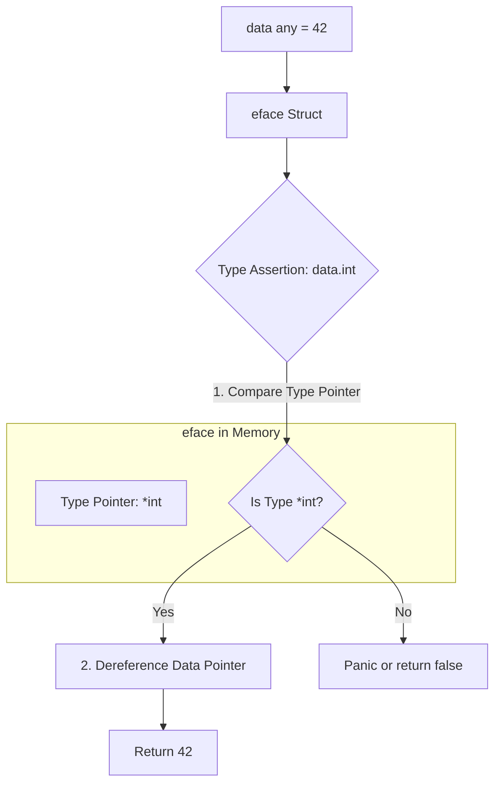

# Type Assertions

When you have a value stored inside an interface (like `any`), the Go compiler hides its original type. To get the concrete data back out so you can use it, you must perform a **Type Assertion**.

## 1. Basic Syntax

A type assertion looks like a method call, but with a type instead of a function name: `interfaceVariable.(TargetType)`.

```go
var data any = "Hello World"

// Assert that 'data' is a string, and extract it
str := data.(string) 

fmt.Println(len(str)) // 11
```

## 2. The Panic Trap

What happens if you guess the type wrong?

```go
var data any = "Hello World"

// 🛑 PANIC: interface conversion: interface {} is string, not int
num := data.(int) 
```

Just like mapping a non-existent key, a failed type assertion instantly crashes your program with a runtime panic.

## 3. The "Comma Ok" Idiom (Safe Assertion)

To safely assert a type without crashing, use the "comma ok" idiom (the exact same pattern used for Maps and Channels).

```go
var data any = "Hello World"

// Attempt to extract an int
num, isInt := data.(int)

if !isInt {
    fmt.Println("It's not an integer!")
} else {
    fmt.Println("Number:", num * 2)
}
```
If the assertion fails, `num` will simply be the zero-value (`0`), `isInt` will be `false`, and the program will continue safely.

## 4. Under the Hood: Unpacking the `eface`

What is the CPU actually doing during a Type Assertion?



The runtime looks at the hidden `eface` struct, checks if the Type Pointer matches the requested type, and if so, copies the data out of the Heap and back to your local variable. This is why heavy use of interfaces and assertions introduces slight runtime CPU overhead compared to strict typing.
