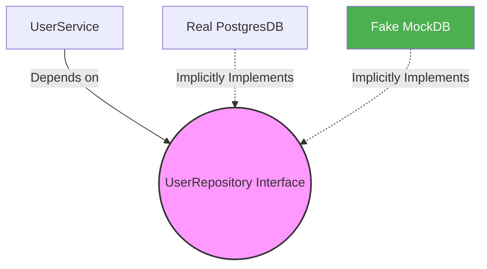

# Practical Interfaces (Dependency Injection)

Why do interfaces actually matter? 

The absolute most critical use-case for interfaces in Go is **Dependency Injection** (DI) and **Unit Testing**. Interfaces allow you to swap out dangerous or slow dependencies (like a real database) with fake dependencies (Mock Objects) during testing.

## 1. The Tight Coupling Problem

Imagine a web server that registers users.

```go
// ❌ TIGHTLY COUPLED
type UserService struct {
    db *PostgresDB // Hardcoded to a real Postgres database!
}

func (s *UserService) Register(name string) {
    s.db.Execute("INSERT INTO users...")
}
```
If we want to write a unit test for `Register()`, our test will actually connect to a real Postgres database, write real data, and slow down our CI/CD pipeline. This is a nightmare.

## 2. The Interface Solution

Instead of hardcoding `PostgresDB`, we define an interface that describes the *behavior* we need.

```go
// 1. Define the behavior
type UserRepository interface {
    InsertUser(name string) error
}

// 2. Inject the interface into the service
type UserService struct {
    repo UserRepository 
}

func (s *UserService) Register(name string) {
    s.repo.InsertUser(name)
}
```

## 3. Swapping Dependencies (Mocking)

Now, the `UserService` has no idea what database it is talking to. It just knows it can call `InsertUser()`.

In production, we pass it the real database.
In testing, we pass it a fake mock database!



```go
// --- TEST CODE ---

// Create a fake database just for the test
type MockDB struct {
    InsertedNames []string
}

func (m *MockDB) InsertUser(name string) error {
    m.InsertedNames = append(m.InsertedNames, name)
    return nil // Never actually touches a network or disk!
}

func TestRegister(t *testing.T) {
    mock := &MockDB{}
    service := UserService{repo: mock} // Inject the mock!
    
    service.Register("Alice")
    
    if mock.InsertedNames[0] != "Alice" {
        t.Fail()
    }
}
```
This pattern allows Go codebases to remain infinitely testable and highly scalable!
