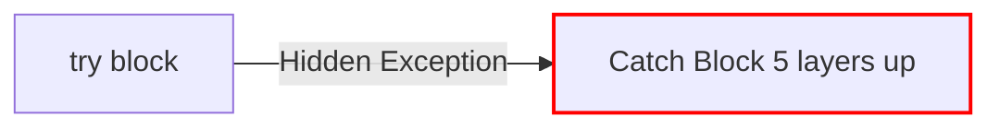

# Errors in Go

If you have written any Go code, you have already encountered the famous `if err != nil` block. 

Unlike languages like Python, Java, or C++, **Go does not have Exceptions or `try/catch` blocks.** Instead, errors are treated as normal, ordinary values that are returned alongside results.

## 1. The `error` Interface

In Go, an error is not a special compiler magic keyword. It is simply a globally built-in interface containing exactly one method:

```go
// This is exactly how 'error' is defined in the Go source code!
type error interface {
    Error() string
}
```
Because it is just an interface, any struct that has an `Error() string` method is legally an error!

## 2. Returning and Checking Errors

Functions that can fail return an `error` as their final return value. If the function succeeds, it returns `nil` for the error.

```go
func divide(a, b float64) (float64, error) {
    if b == 0 {
        // Generate a basic string error using the errors package
        return 0, errors.New("cannot divide by zero")
    }
    return a / b, nil
}

func main() {
    result, err := divide(10, 0)
    
    // Explicitly check for failure
    if err != nil {
        fmt.Println("Math failed:", err)
        return
    }
    
    fmt.Println(result)
}
```

## 3. Why `if err != nil` is a Feature, Not a Bug

Many new Go developers complain about the boilerplate of writing `if err != nil` over and over again.

**Why did the Go team design it this way?**


In a `try/catch` system (like Java), an exception acts like a hidden `goto` statement. It instantly breaks control flow, skips code, and bubbles up the call stack unpredictably. This makes debugging massive codebases terrifying, because you never know which function might silently throw an exception.

By treating errors as values, **Go forces you to acknowledge every single point of failure explicitly.**
Control flow remains perfectly linear. While it requires a few more lines of typing, it drastically reduces production bugs and makes the code extremely easy to read.
