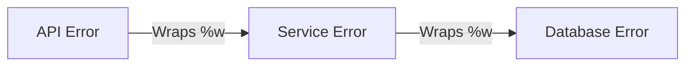

# Wrapping Errors (Go 1.13+)

In complex systems, an error often bubbles up through multiple layers of functions. 

If a database query fails deep in your application, and that error simply bubbles up to the API layer, the API will log `"connection refused"`. But *what* was trying to connect? The API loses all context!

## 1. Wrapping Errors with `%w`

To preserve the original error but add your own context to it, Go allows you to **wrap** errors using `fmt.Errorf` and the special `%w` (wrap) verb.

```go
func fetchUserFromDB() error {
    return errors.New("connection refused")
}

func getUserProfile() error {
    err := fetchUserFromDB()
    if err != nil {
        // Wrap the original error with new context
        return fmt.Errorf("failed to fetch user profile: %w", err)
    }
    return nil
}
```
If you log this wrapped error, it will print: 
`failed to fetch user profile: connection refused`. 

### The Error Tree
By wrapping errors repeatedly as they bubble up the stack, you create a linked list of errors (an Error Tree).



## 2. Checking Wrapped Errors (`errors.Is`)

If you wrap an error, you can no longer use simple equality (`err == ErrNotFound`) to check what the error is, because it is hidden inside the wrapper.

To solve this, Go 1.13 introduced `errors.Is`. It recursively unwraps the error tree and checks if *any* error in the chain matches your target.

```go
var ErrDatabaseDown = errors.New("database down")

func query() error {
    return fmt.Errorf("query failed: %w", ErrDatabaseDown)
}

func main() {
    err := query()
    
    // Unwraps the chain and finds ErrDatabaseDown!
    if errors.Is(err, ErrDatabaseDown) {
        fmt.Println("Triggering database reconnect protocol...")
    }
}
```

## 3. Extracting Wrapped Errors (`errors.As`)

Similar to `errors.Is`, `errors.As` traverses the wrapped chain, but instead of checking for equality, it attempts a **Type Assertion** to extract a custom error struct.

```go
// Assuming HTTPError is a custom error struct (from the previous lesson)
var targetErr *HTTPError

// If an *HTTPError exists anywhere in the chain, it extracts it into targetErr
if errors.As(err, &targetErr) {
    fmt.Println("Found HTTP Status Code:", targetErr.StatusCode)
}
```
