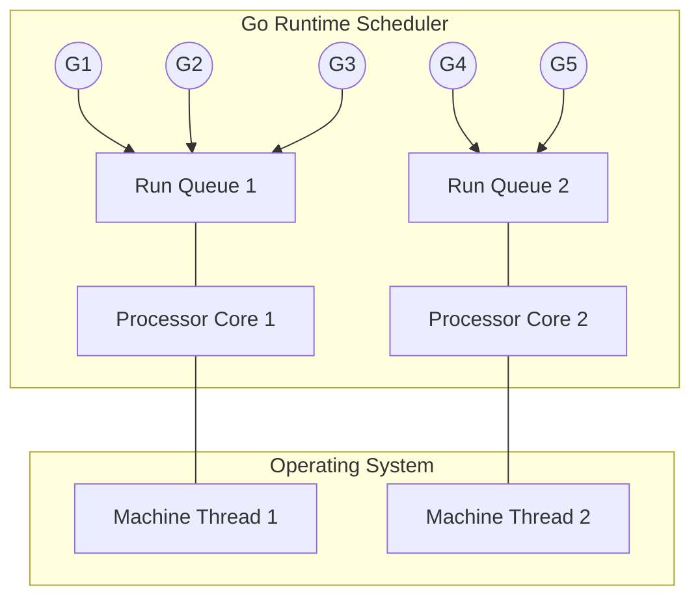

# Introduction to Concurrency

Before diving into Goroutines and Channels, it is absolutely critical to understand what Concurrency actually means. 

As Rob Pike (co-creator of Go) famously said: 
> *"Concurrency is not Parallelism."*

## 1. Concurrency vs. Parallelism

**Concurrency** is about *dealing* with a lot of things at once. It is a way to structure a program into independent pieces that can execute independently.
* *Analogy*: A single barista taking an order, starting the espresso machine, and taking the next customer's order while the espresso brews. One worker, managing multiple tasks efficiently.

**Parallelism** is about *doing* a lot of things at once. It requires multiple physical CPU cores executing instructions at the exact same microsecond.
* *Analogy*: Three baristas making three separate coffees at the exact same time.

Go was designed to make writing **Concurrent** code incredibly easy. If you write concurrent code, and your machine happens to have multiple CPU cores, Go will automatically run your code **in Parallel**.

## 2. Go's Architecture: The GMP Model

Languages like Java or C++ use "OS Threads" for concurrency. 
OS Threads are heavy. They consume 1-2 Megabytes of RAM each, and asking the Operating System to switch between them takes microseconds of CPU time. You can typically only run a few thousand OS threads before your server crashes.

Go created its own scheduler using the **GMP Model**:

* **M (Machine)**: A heavy, physical OS Thread managed by the Operating System.
* **P (Processor)**: A logical processor representing a CPU Core.
* **G (Goroutine)**: An ultra-lightweight Go function.

**How it works:**
The Go Runtime spins up a handful of physical OS Threads (M). It then multiplexes hundreds of thousands of lightweight Goroutines (G) onto those few threads. 
If Goroutine 1 blocks (e.g., waiting for a network request), the Go Scheduler instantly swaps it out and places Goroutine 2 onto the OS Thread.

Because the Go Runtime handles the swapping (not the OS), Context Switching is incredibly fast, and because Goroutines only take 2KB of RAM, a standard server can easily run **1,000,000 concurrent Goroutines** without breaking a sweat.
