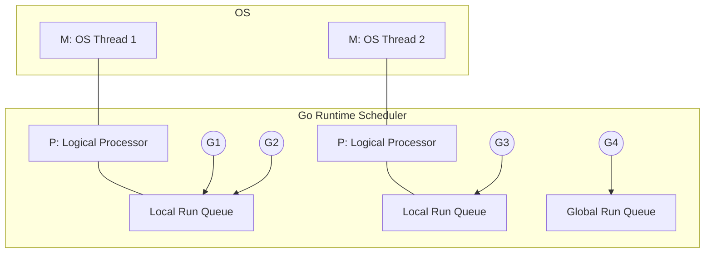

# Goroutines: The Engine of Concurrency

## 1️⃣ Learning Objectives
* **What you'll learn**: Master the GMP (Goroutine, Machine, Processor) scheduler model, how context switching works, and stack memory management.
* **Why it matters**: Goroutines are the lifeblood of Go. Understanding how they map to OS threads prevents thread starvation, high latency, and OOM (Out of Memory) crashes.
* **Where it's used**: Every HTTP request in `net/http` spawns a goroutine. They power background workers, real-time web sockets, and high-throughput data processing.

---

## 2️⃣ Real-world Story
Imagine a traditional restaurant (Java/C++) where a waiter (OS Thread) takes an order, walks to the kitchen, and **stands there waiting** for the food to cook before serving the customer. This wastes massive amounts of the waiter's time.

In Go's restaurant, a waiter (OS Thread) takes an order, drops it in the kitchen (spawns a Goroutine), and immediately goes to serve the next table. When the food is ready, the kitchen rings a bell (Scheduler Wakeup), and the nearest available waiter serves it. A handful of waiters can serve thousands of concurrent customers!

---

## 3️⃣ Visual Learning (Execution Flow & Architecture)


---

## 4️⃣ Internal Working (Under the Hood)
Deep dive into `src/runtime/runtime2.go`. The Go scheduler relies on the **GMP** model:
* **G (Goroutine)**: Represented by the `type g struct`. It contains its own tiny stack (starts at 2KB), instruction pointer, and status (`_Grunning`, `_Gwaiting`, etc.).
* **M (Machine)**: An actual OS Thread (`type m struct`). This executes the Go code.
* **P (Processor)**: A logical resource (`type p struct`). There are `GOMAXPROCS` number of P's. An M must acquire a P to execute Go code. Each P maintains a **Local Run Queue** of 256 G's.

---

## 5️⃣ Compiler Behavior
* **Stack Growth**: Since goroutines start with a tiny 2KB stack, the compiler inserts a preamble check at the start of every function call (`runtime.morestack`). If the stack is too small, it allocates a larger chunk, copies the data, and updates pointers.
* **Preemption**: Go 1.14 introduced asynchronous preemption via OS signals (SIGURG). A tightly looping goroutine without function calls can now be forcefully preempted by the scheduler to prevent starvation!

---

## 6️⃣ Memory Management
* **Stack vs Heap**: While threads in C++ start with 1-8MB of stack memory, Goroutines start with 2KB. This allows you to easily spawn 1,000,000 goroutines using only ~2GB of RAM.
* **Garbage Collection**: The GC must scan the stacks of all active goroutines to find live pointers.

---

## 7️⃣ Code Examples

### 🔹 Example 1: Simple
```go
package main

import (
	"fmt"
	"time"
)

func say(s string) {
	fmt.Println(s)
}

func main() {
	go say("world") // Spawns asynchronously
	say("hello")
	time.Sleep(100 * time.Millisecond) // Dirty hack to wait
}
```

### 🔹 Example 2: Intermediate (WaitGroup)
```go
var wg sync.WaitGroup
for i := 0; i < 5; i++ {
    wg.Add(1)
    go func(id int) {
        defer wg.Done()
        fmt.Printf("Worker %d\n", id)
    }(i) // Pass i by value!
}
wg.Wait()
```

### 🔹 Example 3: Advanced (Worker Pool)
```go
func worker(id int, jobs <-chan int, results chan<- int) {
    for j := range jobs {
        results <- j * 2
    }
}
// Main sets up channels, spawns 3 workers, and pushes 10 jobs.
```

### 🔹 Example 4: Production (Context Cancellation)
```go
func doWork(ctx context.Context) error {
    go func() {
        select {
        case <-time.After(5 * time.Second):
            fmt.Println("Done")
        case <-ctx.Done():
            fmt.Println("Cancelled gracefully")
            return
        }
    }()
    return nil
}
```

---

## 8️⃣ Production Examples
1. **HTTP Servers**: Every incoming request to `http.ListenAndServe` triggers a `go c.serve(ctx)` inside the standard library.
2. **Cron Jobs**: Spawning isolated, non-blocking cleanup tasks inside an API without delaying the HTTP response.
3. **Scatter-Gather Pattern**: Firing 10 API requests concurrently and waiting for the fastest response (or waiting for all).

---

## 9️⃣ Performance & Benchmarking
* **Context Switch Speed**: Switching OS Threads takes ~1-2 microseconds (going into the kernel). Switching Goroutines takes ~200 nanoseconds because it happens purely in userspace!
* **Benchmarking Overhead**:
```bash
go test -bench=BenchmarkGoroutineSpawn
```
*(Spawning a goroutine takes roughly ~100-300ns depending on CPU).*

---

## 🔟 Best Practices
* ✅ **Do**: Always know how and when a goroutine will terminate.
* ✅ **Do**: Use `sync.WaitGroup` or Channels to synchronize execution.
* ❌ **Don't**: Use `time.Sleep()` to wait for a goroutine.
* 🏢 **Google Style**: "Never start a goroutine without knowing how it will stop."

---

## 11️⃣ Common Mistakes
1. **The Loop Variable Closure Trap (Pre-Go 1.22)**:
```go
for i := 0; i < 3; i++ {
    go func() { fmt.Println(i) }() // Might print 3, 3, 3!
}
// Fix: Pass as argument or redefine `i := i`
```
2. **Goroutine Leaks**: A goroutine blocked reading an empty channel forever will never be garbage collected.

---

## 12️⃣ Debugging
* **Trace**: `go tool trace trace.out` provides an incredible visual graph of the GMP scheduler moving goroutines across OS threads.
* **Detecting Leaks**: Use `runtime.NumGoroutine()` in a metrics dashboard (like Grafana). A steady linear increase over time indicates a leak.

---

## 13️⃣ Exercises
1. **Easy**: Write a program that spawns 10 goroutines printing their ID.
2. **Medium**: Fix a program suffering from the loop variable closure bug.
3. **Hard**: Write a concurrent web crawler that stops perfectly when a specific URL is found.
4. **Expert**: Implement an active rate limiter that pauses goroutine execution based on token bucket availability.

---

## 14️⃣ Quiz
1. **MCQ**: What is the default starting stack size of a Goroutine?
   - A) 1MB
   - B) 8MB
   - C) 2KB
2. **Debugging**: Why does `go func(){}()` not guarantee execution before `main()` exits?

---

## 15️⃣ FAANG Interview Questions
* **Beginner**: Differentiate between an OS Thread and a Goroutine.
* **Intermediate**: What happens when a Goroutine makes a blocking Syscall (e.g., reading a file)?
  * *Answer*: The scheduler detaches the M (Thread) from the P, leaving the blocked G on the M. The P gets a brand new M to continue executing the rest of the local queue!
* **Senior (Uber/Meta)**: Explain Work Stealing in the Go Scheduler.

---

## 16️⃣ Mini Project
**Concurrent Port Scanner**
Build a high-speed TCP port scanner. 
Instead of checking ports 1 to 65535 sequentially (which takes hours), spawn a worker pool of 1,000 goroutines reading from a `jobs` channel. You will scan all ports in seconds!

---

## 17️⃣ Enterprise Features & Observability
* **Metrics**: Export `go_goroutines` via Prometheus. Set up an alert if it exceeds 10,000 unexpectedly.
* **Tracing**: Propagate OpenTelemetry contexts across goroutine boundaries to link spans!

---

## 18️⃣ Source Code Reading
Explore `src/runtime/proc.go` (specifically the `schedule()` function).
* Notice how it first checks the Global Run Queue (every 61 ticks), then the Local Run Queue, and finally attempts to "Work Steal" from other P's to ensure CPU cores stay busy!

---

## 19️⃣ Architecture
In Clean Architecture, spawning goroutines should ideally be constrained to the **Service / Usecase Layer** or handled via an interface like a `JobQueue`. The HTTP Handlers should remain synchronous orchestrators.

---

## 20️⃣ Summary & Cheat Sheet
* **GMP**: Goroutine, Machine (Thread), Logical Processor.
* **Stack**: 2KB dynamic growth.
* **Rule**: Don't communicate by sharing memory; share memory by communicating.
