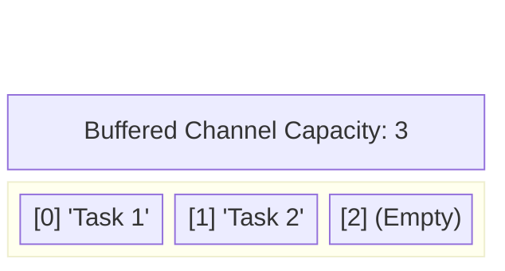

# Buffered Channels (Asynchronous)

If you don't need strict synchronization, and you simply want to dump data into a queue for workers to process later, you use a **Buffered Channel**.

## 1. Syntax and Capacity

You create a buffered channel by providing a capacity as the second argument to `make`.

```go
// Creates a channel that can hold up to 3 strings
ch := make(chan string, 3) 
```

## 2. The Asynchronous Ring Buffer

Unlike an unbuffered channel (which has 0 capacity), a buffered channel allocates a true Array in memory (a Ring Buffer).

* **Sending**: A sender only blocks if the buffer is **full**. If there is room, it drops the data in the array and instantly continues executing!
* **Receiving**: A receiver only blocks if the buffer is **empty**.



## 3. Solving the Single-Goroutine Deadlock

In the previous lesson, trying to send and receive from an unbuffered channel in the same thread caused a fatal deadlock. With a buffered channel, this works perfectly!

```go
func main() {
    ch := make(chan string, 2)
    
    // Doesn't block! The buffer has room.
    ch <- "Hello" 
    ch <- "World"
    
    // If we tried to send a 3rd string here, the main thread would block!
    // ch <- "Overflow" 
    
    fmt.Println(<-ch) // Hello
    fmt.Println(<-ch) // World
}
```

## 4. When to Use Buffered Channels

Buffered channels are heavily used to manage **throughput** and **rate-limiting**. 

If your web server is receiving 10,000 requests a second, but your database can only handle 100 inserts a second, you can put the requests into a heavily buffered channel. The web handlers instantly drop the payload in the buffer and return a `200 OK` to the user, while a small pool of database workers slowly chew through the buffer at their own pace.

*Warning:* Be careful. If you make a buffer capacity too large (e.g., `1,000,000`), you are permanently allocating massive arrays on the Heap, which consumes heavy RAM and degrades performance. Keep buffers as small as practically necessary.
