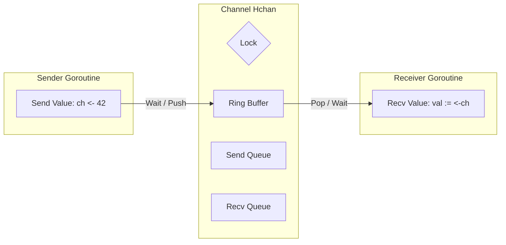

# Channels in Go: Communicating Sequential Processes

## 1️⃣ Learning Objectives
* **What you'll learn**: Master the internal architecture of channels, buffered vs unbuffered semantics, synchronization, and the `runtime.hchan` struct.
* **Why it matters**: Channels are the cornerstone of Go's concurrency model (CSP). They eliminate the need for manual memory locks (Mutexes) in most scenarios.
* **Where it's used**: Streaming data pipelines, Worker Pools, Event buses, and graceful shutdowns.

---

## 2️⃣ Real-world Story
Imagine two factory workers building cars. 
In a traditional threaded language, both workers reach for the exact same tire at the same time and fight over it (Data Race). To fix this, you put a padlock on the tire pile (Mutex).

In Go, one worker builds the car frame, puts it on a conveyor belt (**Channel**), and the other worker picks it off the belt to add tires. The conveyor belt guarantees that only one worker touches the car at any given exact millisecond. 
**"Don't communicate by sharing memory; share memory by communicating."**

---

## 3️⃣ Visual Learning (Execution Flow & Architecture)


---

## 4️⃣ Internal Working (Under the Hood)
A channel in Go is fundamentally a pointer to a struct allocated on the heap (`runtime.hchan`).
```go
type hchan struct {
	qcount   uint           // total data in the queue
	dataqsiz uint           // size of the circular queue
	buf      unsafe.Pointer // points to an array of dataqsiz elements
	elemsize uint16
	closed   uint32
	sendq    waitq          // list of blocked sending goroutines
	recvq    waitq          // list of blocked receiving goroutines
	lock     mutex          // mutex protecting all fields
}
```
**Wait, channels use mutexes under the hood?!**
Yes! A channel is essentially a thread-safe circular buffer protected by a highly optimized Mutex and two linked lists of sleeping goroutines (`sendq` and `recvq`).

---

## 5️⃣ Compiler Behavior
When the compiler sees `ch <- val`, it translates it to a call to `runtime.chansend1()`.
When it sees `<-ch`, it translates to `runtime.chanrecv1()`.
The compiler handles the memory copying—values sent into a channel are **physically copied** into the channel's `buf`, and copied again into the receiver's variable.

---

## 6️⃣ Memory Management
* Channels are allocated on the heap via `make()`. 
* **Zero-copy optimization**: If a receiver is already waiting in the `recvq` when a sender arrives, the sender copies the value **directly** into the receiver's stack frame, bypassing the channel buffer entirely!

---

## 7️⃣ Code Examples

### 🔹 Example 1: Simple (Unbuffered)
```go
func main() {
    ch := make(chan int) // Unbuffered (size 0)
    
    go func() {
        ch <- 42 // Blocks until a receiver is ready
    }()
    
    val := <-ch // Blocks until a sender is ready
    fmt.Println(val)
}
```

### 🔹 Example 2: Intermediate (Buffered & Ranging)
```go
func main() {
    ch := make(chan string, 2)
    ch <- "Hello"
    ch <- "World"
    close(ch) // Important when using range
    
    for msg := range ch {
        fmt.Println(msg)
    }
}
```

### 🔹 Example 3: Advanced (Select Timeout)
```go
func fetch() {
    ch := make(chan string)
    go func() { time.Sleep(2*time.Second); ch <- "Data" }()
    
    select {
    case res := <-ch:
        fmt.Println(res)
    case <-time.After(1 * time.Second): // Prevents hanging forever
        fmt.Println("Timeout!")
    }
}
```

### 🔹 Example 4: Production (Graceful Shutdown Pattern)
```go
func worker(stop <-chan struct{}) {
    for {
        select {
        case <-stop:
            fmt.Println("Shutting down worker gracefully...")
            return
        default:
            // Do normal work
            time.Sleep(100 * time.Millisecond)
        }
    }
}
```

---

## 8️⃣ Production Examples
1. **Worker Pools**: A master goroutine sends jobs into a `chan Job`, and 10 worker goroutines read from it continuously.
2. **Fan-out / Fan-in**: Distributing a massive calculation across multiple channels and aggregating the results back into a single channel.
3. **Signal Handling**: `os/signal.Notify` uses channels to deliver `SIGTERM` interrupts to your Go application.

---

## 9️⃣ Performance & Benchmarking
While channels are incredibly safe, they are technically slower than a raw `sync.Mutex` due to the overhead of the Go scheduler and memory copying.
* Raw Mutex Lock/Unlock: ~15ns
* Channel Send/Recv: ~50ns
**Verdict**: Use Mutexes for internal struct state. Use Channels for passing ownership of data between goroutines.

---

## 🔟 Best Practices
* ✅ **Do**: The sender should be the one to `close()` the channel, not the receiver.
* ✅ **Do**: Use Directional Channels in function signatures (`func read(ch <-chan int)` and `func write(ch chan<- int)`).
* ❌ **Don't**: Use buffered channels to "fix" deadlocks. It only masks the architectural design flaw.

---

## 11️⃣ Common Mistakes
1. **Deadlocks**: 
```go
ch := make(chan int)
ch <- 1 // FATAL ERROR: all goroutines are asleep - deadlock!
```
2. **Panic on Close**: Sending to a closed channel, or closing an already closed channel causes a panic.
3. **Goroutine Leaks**: If you spawn a goroutine that waits on a channel (`<-ch`), but you never send to it, that goroutine stays in memory forever.

---

## 12️⃣ Debugging
* Use the **Race Detector** (`go run -race`) to ensure you aren't modifying channel data concurrently without passing it.
* A panicked stack trace explicitly tells you: `send on closed channel` or `all goroutines are asleep - deadlock!`.

---

## 13️⃣ Exercises
1. **Easy**: Create a channel, send 5 integers to it from a goroutine, and print them in `main`.
2. **Medium**: Implement a Ping-Pong program where two goroutines pass a string back and forth using a channel 10 times.
3. **Hard**: Implement a generic Fan-in function that takes `n` channels and merges their output into a single channel.

---

## 14️⃣ Quiz
1. **MCQ**: What happens when you read from a closed channel?
   - A) Panic
   - B) Blocks forever
   - C) Immediately returns the zero value of the type
*(Answer: C! You check it using `val, ok := <-ch`)*

---

## 15️⃣ FAANG Interview Questions
* **Beginner**: Explain the difference between buffered and unbuffered channels.
* **Intermediate**: How do you prevent a goroutine leak if a channel sender crashes?
* **Senior (Netflix/Amazon)**: Explain exactly what happens in the Go scheduler when a goroutine executes `ch <- data` on a full channel. How does the `hchan` lock, and how is the goroutine parked?

---

## 16️⃣ Mini Project
**Real-Time Data Pipeline (ETL)**
Build a robust ETL pipeline. 
1. The **Extractor** reads a CSV and sends rows to `chan RawData`.
2. 5 **Transformers** read from `chan RawData`, process it, and send to `chan CleanData`.
3. The **Loader** reads from `chan CleanData` and writes to a database. 
Use `sync.WaitGroup` and proper channel closures to ensure the program exits safely only when all rows are processed!

---

## 17️⃣ Enterprise Features & Observability
* **Metrics**: Instrument the length of your buffered channels. If `len(ch) == cap(ch)`, your consumers are too slow, and backpressure is building in your system!

---

## 18️⃣ Source Code Reading
Read `src/runtime/chan.go`.
* Observe the `chansend` function. Notice the `sudog` struct! A `sudog` represents a goroutine waiting in the channel's wait queue.

---

## 19️⃣ Architecture
Channels are the glue in an Event-Driven Architecture. They decouple the Producer (Handler/Cron) from the Consumer (Background Service), ensuring high availability and fault isolation.

---

## 20️⃣ Summary & Cheat Sheet
* **Send**: `ch <- val`
* **Receive**: `val := <-ch`
* **Check Close**: `val, ok := <-ch` (ok is false if closed)
* **Close**: `close(ch)`
* **Unbuffered**: Synchronous. Sender blocks until Receiver is ready.
* **Buffered**: Asynchronous (mostly). Sender blocks only when full.
