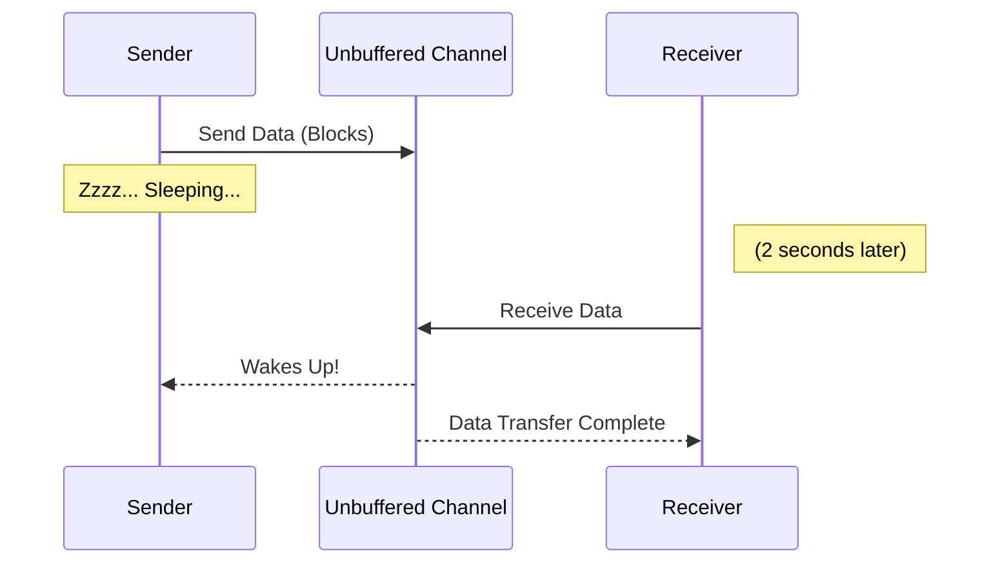

# Unbuffered Channels (Synchronous)

There are two types of channels in Go: **Unbuffered** and **Buffered**. 

By default, when you write `make(chan int)`, you are creating an **Unbuffered Channel**.

## 1. The Rendezvous Point

An unbuffered channel has a capacity of **zero**. It cannot hold any data inside it. 

Because it cannot hold data, a send operation (`ch <- val`) and a receive operation (`<-ch`) must happen at the **exact same microsecond**. 

* If a goroutine tries to send data, it will **block and fall asleep** until another goroutine attempts to read the data.
* If a goroutine tries to read data, it will **block and fall asleep** until another goroutine attempts to send data.



## 2. The Deadlock Trap

Because unbuffered channels are strictly synchronous, you cannot send and receive from the exact same goroutine!

**❌ DANGEROUS CODE (Causes Panic):**
```go
func main() {
    ch := make(chan string)
    
    // The main thread attempts to send. 
    // It blocks, waiting for a receiver. 
    // Because the main thread is blocked, it can never reach line 9!
    ch <- "Hello" 
    
    fmt.Println(<-ch) 
}
```
**Output:** `fatal error: all goroutines are asleep - deadlock!`

## 3. When to Use Unbuffered Channels

Because they are strictly synchronous, unbuffered channels offer **Guaranteed Delivery**.

When the sender wakes up and continues executing the next line of code, it has 100% mathematical certainty that the receiver actually received the data and is processing it. 

This makes unbuffered channels perfect for strict signaling and synchronization between systems where timing is critical.
