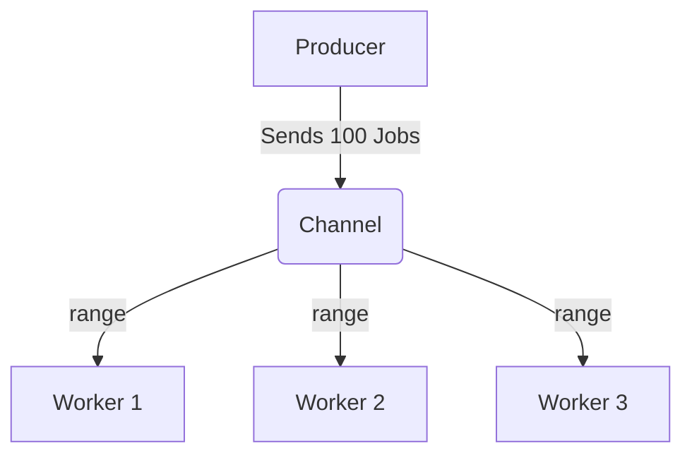

# Range over Channels

We've seen that you can receive data from a channel using `val := <-ch`. But if a worker needs to process thousands of jobs from a channel, writing that manually is impossible.

The most idiomatic way to consume data from a channel is using a `for range` loop.

## 1. Syntax and Mechanics

When you `range` over a channel, the loop automatically:
1. Blocks and waits if the channel is empty.
2. Wakes up and processes the data when a value arrives.
3. Instantly exits the loop the moment the channel is **closed**.

```go
func producer(ch chan int) {
    for i := 1; i <= 3; i++ {
        ch <- i // Send data
    }
    close(ch) // Signal that no more data is coming
}

func main() {
    ch := make(chan int)
    
    go producer(ch)

    // Automatically blocks, receives, and exits when closed
    for val := range ch {
        fmt.Println("Received:", val)
    }
    
    fmt.Println("Channel closed, loop finished.")
}
```

## 2. The Deadlock Trap

What happens if the producer forgets to call `close(ch)`?

The `for range` loop will process the 3 integers, and then it will block, waiting for a 4th integer. Because the producer function has finished executing, a 4th integer will never arrive. 

The Go runtime detects that the main thread is stuck waiting on a channel that no active goroutine holds a reference to, and it crashes the program with a `fatal error: all goroutines are asleep - deadlock!`.

**Rule:** Always ensure the sender explicitly closes the channel if a receiver is using a `range` loop.

## 3. The Producer-Consumer Pattern

`range` is the foundation of the Producer-Consumer pattern. You can spawn one producer and multiple consumers. Because channels are thread-safe, the consumers will naturally load-balance the work!


If Worker 1 is stuck processing a slow job, Workers 2 and 3 will automatically pull the next available jobs from the channel.
