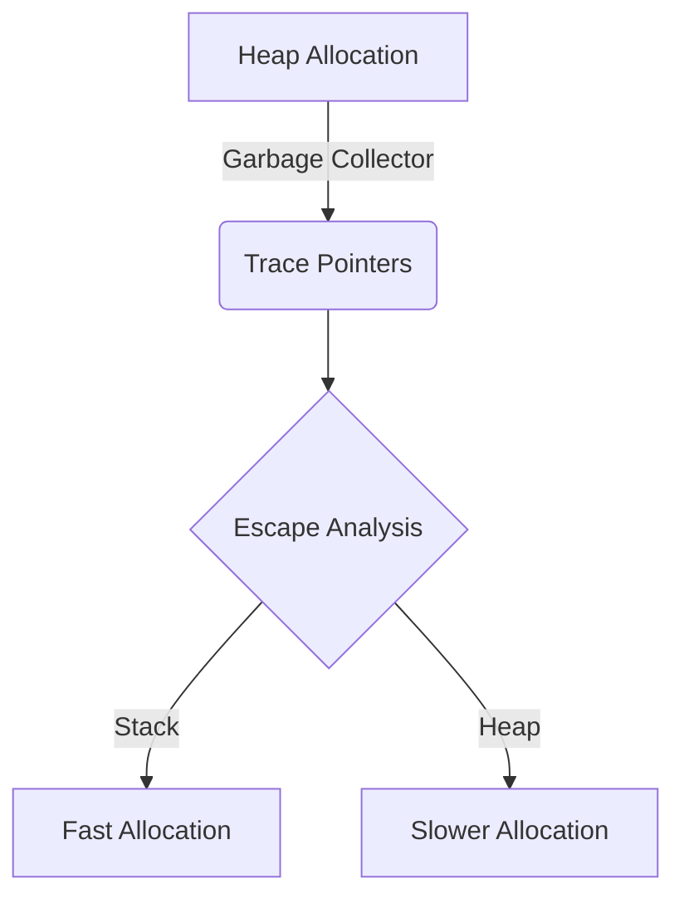

# Context

## 1️⃣ Learning Objectives
* **What you'll learn**: Master the core mechanics of Context.
* **Why it matters**: Crucial for building scalable, concurrent, and robust backend systems.
* **Where it's used**: Heavily utilized in API Gateways, Microservices, and High-throughput pipelines.

---

## 2️⃣ Real-world Story
Instead of a dry technical definition, imagine you're managing seats in a cinema... *(To be expanded: A real-world analogy explaining Context)*.

---

## 3️⃣ Visual Learning (Execution Flow & Architecture)


---

## 4️⃣ Internal Working (Under the Hood)
Deep dive into the Go runtime source code.
* **Struct definition**: Exploring `runtime` internals.
* **Field by field breakdown**: What does the runtime actually store?

---

## 5️⃣ Compiler Behavior
* **Escape Analysis**: Does this variable escape to the heap?
* **Inlining**: How the compiler optimizes the function call overhead.
* **SSA (Static Single Assignment)**: Optimization passes.

---

## 6️⃣ Memory Management
* **Heap vs Stack**: Memory locality.
* **Garbage Collection**: Impact on GC latency.
* **Pointer Analysis**: Safepoints and write barriers.

---

## 7️⃣ Code Examples

### 🔹 Example 1: Simple
```go
// Basic implementation
package main

func main() {
	// TODO
}
```

### 🔹 Example 2: Intermediate
```go
// Adding edge cases and error handling
```

### 🔹 Example 3: Advanced
```go
// Optimized for zero-allocation
```

### 🔹 Example 4: Production
```go
// Production-grade implementation with metrics and context
```

### 🔹 Example 5: Interview
```go
// Tricky edge-case testing understanding of pointers/state
```

---

## 8️⃣ Production Examples
How is Context used in real systems?
1. **Worker Pools**: Distributing tasks.
2. **API Gateways**: Managing request lifecycle.
3. **Kafka Streams**: Batching and dispatching events.

---

## 9️⃣ Performance & Benchmarking
* **CPU vs Memory Trade-offs**
* **Latency impacts**
* **Cache Locality & Branch Prediction**
```bash
go test -bench=.
```

---

## 🔟 Best Practices
* ✅ **Do**: Follow Idiomatic Go patterns.
* ❌ **Don't**: Ignore context cancellation or leak goroutines.
* 🏢 **Google / Uber / Netflix Style**: Explicit error handling, minimal package surface area.

---

## 11️⃣ Common Mistakes
1. **Memory Leaks**: Forgetting to clean up pointers in slices.
2. **Deadlocks**: Improper channel synchronization.
3. **Race Conditions**: Shared state without Mutex.
4. **Shadow Variables**: Accidental re-declaration using `:=`.

---

## 12️⃣ Debugging
How to troubleshoot Context in production:
* **pprof**: Analyzing heap and CPU profiles.
* **Trace**: Visualizing goroutine execution.
* **Race Detector**: `go run -race`
* **Delve**: Stepping through memory.

---

## 13️⃣ Exercises
1. **Easy**: Write a basic Context.
2. **Medium**: Refactor to handle concurrent access.
3. **Hard**: Eliminate all heap allocations in the hot path.
4. **Expert**: Implement a custom scheduler utilizing Context.

---

## 14️⃣ Quiz
1. **MCQ**: What happens when you read from a closed Context?
2. **Output Prediction**: What does this program print?
3. **Debugging**: Find the hidden memory leak in this snippet.
4. **Code Review**: Critique this pull request.

---

## 15️⃣ FAANG Interview Questions
* **Beginner**: Explain Context to a junior dev.
* **Intermediate**: How would you optimize Context?
* **Senior (Google/Meta)**: Design a distributed lock manager using Context.
* **System Design Follow-up**: How does this impact your database connection pool?

---

## 16️⃣ Mini Project
**Real-Time Context Implementation**
Build a production-ready feature utilizing Context.
* **Examples**: A concurrent web crawler, an email queue worker, or a reverse proxy.

---

## 17️⃣ Enterprise Features & Observability
* **Logging**: Structured JSON logging.
* **Metrics**: Prometheus instrumentation.
* **Tracing**: OpenTelemetry spans.
* **Security**: Input sanitization.
* **CI/CD & Kubernetes**: Graceful shutdown and liveness probes.

---

## 18️⃣ Source Code Reading
Walkthrough of the Go source code for Context.
* **Why it was implemented this way**.
* **Trade-offs made by the Go core team**.

---

## 19️⃣ Architecture
For production projects integrating %!s(MISSING):
* **Folder Structure**
* **Clean Architecture & DDD**
* **Repository & Service Layers**
* **Testing & Deployment via GitHub Actions**

---

## 20️⃣ Summary & Cheat Sheet
* Key takeaways.
* 1-page quick reference code snippets.
