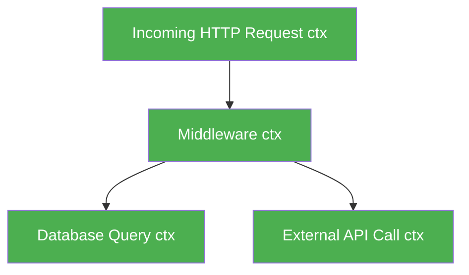

# Context

The `context` package is arguably the most important package in the Go standard library for building production enterprise applications. 

It is the standard mechanism for passing **cancellation signals**, **timeouts**, and **request-scoped data** across API boundaries and between goroutines.

## 1. Why Context? The Ghost Goroutine Problem

Imagine a user makes an HTTP request to your web server. Your server spawns a goroutine. That goroutine makes a slow database query.
Three seconds later, the user gets bored, closes their browser tab, and disconnects.

**What happens to your goroutine?**
Without `context`, your server has no idea the user disconnected. The database query continues running, chewing up RAM, CPU, and database connections for a user who is already gone! 

## 2. Cancellation Trees

Context solves this by creating a tree. If you cancel a parent context, every single child context derived from it is instantly cancelled, signaling all downstream goroutines to stop working.


*If `A` cancels, `B`, `C`, and `D` are instantly notified.*

## 3. `context.WithTimeout`

The most common use of context is enforcing hard deadlines. 

```go
import (
    "context"
    "fmt"
    "time"
)

func slowDatabaseQuery(ctx context.Context) {
    // A select statement multiplexes the context cancellation!
    select {
    case <-time.After(5 * time.Second):
        fmt.Println("Database query completed successfully.")
    case <-ctx.Done(): // This channel triggers when the context is cancelled!
        fmt.Println("Query aborted:", ctx.Err())
    }
}

func main() {
    // 1. Create a parent context
    background := context.Background()

    // 2. Create a child context that automatically cancels after 2 seconds
    ctx, cancel := context.WithTimeout(background, 2*time.Second)
    
    // Always defer the cancel function to prevent context memory leaks
    defer cancel() 

    // 3. Pass the context down the stack
    slowDatabaseQuery(ctx)
}
// Output: Query aborted: context deadline exceeded
```

## 4. `context.WithValue`

Context can also carry request-scoped data. This is heavily used by HTTP middleware to attach a User ID or Trace ID to an incoming request, passing it down to the repository layer.

```go
// Add data
ctx := context.WithValue(context.Background(), "userID", "12345")

// Extract data
userID := ctx.Value("userID").(string)
```
*Rule: Never use `context.WithValue` for optional parameters or business logic variables. Only use it for cross-cutting operational metadata (like traces or auth tokens).*
