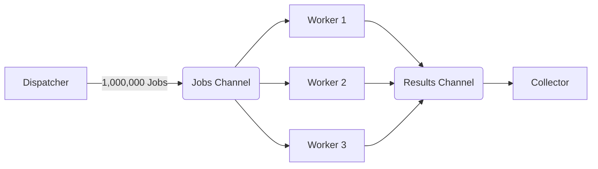

# The Worker Pool Pattern

If Goroutines are so cheap, why not spawn a million of them? 

Imagine you need to process 1,000,000 uploaded images. If you write a `for` loop that spawns `go process(image)`, you will instantly attempt to open 1,000,000 file handles and consume 100% of your CPU. Your operating system will forcefully kill your application for resource exhaustion (OOM kill).

To control concurrency and protect your system, you must use a **Worker Pool**.

## 1. The Architecture

A Worker Pool restricts the number of active goroutines to a fixed amount (e.g., 5 workers). 
1. The **Dispatcher** dumps all 1,000,000 jobs into a Buffered Channel.
2. The **Workers** pull jobs from the channel one by one.
3. Because there are only 5 workers, your system never processes more than 5 images simultaneously.



## 2. Implementing the Pattern

```go
import (
    "fmt"
    "time"
)

// 1. The Worker Function
func worker(id int, jobs <-chan int, results chan<- int) {
    for j := range jobs {
        fmt.Printf("Worker %d processing job %d\n", id, j)
        time.Sleep(time.Second) // Simulate heavy CPU work
        results <- j * 2
    }
}

func main() {
    numJobs := 10
    jobs := make(chan int, numJobs)
    results := make(chan int, numJobs)

    // 2. Spawn exactly 3 workers (The Pool)
    for w := 1; w <= 3; w++ {
        go worker(w, jobs, results)
    }

    // 3. Dispatch all jobs into the channel
    for j := 1; j <= numJobs; j++ {
        jobs <- j
    }
    
    // 4. Close the jobs channel so workers know when to stop
    close(jobs)

    // 5. Collect the results
    for a := 1; a <= numJobs; a++ {
        <-results
    }
    fmt.Println("All jobs processed successfully!")
}
```

### 🧠 Production Considerations
In a real enterprise application, you should also inject a `context.Context` into the worker pool. If the application is shutting down, you can cancel the context, and the workers can instantly abandon the remaining jobs in the channel to allow the server to gracefully shut down.
