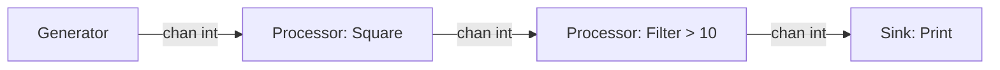

# The Pipeline Pattern

The Pipeline Pattern is an advanced concurrency model where a series of processing stages are connected by channels. 

Each stage is a group of goroutines that:
1. Receives values from inbound channels
2. Performs some function on that data
3. Sends values downstream via outbound channels

## 1. The Pipeline Architecture

A classic pipeline consists of three main stages: a Generator (source), Processors (transformers), and a Sink (consumer).



## 2. Implementing the Pipeline

Each function returns a receive-only channel (`<-chan`), which allows the stages to snap together like Lego bricks.

```go
// STAGE 1: Generator (Converts a slice into a channel stream)
func generate(nums ...int) <-chan int {
    out := make(chan int)
    go func() {
        for _, n := range nums {
            out <- n
        }
        close(out) // Crucial: Closes when done
    }()
    return out
}

// STAGE 2: Processor (Squares the numbers)
func square(in <-chan int) <-chan int {
    out := make(chan int)
    go func() {
        for n := range in {
            out <- n * n
        }
        close(out)
    }()
    return out
}

func main() {
    // Snap the pipeline together!
    // generate() outputs a channel, which is fed directly into square()
    stream := square(generate(2, 3, 4, 5))

    // STAGE 3: Sink (Consume the final results)
    for result := range stream {
        fmt.Println(result) // Outputs: 4, 9, 16, 25
    }
}
```

## 3. Fan-out and Fan-in

To supercharge a pipeline, you can use **Fan-out** and **Fan-in**.

* **Fan-out**: Multiple functions can read from the same channel until that channel is closed; this provides a way to distribute work amongst a group of workers to parallelize CPU use.
* **Fan-in**: A single function can read from multiple inputs and proceed until all are closed by multiplexing the input channels onto a single channel that's closed when all the inputs are closed.

By combining Fan-out, Fan-in, and the Pipeline pattern, you can build massive, highly parallel data-processing engines (like ETL pipelines) that chew through gigabytes of data with incredibly small memory footprints.
