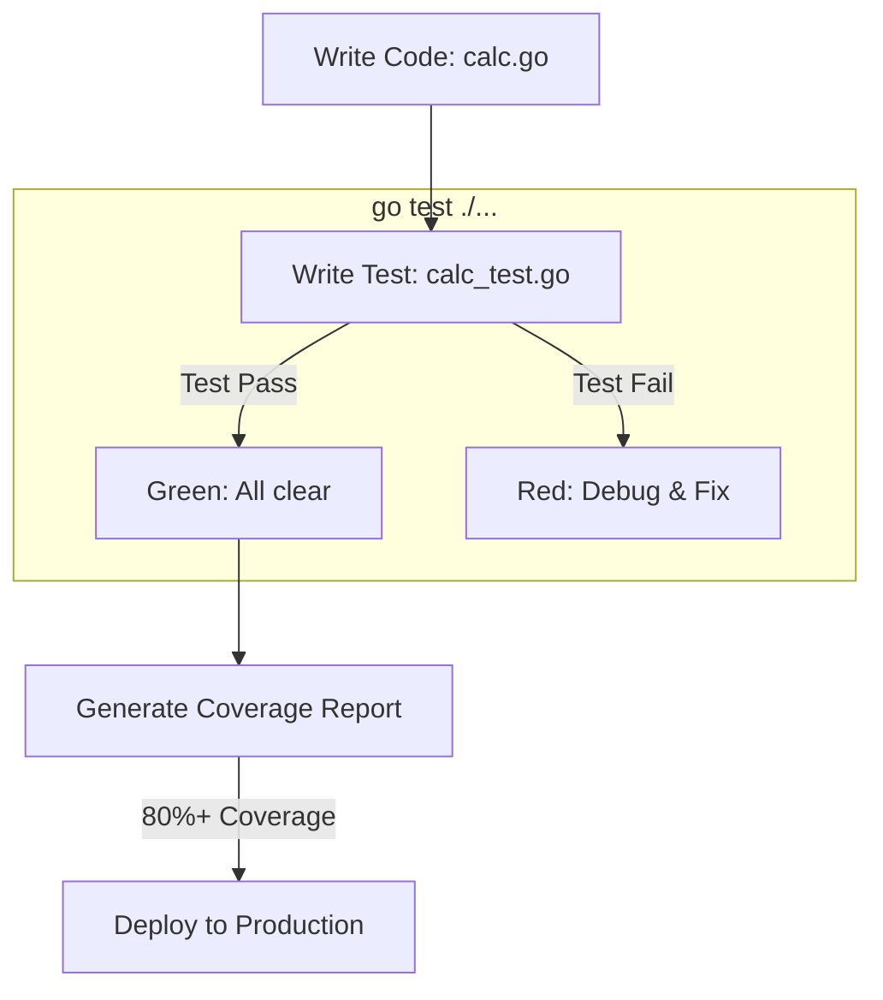

# Unit Testing in Go: Building Bulletproof Code

## 1️⃣ Learning Objectives
* **What you'll learn**: Master the `testing` package, Table-Driven Tests, Mocking interfaces, and Code Coverage.
* **Why it matters**: Untested code is legacy code the moment it is written. Go's built-in testing framework is so powerful that third-party testing libraries (like Jest or JUnit) are almost never required.
* **Where it's used**: CI/CD pipelines (GitHub Actions), Test-Driven Development (TDD), and pre-commit hooks to ensure no broken code enters production.

---

## 2️⃣ Real-world Story
Imagine building a car. You don't just assemble the entire vehicle, turn the key, and hope the engine doesn't explode. 

You test the spark plugs individually. Then you test the engine block. Then you test the brakes on a dyno. 
**Unit Testing** is testing each small component (function) in isolation. If every individual component works perfectly, you can be highly confident the entire car will drive safely.

---

## 3️⃣ Visual Learning (Execution Flow & Architecture)


---

## 4️⃣ Internal Working (Under the Hood)
When you run `go test`, the Go tooling actually generates a brand new, temporary `main` package behind the scenes!
1. It scans your directory for files ending in `_test.go`.
2. It finds all functions starting with `TestXxx(t *testing.T)`.
3. It creates a temporary binary executable, compiles your code into it, runs the tests, prints the results, and deletes the binary.

---

## 5️⃣ Compiler Behavior
* **Dead Code Elimination**: The Go compiler completely ignores files ending in `_test.go` when you run `go build`. Your production binary will never be bloated by your testing code or mock data!
* **Race Detector**: Running `go test -race` instructs the compiler to inject memory-access logging into every single read/write operation. It will instantly crash the test if two goroutines touch the same memory without a Mutex.

---

## 6️⃣ Memory Management
* **t.Parallel()**: If you call `t.Parallel()` inside a test, the Go scheduler pauses it and runs other tests simultaneously on different CPU cores. This drastically reduces the time it takes to run massive test suites, but requires absolute memory isolation (no shared global variables!).

---

## 7️⃣ Code Examples

### 🔹 Example 1: Simple (Basic Test)
```go
// math.go
func Add(a, b int) int { return a + b }

// math_test.go
func TestAdd(t *testing.T) {
    result := Add(2, 3)
    if result != 5 {
        t.Errorf("Expected 5, got %d", result)
    }
}
```

### 🔹 Example 2: Intermediate (Table-Driven Tests)
The standard Go idiom for testing multiple scenarios without writing 50 different test functions.
```go
func TestAddTable(t *testing.T) {
    tests := []struct {
        name     string
        a, b     int
        expected int
    }{
        {"positive numbers", 2, 3, 5},
        {"negative numbers", -2, -3, -5},
        {"mixed numbers", -1, 5, 4},
    }

    for _, tc := range tests {
        t.Run(tc.name, func(t *testing.T) {
            if got := Add(tc.a, tc.b); got != tc.expected {
                t.Errorf("Add(%d, %d) = %d; want %d", tc.a, tc.b, got, tc.expected)
            }
        })
    }
}
```

### 🔹 Example 3: Advanced (Mocking Interfaces)
```go
// 1. The Interface
type Database interface { GetUser(id string) string }

// 2. The Mock Implementation
type MockDB struct{}
func (m MockDB) GetUser(id string) string { return "MockUser" }

// 3. The Test
func TestService(t *testing.T) {
    svc := NewUserService(MockDB{})
    if name := svc.GetUserName("123"); name != "MockUser" {
        t.Errorf("Failed to use mock database")
    }
}
```

### 🔹 Example 4: Production (Testify Asserts & Require)
While standard library is great, production teams often use `github.com/stretchr/testify` for cleaner assertions.
```go
import "github.com/stretchr/testify/assert"

func TestSubtract(t *testing.T) {
    assert.Equal(t, 5, Subtract(10, 5), "They should be equal")
    assert.NotNil(t, someObject)
}
```

---

## 8️⃣ Production Examples
1. **GitHub Actions**: Running `go test ./... -v -race -coverprofile=coverage.out` on every Pull Request.
2. **Integration Tests**: Creating a `TestMain(m *testing.M)` function that spins up a Dockerized PostgreSQL database using `Testcontainers` before running the API tests.
3. **Fuzz Testing**: Automatically throwing millions of random bytes at an encryption algorithm to ensure it never panics.

---

## 9️⃣ Performance & Benchmarking
Go has a built-in benchmarking framework!
```go
func BenchmarkAdd(b *testing.B) {
    for i := 0; i < b.N; i++ {
        Add(2, 3)
    }
}
```
Run it: `go test -bench=.`
Output: `BenchmarkAdd-10    1000000000    0.314 ns/op` (This means the function took 0.3 nanoseconds!)

---

## 🔟 Best Practices
* ✅ **Do**: Use Table-Driven tests for any function with multiple edge cases.
* ✅ **Do**: Place your tests in the exact same package as your code (e.g., `package user`), but name the file `user_test.go`.
* ❌ **Don't**: Use global variables in tests. `t.Parallel()` will cause them to overwrite each other and fail randomly (Flaky Tests).
* 🏢 **Uber Style**: Strive for 80% code coverage. 100% coverage often requires testing useless boilerplate and is an anti-pattern.

---

## 11️⃣ Common Mistakes
1. **Testing internal state**: Don't test *how* a function does its job. Test the *inputs* and the *outputs*.
2. **The Loop Variable Trap in Table Tests**:
```go
for _, tc := range tests {
    tc := tc // MUST DO THIS prior to Go 1.22 if using t.Parallel() inside the loop!
    t.Run(tc.name, func(t *testing.T) {
        t.Parallel()
        // ...
    })
}
```

---

## 12️⃣ Debugging
* **Code Coverage**: 
  ```bash
  go test -coverprofile=c.out
  go tool cover -html=c.out
  ```
  This opens a beautiful website in your browser showing exactly which lines of code are highlighted in Green (Tested) and Red (Untested)!

---

## 13️⃣ Exercises
1. **Easy**: Write a function `Multiply(a, b)` and write a unit test for it.
2. **Medium**: Convert the `Multiply` test into a Table-Driven test with 5 different scenarios (including multiplying by 0).
3. **Hard**: Write an HTTP Handler that returns JSON. Use the `httptest` package to write a test that sends a mock HTTP request to your handler and verifies the JSON response!

---

## 14️⃣ Quiz
1. **MCQ**: What flag do you pass to `go test` to detect concurrent memory mutation?
   - A) `-bench`
   - B) `-race`
   - C) `-cover`
*(Answer: B! The Race Detector is the most powerful tool in Go.)*

---

## 15️⃣ FAANG Interview Questions
* **Beginner**: Why do we name test files with `_test.go`?
* **Intermediate**: Explain the concept of Dependency Injection and how it relates to Mocking interfaces in tests.
* **Senior (Netflix/Amazon)**: You have a flaky test that passes 99% of the time, but fails 1% of the time in the CI pipeline. Walk me through your exact debugging process to identify the root cause (Hint: Goroutine leaks, shared maps, time-dependent logic).

---

## 16️⃣ Mini Project
**Mocking a Third-Party API**
1. Write a service that fetches the current Bitcoin price from an external HTTP API.
2. Define a `PriceFetcher` interface.
3. Write a unit test that injects a `MockFetcher` returning `$50,000`, and assert that your service calculates taxes correctly without actually making a network call to the real API!

---

## 17️⃣ Enterprise Features & Observability
* **Testcontainers**: In enterprise environments, mocking a database isn't always enough. Libraries like `testcontainers-go` spin up a real Postgres Docker container, run your migrations, run your tests, and tear it down automatically.

---

## 18️⃣ Source Code Reading
* Open `src/testing/testing.go`. Look at the `T` struct. Notice that it contains a `RWMutex` to prevent data races when you call `t.Log()` or `t.Fail()` from multiple goroutines!

---

## 19️⃣ Architecture
When designing Clean Architecture, your core **Domain** layer should have 100% test coverage with zero mocks (because it shouldn't have external dependencies). Your **Service** layer tests should heavily mock the **Repository** layer.

---

## 20️⃣ Summary & Cheat Sheet
* **Run Tests**: `go test ./...`
* **Verbose**: `go test -v`
* **Race Detector**: `go test -race`
* **Coverage**: `go test -cover`
* **Benchmarks**: `go test -bench=.`
