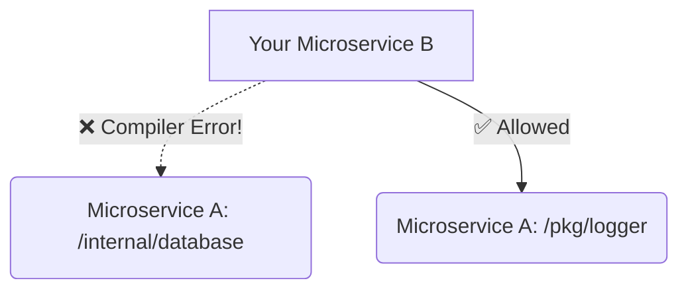

# Project Structure

Unlike Java or Ruby on Rails, Go does not enforce a strict directory structure. You can put your entire application in a single `main.go` file if you want. 

However, as codebases grow to hundreds of thousands of lines, the Go community has converged on a standard architectural layout.

## 1. The Standard Layout

If you open almost any major open-source Go project (like Kubernetes or Docker), you will see this exact directory structure:

```text
my-project/
├── cmd/
│   └── server/
│       └── main.go       # The entry point of the application
├── internal/
│   ├── auth/             # Authentication logic
│   └── database/         # Postgres connections
├── pkg/
│   └── logger/           # Public libraries for other projects to use
├── go.mod                # Dependency tracking
└── README.md
```

## 2. The `cmd/` Directory (Executables)

Your core business logic should **never** live in `main.go`. 

The `cmd` directory contains the entry points for your executables. If your project produces a web server and a background worker, you would have `cmd/server/main.go` and `cmd/worker/main.go`. 

These `main.go` files should be tiny. Their only job is to read configuration, initialize database connections, wire dependencies together, and start the system. 

## 3. The `pkg/` Directory (Public Library)

If you write an amazing `logger` package or a `math_utils` package, and you want to allow *other* external Go projects (like your company's other microservices) to import and use it, you place it in the `pkg/` directory.

Code in `pkg/` is implicitly declaring: *"This is a public API. It is safe for others to import."*

## 4. The `internal/` Directory (Compiler Magic)

This is the most important directory in Go. 

If you put code in `internal/`, **the Go compiler physically prevents any other repository from importing it.**



Why is this magic? 
If you put your sensitive business logic (like user password hashing) or fragile database schemas in `internal/`, you mathematically guarantee that no other team in your company can accidentally import your code and create a tight coupling dependency!

You should default to putting 100% of your business logic inside `internal/`. Only move things to `pkg/` if you explicitly intend to open-source them to other projects.
