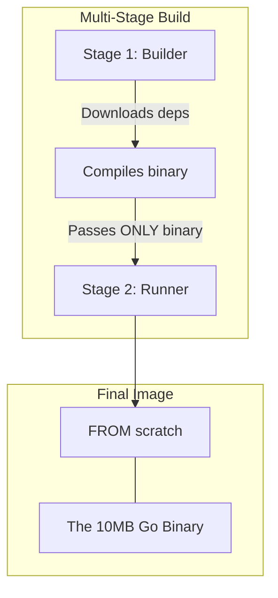

# Docker for Go: Production Containerization

## 1️⃣ Learning Objectives
* **What you'll learn**: Master multi-stage builds, static compilation, Alpine vs Scratch images, and handling Cgroups.
* **Why it matters**: A poorly written Dockerfile will result in a 1GB image with massive security vulnerabilities. A well-written Go Dockerfile results in a hyper-secure, 5MB image that deploys in milliseconds.
* **Where it's used**: Literally everywhere. Docker is the standard deployment mechanism for Kubernetes, Cloud Run, ECS, and modern CI/CD pipelines.

---

## 2️⃣ Real-world Story
In the past, deploying code was like sending a friend a recipe. They had to go to the store, buy the exact ingredients, and hope their oven worked exactly like yours (Dependency Hell).

Docker is like shipping them a fully functioning, indestructible microwave with the food already perfectly cooked inside. They don't need to install Go, download dependencies, or configure the OS. They just plug it in and press "Start".

---

## 3️⃣ Visual Learning (Execution Flow & Architecture)


---

## 4️⃣ Internal Working (Under the Hood)
Docker is not a Virtual Machine! It does not run a Guest OS. It runs directly on the Host Kernel using two Linux features:
* **Namespaces**: Isolates what the container can *see* (Network, Mounts, PIDs).
* **Cgroups (Control Groups)**: Limits what the container can *use* (CPU, Memory).

---

## 5️⃣ Compiler Behavior
To run a Go binary inside a pure empty container (`scratch`), it must be **statically linked**. 
* `CGO_ENABLED=0`: Tells the compiler to completely disable C dependencies (like glibc).
* `GOOS=linux GOARCH=amd64`: Cross-compiles the binary so it runs on Linux, regardless of whether you are building it on a Mac or Windows machine!

---

## 6️⃣ Memory Management
* **The CPU Trap**: By default, the Go runtime looks at the Host Machine's CPU count to set `GOMAXPROCS`. If your host has 64 cores, but Docker limits your container to 1 core, Go will still spawn 64 threads, causing massive context-switching overhead!
* **The OOM Trap**: If you exceed your Docker memory limit, the Linux OOM Killer will instantly terminate your container without warning (`Exit Code 137`).

---

## 7️⃣ Code Examples

### 🔹 Example 1: Simple (Bad Practice)
```dockerfile
# NEVER DO THIS IN PRODUCTION
FROM golang:1.21
WORKDIR /app
COPY . .
RUN go build -o main .
CMD ["./main"]
# This image will be > 800MB and contains your source code!
```

### 🔹 Example 2: Intermediate (Multi-Stage Build)
```dockerfile
# Stage 1: Build
FROM golang:1.21-alpine AS builder
WORKDIR /app
COPY go.mod go.sum ./
RUN go mod download
COPY . .
# Statically compile
RUN CGO_ENABLED=0 GOOS=linux go build -o /server ./cmd/api/main.go

# Stage 2: Final
FROM alpine:latest
WORKDIR /app
COPY --from=builder /server .
CMD ["./server"]
# This image will be ~15MB!
```

### 🔹 Example 3: Advanced (Scratch & Security)
```dockerfile
FROM golang:1.21 AS builder
WORKDIR /app
COPY . .
RUN CGO_ENABLED=0 GOOS=linux go build -o /server .

# FROM scratch is a completely empty image. 0 OS files. 0 Shell.
FROM scratch
# Need CA certificates for HTTPS requests!
COPY --from=builder /etc/ssl/certs/ca-certificates.crt /etc/ssl/certs/
COPY --from=builder /server /server
ENTRYPOINT ["/server"]
```

### 🔹 Example 4: Production (Automaxprocs)
```go
// In your Go code (main.go):
import _ "go.uber.org/automaxprocs"

func main() {
    // automaxprocs automatically reads the Docker Cgroup limits
    // and sets GOMAXPROCS accurately to prevent CPU throttling!
}
```

---

## 8️⃣ Production Examples
1. **CI/CD Pipelines**: GitHub Actions runs `docker build`, tags it with the Git commit hash, and pushes it to AWS ECR.
2. **Kubernetes (K8s)**: K8s pulls the Docker image and spins up 50 replicas across a cluster of nodes.
3. **Local Development**: Using `docker-compose.yml` to spin up a Go API alongside a local Postgres database and Redis cache with one command.

---

## 9️⃣ Performance & Benchmarking
* **Layer Caching**: Docker caches layers. Always copy `go.mod` and run `go mod download` BEFORE copying your source code. If you change a `.go` file, Docker will use the cached dependencies, reducing build time from 3 minutes to 3 seconds!

---

## 🔟 Best Practices
* ✅ **Do**: Use Multi-stage builds.
* ✅ **Do**: Use `.dockerignore` to prevent sending the `.git` folder and `vendor` folder to the Docker daemon.
* ❌ **Don't**: Run your Go app as `root` inside the container. Create a non-root user.
* 🏢 **Google Style**: Use "Distroless" images (from GoogleContainerTools) instead of Alpine. They contain certificates and timezones but zero shell, making them impervious to RCE (Remote Code Execution) attacks.

---

## 11️⃣ Common Mistakes
1. **Missing CA Certificates**: If you use `FROM scratch`, your Go app will instantly crash if it tries to make an HTTPS request (e.g., calling Stripe API), because it lacks the Root CA certs to verify the SSL connection.
2. **Missing Timezones**: `time.LoadLocation("America/New_York")` will panic in `scratch` unless you copy the `tzdata` package into the image!

---

## 12️⃣ Debugging
* **Exit Code 137**: Your container ran out of memory. Increase limits or profile your Go app for leaks.
* **Exit Code 1**: Your Go app `panic()`'d.
* **Exec into a running container**: `docker exec -it <container_id> /bin/sh` (Note: This fails on `scratch` images because they have no shell!).

---

## 13️⃣ Exercises
1. **Easy**: Write a `.dockerignore` file for a standard Go project.
2. **Medium**: Write a `docker-compose.yml` that runs a Go container and a PostgreSQL container, connected via a custom Docker network.
3. **Hard**: Build a Go binary, inject it into a `FROM scratch` image, and prove it works.
4. **Expert**: Write a Go program that prints the value of `runtime.GOMAXPROCS(0)`. Run it in a Docker container with `--cpus="2"`. Did it print 2, or did it print your host's CPU count? Fix it using `automaxprocs`.

---

## 14️⃣ Quiz
1. **MCQ**: What does `CGO_ENABLED=0` do?
   - A) Optimizes the garbage collector.
   - B) Disables the C-bindings, allowing the Go binary to be completely statically linked and portable.
   - C) Enables concurrent goroutines.
*(Answer: B!)*

---

## 15️⃣ FAANG Interview Questions
* **Beginner**: Explain the difference between an Image and a Container.
* **Intermediate**: Why is a multi-stage Dockerfile critical for compiled languages like Go, but less relevant for interpreted languages like Python?
* **Senior (Netflix/Amazon)**: You deploy a Go service to a Kubernetes Pod with a hard limit of 500MB of RAM. After 3 hours, the pod is OOMKilled by the Linux kernel. However, your Go `pprof` heap profile says the app is only using 150MB of memory. Explain the discrepancy between Go runtime memory and Linux Cgroup memory, and how `GOGC` plays a role here.

---

## 16️⃣ Mini Project
**Containerized Web Scraper with Postgres**
1. Write a Go application that scrapes a website every 10 seconds and saves the result.
2. Create a Multi-Stage `Dockerfile` for the Go app.
3. Create a `docker-compose.yml` that spins up the Go app AND a Postgres database.
4. Ensure the Go app waits for Postgres to be ready before starting!

---

## 17️⃣ Enterprise Features & Observability
* **Liveness & Readiness Probes**: Your Go app should expose a `/health` endpoint. Kubernetes will ping this every 10 seconds. If it returns 500, K8s will automatically restart your Docker container.

---

## 18️⃣ Source Code Reading
* Look at the Go standard library `os/user`. If you compile purely statically (`CGO_ENABLED=0`), `user.Current()` actually uses a pure Go implementation to parse `/etc/passwd` instead of relying on the C standard library!

---

## 19️⃣ Architecture
The ultimate goal of Docker is **Immutability**. Your Continuous Integration (CI) pipeline should build the Docker Image EXACTLY ONCE. That exact same image hash is then deployed to Staging, UAT, and Production. You pass different configurations (DB URLs, API Keys) via **Environment Variables**.

---

## 20️⃣ Summary & Cheat Sheet
* **Build**: `docker build -t myapp:latest .`
* **Run**: `docker run -p 8080:8080 myapp:latest`
* **Golden Build Command**: `CGO_ENABLED=0 GOOS=linux go build -o main .`
* **Golden Base Image**: `FROM scratch` or `FROM gcr.io/distroless/static`
