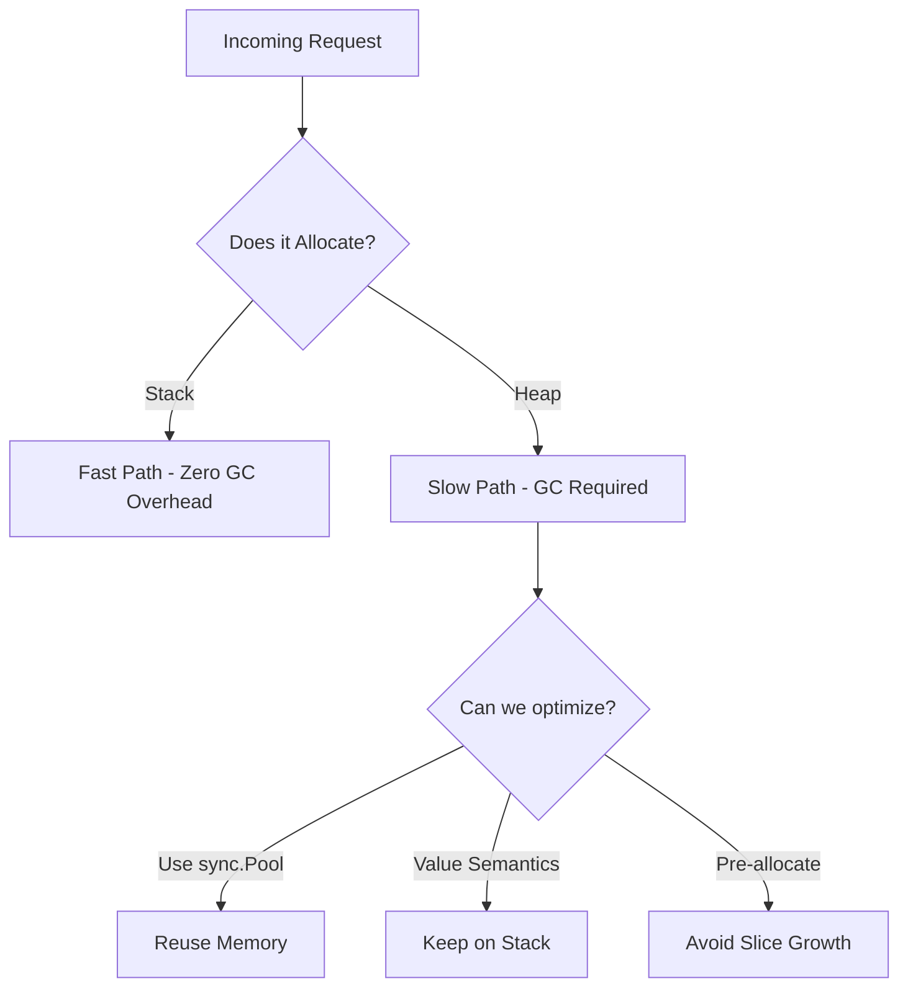

# Performance Optimization in Go

## 1️⃣ Learning Objectives
* **What you'll learn**: Master the art of profiling, benchmarking, and eliminating performance bottlenecks in Go. Understand Escape Analysis, `sync.Pool`, and struct padding.
* **Why it matters**: At Google/Uber scale, saving a few milliseconds of latency or a few kilobytes of allocation per request translates to millions of dollars in saved server costs.
* **Where it's used**: Ultra-low latency trading systems, high-throughput API gateways, and real-time streaming services.

---

## 2️⃣ Real-world Story
Imagine a busy coffee shop. The barista (CPU) is blazing fast. However, every time a customer asks for a cup of coffee, the barista has to run to the warehouse across the street (Heap Allocation) to get a new cup, instead of grabbing a washed cup from the drying rack next to them (Stack / `sync.Pool`).

Performance optimization in Go isn't just about writing "faster algorithms." It's mostly about **managing where memory lives** so the CPU doesn't waste time waiting for the Garbage Collector to clean up the warehouse.

---

## 3️⃣ Visual Learning (Execution Flow & Architecture)


---

## 4️⃣ Internal Working (Under the Hood)
Deep dive into the runtime mechanisms driving performance.
* **Struct Padding**: The Go compiler aligns memory on 8-byte boundaries (on 64-bit). Ordering struct fields from largest to smallest saves memory.
* **TCMalloc**: Go's allocator groups memory into spans. Small allocations (<=32KB) are fast, but millions of them trigger intense Garbage Collection "Stop The World" (STW) pauses.

---

## 5️⃣ Compiler Behavior
* **Escape Analysis**: The compiler command `go build -gcflags="-m"` tells you if a variable "escapes to the heap". If you return a pointer to a local variable, the compiler MUST move it to the heap.
* **Inlining**: The compiler pulls small functions directly into the caller's body to avoid function call overhead. Use `-gcflags="-m -m"` to view inlining decisions.

---

## 6️⃣ Memory Management
* **sync.Pool**: A thread-safe, high-performance object cache. If you generate a lot of temporary `[]byte` buffers, fetching them from a `sync.Pool` reduces heap allocations to exactly zero!
* **Garbage Collection**: The GC runs automatically, typically when the heap size doubles (controlled by `GOGC`, default 100). Lowering allocations directly lowers GC CPU usage.

---

## 7️⃣ Code Examples

### 🔹 Example 1: Struct Padding (Memory Optimization)
```go
// Bad: Takes 24 bytes due to padding!
type BadStruct struct {
    a bool   // 1 byte + 7 bytes padding
    b int64  // 8 bytes
    c bool   // 1 byte + 7 bytes padding
}

// Good: Takes 16 bytes. Always order Largest to Smallest!
type GoodStruct struct {
    b int64  // 8 bytes
    a bool   // 1 byte
    c bool   // 1 byte + 6 bytes padding
}
```

### 🔹 Example 2: String/Byte Conversion (Zero-Copy)
```go
// Normal conversion allocates memory: []byte(str)
// Go 1.20+ Zero-copy unsafe conversion:
import "unsafe"

func StringToBytes(s string) []byte {
    return unsafe.Slice(unsafe.StringData(s), len(s))
}
```

### 🔹 Example 3: Using sync.Pool
```go
var bufPool = sync.Pool{
    New: func() any { return new(bytes.Buffer) },
}

func logFast(msg string) {
    buf := bufPool.Get().(*bytes.Buffer)
    defer bufPool.Put(buf) // Return it!
    
    buf.Reset() // Always reset before use
    buf.WriteString(msg)
    fmt.Println(buf.String())
}
```

### 🔹 Example 4: Production Benchmarking
```go
// file: bench_test.go
func BenchmarkStringConcat(b *testing.B) {
    for i := 0; i < b.N; i++ {
        _ = "a" + "b" + "c" // Slower
    }
}
func BenchmarkBuilder(b *testing.B) {
    for i := 0; i < b.N; i++ {
        var sb strings.Builder // Faster, zero allocations if pre-grown
        sb.WriteString("a")
        sb.WriteString("b")
        sb.WriteString("c")
        _ = sb.String()
    }
}
```

---

## 8️⃣ Production Examples
1. **Fasthttp**: The `valyala/fasthttp` library powers extreme performance APIs by aggressively reusing connections and buffers via `sync.Pool`.
2. **Uber's Zap Logger**: `go.uber.org/zap` achieves blazing speed by completely avoiding `interface{}` allocations and using strongly-typed fields.

---

## 9️⃣ Performance & Benchmarking
* **CPU Profiling**: Identifies where the CPU spends the most time.
* **Heap Profiling**: Identifies who is allocating the most memory.
```bash
# Generate CPU profile
go test -cpuprofile cpu.prof -bench .
# View interactively
go tool pprof cpu.prof
```

---

## 🔟 Best Practices
* ✅ **Do**: Write clean, readable code first. Only optimize when profiling proves there is a bottleneck.
* ✅ **Do**: Pre-allocate slices! `make([]int, 0, capacity)` is the easiest performance win in Go.
* ❌ **Don't**: Overuse `interface{}`. Dynamic dispatch and boxing values into interfaces causes heap allocations.
* 🏢 **Uber Style**: Use `atomic` operations instead of `sync.Mutex` for simple counter increments.

---

## 11️⃣ Common Mistakes
1. **Premature Optimization**: Making code unreadable to save 1 nanosecond on a path that is only executed once a day.
2. **False Sharing**: Placing two heavily modified atomic counters next to each other in a struct. They will end up on the same CPU cache line, causing massive CPU cache invalidation overhead across threads!

---

## 12️⃣ Debugging
* **pprof via HTTP**:
```go
import _ "net/http/pprof"
go func() { log.Println(http.ListenAndServe("localhost:6060", nil)) }()
```
Open `http://localhost:6060/debug/pprof/` in your browser while your production app is running!

---

## 13️⃣ Exercises
1. **Easy**: Write a benchmark comparing string concatenation `+` vs `strings.Builder`.
2. **Medium**: Run `go build -gcflags="-m"` on a simple program and identify which variables escape to the heap.
3. **Hard**: Re-order the fields of a massive struct to save memory, and prove it using `unsafe.Sizeof()`.
4. **Expert**: Write an HTTP middleware that pools `bytes.Buffer` for response generation, completely eliminating GC overhead.

---

## 14️⃣ Quiz
1. **MCQ**: What does the `GOGC` environment variable control?
   - A) The maximum number of goroutines.
   - B) The percentage of heap growth before the next garbage collection triggers.
   - C) The CPU cache size.
*(Answer: B. Setting GOGC=off disables GC entirely!)*

---

## 15️⃣ FAANG Interview Questions
* **Beginner**: Why is a pointer receiver on a method not always faster than a value receiver?
* **Intermediate**: Explain what Escape Analysis is. Give an example of a variable escaping to the heap.
* **Senior (Google/Netflix)**: Your Go microservice is experiencing massive latency spikes every 2 minutes. CPU usage spikes alongside it. Walk me through exactly how you would use `pprof` to diagnose and fix the issue. (Hint: GC Thrashing).

---

## 16️⃣ Mini Project
**Zero-Allocation JSON Parser**
Write a micro-library that extracts a specific field from a JSON byte slice (e.g., `{"user": {"id": 123}}`) WITHOUT unmarshaling the entire JSON payload into a `map[string]any` or a struct. Use raw byte scanning. Benchmark it against `encoding/json`. It should run 100x faster and have 0 allocations.

---

## 17️⃣ Enterprise Features & Observability
* **Continuous Profiling**: In enterprise setups (like Google Cloud Profiler or Datadog), continuous `pprof` data is sent to a dashboard to find performance regressions introduced by new pull requests over time.

---

## 18️⃣ Source Code Reading
Read `src/sync/pool.go`.
* Notice how `sync.Pool` utilizes a thread-local cache (`poolLocal`) tied to the P (Processor) to achieve lock-free gets and puts in the fast path!

---

## 19️⃣ Architecture
Performance should not dictate architecture initially. Keep Domain Driven Design intact. Once a bottleneck is identified in the Service layer, surgically apply `sync.Pool` or zero-allocation techniques without changing the exposed interface.

---

## 20️⃣ Summary & Cheat Sheet
* **Check escapes**: `go build -gcflags="-m"`
* **Benchmark**: `go test -bench=. -benchmem`
* **CPU Profile**: `go tool pprof cpu.prof`
* **Golden Rule**: Pre-allocate slices, avoid `any`/`interface{}`, and keep short-lived objects on the stack.
