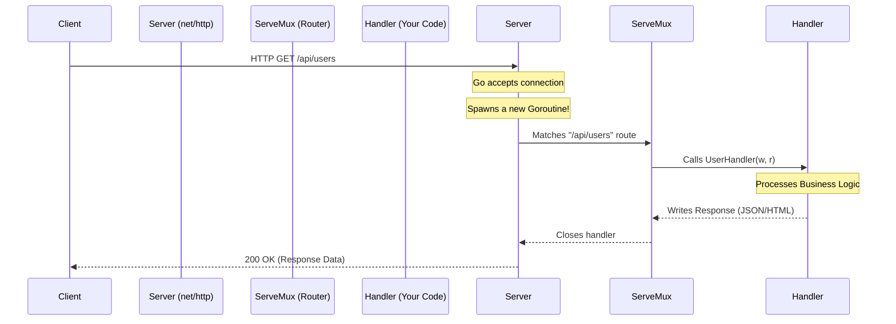
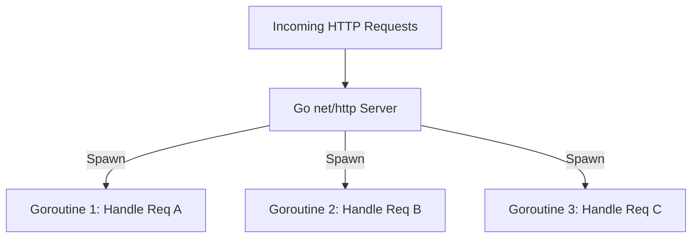

# Go HTTP: Building Robust Web Servers and Clients

Welcome to the definitive guide on working with HTTP in Go! Go was designed in the internet age, and its standard library (`net/http`) is powerful enough to build production-grade web servers without needing third-party frameworks.

## Learning Objectives
By the end of this module, you will be able to:
- Understand the HTTP Request/Response lifecycle in Go.
- Build robust HTTP servers and clients.
- Understand how Go handles concurrent HTTP requests under the hood.
- Implement middleware and custom routers.
- Write production-ready, secure HTTP services.

## Prerequisites
- Basic understanding of Go syntax.
- Familiarity with Go interfaces.
- Basic understanding of Goroutines (Go's concurrency model).

---

## Real-World Analogy: The Restaurant

Think of an HTTP server like a **Restaurant**:
- **The Server (`http.Server`)**: The restaurant itself.
- **The Router (`http.ServeMux`)**: The host who looks at what you want (the path, e.g., `/menu` or `/checkout`) and directs you to the right table or waiter.
- **The Handler (`http.HandlerFunc`)**: The waiter who takes your specific order, processes it, and brings you the food (the Response).
- **The Client (`http.Client`)**: The customer making the request.

---

## Concept Overview

HTTP (Hypertext Transfer Protocol) is a request-response protocol. In Go, the `net/http` package provides HTTP client and server implementations.

- **Request**: A client asks for something (GET, POST, PUT, DELETE).
- **Response**: The server answers with a status code (e.g., 200 OK, 404 Not Found) and a body (the data).

---

## Visual Diagram: HTTP Request Lifecycle



---

## Internal Runtime: How Go is Different

In languages like Python (WSGI/Gunicorn) or Node.js (Event Loop), web servers have specific architectures for handling concurrency. 

**Go's Approach: One Goroutine per Request**
When `http.ListenAndServe` receives an incoming HTTP connection, it accepts it and immediately spawns a new **goroutine** to handle it. 


This means your HTTP handlers run concurrently by default! You can use blocking operations (like database calls) inside a handler without blocking other incoming requests, making Go incredibly fast and simple to write.

---

## Step 1: The Beginner Example

Let's build the simplest possible HTTP server.

```go
package main

import (
	"fmt"
	"net/http"
)

// A simple handler function
func helloHandler(w http.ResponseWriter, r *http.Request) {
	fmt.Fprintf(w, "Hello, World! You requested: %s\n", r.URL.Path)
}

func main() {
	// Register the route
	http.HandleFunc("/", helloHandler)

	fmt.Println("Server starting on port 8080...")
	// Start the server (this is a blocking call)
	err := http.ListenAndServe(":8080", nil)
	if err != nil {
		fmt.Println("Server failed:", err)
	}
}
```

### Explanation:
1. `w http.ResponseWriter`: Where we write our response back to the client.
2. `r *http.Request`: Contains all info about the incoming request (Headers, URL, Body).
3. `http.HandleFunc`: Tells the default router (DefaultServeMux) to send `/` traffic to `helloHandler`.
4. `http.ListenAndServe`: Starts the server on port 8080.

---

## Step 2: The Intermediate Example (Custom Mux & Middleware)

Relying on the global `http.DefaultServeMux` is generally discouraged because any third-party package could register routes to it. Let's create our own multiplexer (router) and add a **Middleware** (code that runs before your handler).

```go
package main

import (
	"fmt"
	"log"
	"net/http"
	"time"
)

// Middleware: Logs the request method, path, and time taken
func loggingMiddleware(next http.Handler) http.Handler {
	return http.HandlerFunc(func(w http.ResponseWriter, r *http.Request) {
		start := time.Now()
		
		// Call the next handler in the chain
		next.ServeHTTP(w, r)
		
		log.Printf("[%s] %s took %v", r.Method, r.URL.Path, time.Since(start))
	})
}

func apiHandler(w http.ResponseWriter, r *http.Request) {
	w.Header().Set("Content-Type", "application/json")
	w.WriteHeader(http.StatusOK)
	w.Write([]byte(`{"status": "success", "message": "API is running"}`))
}

func main() {
	// Create a custom router
	mux := http.NewServeMux()

	// Register routes to our custom router
	mux.HandleFunc("/api", apiHandler)

	// Wrap the router with our middleware
	loggedMux := loggingMiddleware(mux)

	log.Println("Server starting on :8080")
	http.ListenAndServe(":8080", loggedMux)
}
```

---

## Step 3: The Production Use Case (Timeouts & Graceful Shutdown)

In production, you **cannot** use `http.ListenAndServe` directly because it has **infinite timeouts** by default. A slow client (like a malicious attacker sending 1 byte per second) could exhaust your server's resources (Slowloris attack).

Here is a production-ready server skeleton:

```go
package main

import (
	"context"
	"log"
	"net/http"
	"os"
	"os/signal"
	"syscall"
	"time"
)

func main() {
	mux := http.NewServeMux()
	mux.HandleFunc("/", func(w http.ResponseWriter, r *http.Request) {
		w.Write([]byte("Production Server OK"))
	})

	// 1. Configure the Server with Timeouts!
	srv := &http.Server{
		Addr:         ":8080",
		Handler:      mux,
		ReadTimeout:  5 * time.Second,  // Max time to read request from client
		WriteTimeout: 10 * time.Second, // Max time to write response to client
		IdleTimeout:  120 * time.Second, // Max time for keep-alive connections
	}

	// 2. Start server in a goroutine so it doesn't block
	go func() {
		log.Println("Starting production server on :8080")
		if err := srv.ListenAndServe(); err != nil && err != http.ErrServerClosed {
			log.Fatalf("Listen and serve failed: %v", err)
		}
	}()

	// 3. Graceful Shutdown Setup
	quit := make(chan os.Signal, 1)
	signal.Notify(quit, syscall.SIGINT, syscall.SIGTERM) // Listen for Ctrl+C or Docker stop

	<-quit // Block until a signal is received
	log.Println("Shutting down server gracefully...")

	// Create a context with a 10 second timeout for the shutdown
	ctx, cancel := context.WithTimeout(context.Background(), 10*time.Second)
	defer cancel()

	if err := srv.Shutdown(ctx); err != nil {
		log.Fatalf("Server forced to shutdown: %v", err)
	}

	log.Println("Server exited properly")
}
```

---

## The Client Side: Making Requests

Just as production servers need timeouts, **production clients need timeouts too**. The default `http.Get()` has no timeout!

### ❌ Bad Practice (No Timeout)
```go
resp, err := http.Get("https://api.github.com") // Could hang forever!
```

### ✅ Production Best Practice (Custom Client)
```go
package main

import (
	"fmt"
	"io"
	"net/http"
	"time"
)

func main() {
	// 1. Create a client with a timeout
	client := &http.Client{
		Timeout: 5 * time.Second,
	}

	// 2. Make the request
	resp, err := client.Get("https://api.github.com")
	if err != nil {
		panic(err)
	}
	// 3. CRITICAL: Always close the response body!
	defer resp.Body.Close()

	// 4. Read the body
	body, err := io.ReadAll(resp.Body)
	if err != nil {
		panic(err)
	}

	fmt.Printf("Received %d bytes\n", len(body))
}
```

---

## Common Mistakes & Pitfalls

1. **Forgetting to close `resp.Body`**: This is the #1 cause of memory/connection leaks in Go HTTP clients. Always `defer resp.Body.Close()`.
2. **Using the Default HTTP Client**: `http.Get()` uses `http.DefaultClient` which has NO TIMEOUT. Your application will hang if the third-party API is unresponsive.
3. **Using the DefaultServeMux**: `http.HandleFunc` uses the global mux. It's safer to instantiate your own `http.NewServeMux()`.
4. **Not setting Server Timeouts**: `http.ListenAndServe` is vulnerable to slow-client attacks. Always use a custom `http.Server{}`.

---

## Interview Questions & Quizzes

### Q1: How does Go handle multiple simultaneous HTTP requests?
**Answer**: For every incoming connection, the Go `net/http` server spawns a new lightweight goroutine. This allows Go to handle thousands of concurrent requests effortlessly without complex async/await syntax.

### Q2: Why is it important to close the `resp.Body` in an HTTP client?
**Answer**: If you don't close it, the underlying TCP connection remains open, eventually leading to file descriptor exhaustion and a memory leak. 

### Q3: What is the `http.Handler` interface?
**Answer**: It is an interface with a single method: `ServeHTTP(ResponseWriter, *Request)`. Any type that implements this method can act as a web server endpoint.

### Quiz 1: Find the Bug
```go
func fetchData() {
    resp, _ := http.Get("https://example.com")
    body, _ := io.ReadAll(resp.Body)
    fmt.Println(string(body))
}
```
*Hint: Look at the error handling and the cleanup phase.*

---

## Final Exercises & Real-World Implementation

### Exercise 1: Build a JSON API
Create a server with a custom `http.ServeMux` that responds to `GET /users` with a JSON list of users, and `POST /users` that accepts a JSON payload to add a new user. 
*Constraint: Protect the user list with a `sync.Mutex` so it is safe for concurrent access.*

### Exercise 2: Concurrent API Fetcher
Write a script using `http.Client` (with a timeout) that fetches data from 5 different public APIs concurrently using Goroutines and `sync.WaitGroup`, then aggregates and prints the results.

### Capstone: URL Shortener
Implement a production-grade URL shortener:
1. **POST /shorten**: Accepts `{ "url": "https://very-long-url.com" }` and returns `{ "short_id": "abc12" }`.
2. **GET /{short_id}**: Redirects (`http.Redirect`) the user to the original long URL.
3. Use a custom `http.Server` with timeouts.
4. Implement graceful shutdown.
5. Add a middleware that limits requests to 5 per second (Rate Limiting).
