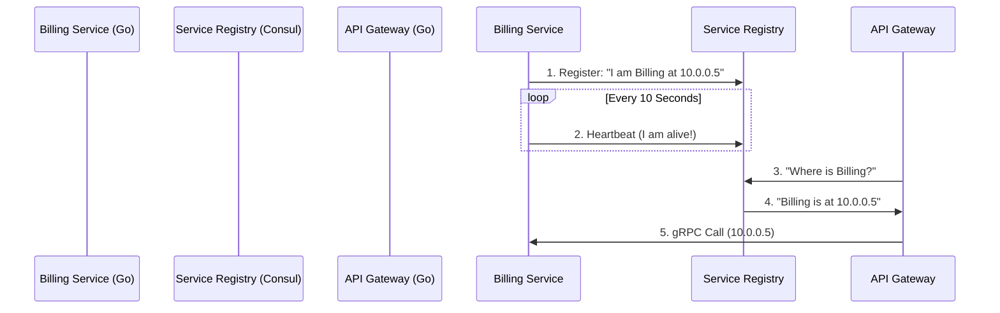

# Service Discovery

## 1. Learning Objectives
* **What you'll learn**: How microservices dynamically find each other over a network without hardcoded IP addresses using tools like Consul, etcd, or Kubernetes DNS.
* **Why it matters**: In a cloud environment, servers crash and boot up constantly. IP addresses change every second. Hardcoding IPs will instantly break your entire system.
* **Where it's used**: Any distributed system with more than a few nodes (Docker Swarm, Kubernetes, HashiCorp Nomad).

---

## 2. Real-world Story
Imagine trying to mail a letter to your friend, Bob. But Bob is a digital nomad; he moves to a new hotel every 12 hours. If you hardcode his address on the envelope, the letter will get lost. 
Instead, you call Bob's Mom (The Service Registry). Bob calls his Mom every time he moves and says, "I'm currently at Hotel X." You ask his Mom, "Where is Bob right now?" and she gives you the exact, real-time address. 
In microservices, the Go API Gateway is You. The Billing Service is Bob. Consul/etcd is Bob's Mom.

---

## 3. Visual Learning (Execution Flow & Architecture)


---

## 4. Internal Working (Under the Hood)
Service Discovery has two core components:
1. **The Registry**: A highly available, distributed Key-Value store (like Consul, etcd, or Zookeeper). It holds a real-time list of all active IP addresses for every service.
2. **Health Checking**: The Registry constantly pings the services (or the services send heartbeats). If a Go service panics or loses power, the Registry instantly removes its IP address from the list, ensuring no traffic is sent to a dead server.

---

## 5. Compiler Behavior
* **Client-Side Load Balancing**: In Go, `google.golang.org/grpc` has built-in support for custom Name Resolvers. You can compile your Go app with a custom Consul resolver. When you dial `grpc.Dial("consul://my-service")`, the Go gRPC client talks to Consul, gets 5 IP addresses, and natively load-balances the TCP traffic across them using Round-Robin, all entirely in Go RAM!

---

## 6. Memory Management
* **DNS Caching**: If your Go app queries the registry for every single HTTP request, you will overwhelm the registry and add 10ms of latency to every call. Go developers heavily utilize background Goroutines to cache the IPs locally and update the cache asynchronously via Long-Polling or Watchers.

---

## 7. Code Examples

### 🔹 Example 1: Simple
```go
// Registering a Go Service with HashiCorp Consul
import "github.com/hashicorp/consul/api"

func RegisterService() {
    config := api.DefaultConfig()
    client, _ := api.NewClient(config)

    registration := &api.AgentServiceRegistration{
        ID:      "billing-node-1",
        Name:    "billing-service",
        Port:    8080,
        Address: "10.0.0.5",
        Check: &api.AgentServiceCheck{ // Health Check!
            HTTP:     "http://10.0.0.5:8080/health",
            Interval: "10s",
        },
    }
    client.Agent().ServiceRegister(registration)
}
```

### 🔹 Example 2: Intermediate
```go
// Discovering a Service
func DiscoverBilling() string {
    config := api.DefaultConfig()
    client, _ := api.NewClient(config)

    // Ask Consul for healthy 'billing-service' nodes
    services, _, _ := client.Health().Service("billing-service", "", true, nil)
    
    if len(services) == 0 {
        return ""
    }
    
    // Pick the first one (or implement Round-Robin)
    address := services[0].Service.Address
    port := services[0].Service.Port
    return fmt.Sprintf("%s:%d", address, port)
}
```

### 🔹 Example 3: Advanced
```go
// Kubernetes Native DNS Service Discovery
// In K8s, you don't need Consul! CoreDNS handles it automatically.
// You just make a standard HTTP request to the service name!
func FetchBillingK8s() {
    // "billing-svc" is physically resolved to a healthy Pod IP by Kubernetes DNS!
    resp, err := http.Get("http://billing-svc.default.svc.cluster.local:8080/invoice")
}
```

### 🔹 Example 4: Production
```go
// Graceful Deregistration
// ALWAYS deregister your service when Go shuts down (SIGTERM), 
// otherwise Consul will route traffic to a dead port for 10 seconds!
defer client.Agent().ServiceDeregister("billing-node-1")
```

### 🔹 Example 5: Interview
```go
// Q: Why not use a standard Hardware Load Balancer (AWS ALB) between every microservice?
// A: Adding a physical Load Balancer adds an extra network hop (latency), costs money, 
// and creates a single point of failure. Client-Side Load Balancing via Service Discovery is faster and cheaper.
```

---

## 8. Production Examples
1. **HashiCorp Consul**: The industry standard for bare-metal and VM service discovery.
2. **etcd**: The key-value store that physically powers Kubernetes. When a Pod boots up, `kubelet` writes its IP into `etcd`.
3. **Netflix Eureka**: The original Java-based service registry that pioneered the concept.

---

## 9. Performance & Benchmarking
* **The Thundering Herd**: If a registry goes offline and comes back, 10,000 Go microservices might simultaneously hit it to re-register. High-quality Go clients use **Jitter** (adding a random 10-500ms delay) to stagger the requests and protect the registry from DDOS.

---

## 10. Best Practices
* ✅ **Do**: Expose a `/health` endpoint on every single Go microservice.
* ❌ **Don't**: Build a massive distributed Service Registry from scratch. Use battle-tested tools like Consul or K8s.
* 🏢 **Google / Uber / Netflix Style**: Use **Service Meshes** (like Istio or Linkerd). The Go code just calls `http://billing`. The Service Mesh sidecar automatically intercepts the call, discovers the IP, and routes it.

---

## 11. Common Mistakes
1. **Ignoring Cache Invalidation**: If the Registry removes an IP, but your Go app caches it for 60 seconds, your app will send 60 seconds of traffic into the void (502 Bad Gateway errors).
2. **Flapping Health Checks**: If your Go service has a memory leak and garbage collects for 2 seconds, the Health Check might timeout. The Registry unregisters it, then registers it 3 seconds later. This is called "Flapping" and it destroys network routing tables.

---

## 12. Debugging
How to troubleshoot Service Discovery in production:
* **Consul UI / `kubectl get endpoints`**: The very first step is checking the Registry UI. If the Go service is running, but the Registry shows it as "Unhealthy" or missing, your Service Discovery is broken, likely due to a failing `/health` check.

---

## 13. Exercises
1. **Easy**: Write a simple Go HTTP server with a `/health` endpoint that always returns `200 OK`.
2. **Medium**: Run a local Consul docker container and register your Go server programmatically on boot.
3. **Hard**: Build a second Go server (Gateway) that queries Consul to find the first server and makes an HTTP request to it.
4. **Expert**: Modify the `/health` endpoint to return `500` if a simulated database connection drops. Watch Consul automatically remove it from the routing pool.

---

## 14. Quiz
1. **MCQ**: What is the primary benefit of Client-Side Service Discovery over Server-Side Load Balancing?
   * (A) Better security (B) Less network hops (latency) (C) It uses less CPU. *(Answer: B)*
2. **System Design Follow-up**: If the Consul cluster completely crashes, should your Go microservices instantly drop all traffic? *(No! They should gracefully degrade by continuing to use their last known locally cached IPs until Consul recovers).*

---

## 15. FAANG Interview Questions
* **Beginner**: Why is hardcoding IP addresses an anti-pattern in the cloud?
* **Intermediate**: Explain the difference between Server-Side (Nginx) and Client-Side (Consul/gRPC) load balancing.
* **Senior (Google/Meta)**: Design a multi-region Service Discovery architecture. How does a Go service in US-East discover a backup service in EU-West if the US-East registry partition fails?

---

## 16. Mini Project
**The Self-Healing Cluster**
* Spin up 3 identical instances of a Go `WorkerService` on different ports.
* Have them all register to Consul.
* Build a Go `GatewayService` that discovers them and round-robins HTTP requests.
* Kill one of the Workers (Ctrl+C). Verify the Gateway seamlessly routes around the dead node within 5 seconds.

---

## 17. Enterprise Features & Observability
* **Service Tags / Metadata**: You can tag registrations with `version: v1.2`. The Gateway can then use this metadata to perform Canary Deployments, routing 10% of traffic to the `v1.2` tags and 90% to `v1.1`.

---

## 18. Source Code Reading
Walkthrough of `github.com/hashicorp/consul/api`.
* **Blocking Queries (Long Polling)**: Look at how the Consul Go client implements `WaitIndex`. Instead of spamming the server every 1 second, it sends a request that the server *holds open* until the IP list actually changes, vastly reducing network CPU overhead!

---

## 19. Architecture
* **The Sidecar Pattern**: Modern architectures extract the Consul registration logic entirely OUT of the Go code. A lightweight "Sidecar" container runs next to the Go app, monitors it, and registers with Consul. This keeps the Go business logic 100% pure and unaware of the infrastructure.

---

## 20. Summary & Cheat Sheet
* **Problem**: Dynamic IP addresses in the cloud.
* **Solution**: A centralized Key-Value registry (Consul, etcd).
* **Health Checks**: Prevents routing to dead nodes.
* **Kubernetes**: Has this built-in via CoreDNS (`svc.cluster.local`).
