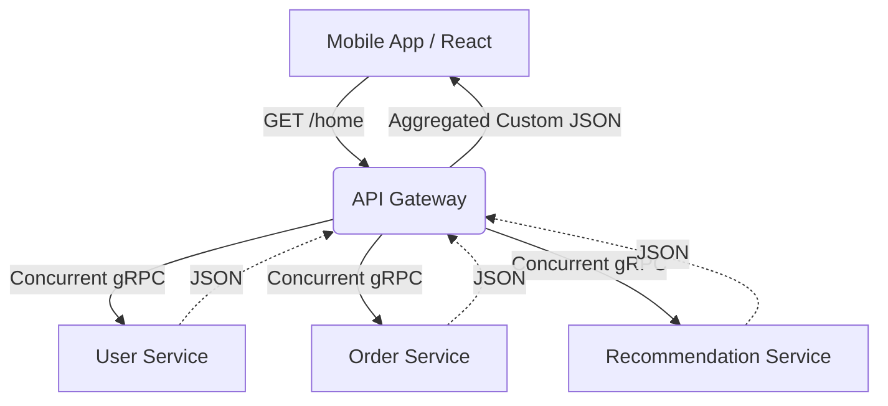

# API Gateway Pattern

## 1. Learning Objectives
* **What you'll learn**: How to build an API Gateway or Backend-For-Frontend (BFF) in Go to aggregate microservices and handle cross-cutting concerns.
* **Why it matters**: If a mobile app has to make 15 separate HTTP requests to 15 different microservices to render the Home Screen, the app will feel incredibly slow and drain the user's battery.
* **Where it's used**: Netflix, Amazon, and every modern Microservice architecture facing public clients.

---

## 2. Real-world Story
Imagine going to a restaurant and wanting a Burger, Fries, and a Shake. 
If there is no waiter, you must go to the Grill Station for the burger, the Fryer Station for the fries, and the Ice Cream Station for the shake. You are doing all the routing yourself.
An **API Gateway** is the Waiter. You hand the waiter one single order. The waiter runs to all three stations concurrently, puts everything on a single tray, and hands you exactly what you asked for.

---

## 3. Visual Learning (Execution Flow & Architecture)


---

## 4. Internal Working (Under the Hood)
An API Gateway acts as a Reverse Proxy with intelligence. 
Instead of just blindly forwarding traffic (like NGINX), a Go API Gateway intercepts the request and performs:
1. **Authentication**: Validates the JWT once, preventing the 10 backend microservices from having to duplicate auth logic.
2. **Aggregation**: Fires 3 requests to backend services, stitches the JSON responses together, and drops unnecessary fields (preventing over-fetching).
3. **Rate Limiting**: Stops malicious users before they reach the fragile internal network.

---

## 5. Compiler Behavior
* **Goroutines & Aggregation**: Go is arguably the absolute best language on earth for building API Gateways. Node.js struggles with CPU-bound JSON stitching. Java requires heavy threading models. Go can effortlessly spawn 5 Goroutines to fetch data concurrently, wait for them via `sync.WaitGroup`, and stitch the JSON in 2 milliseconds.

---

## 6. Memory Management
* **Streaming vs Buffering**: If the API Gateway is downloading a 50MB file from the `VideoService` to send to the Client, it should NEVER load the 50MB into a Go `[]byte` slice (OOM risk). It must use `io.Copy(w, resp.Body)` to stream the bytes directly from the internal TCP socket to the external TCP socket using only a 32KB buffer!

---

## 7. Code Examples

### 🔹 Example 1: Simple
```go
// A basic Reverse Proxy in Go (Standard Library!)
import "net/http/httputil"

func proxyHandler(w http.ResponseWriter, r *http.Request) {
    targetURL, _ := url.Parse("http://internal-billing-service:8080")
    proxy := httputil.NewSingleHostReverseProxy(targetURL)
    
    // Transparently forwards headers, body, and method!
    proxy.ServeHTTP(w, r)
}
```

### 🔹 Example 2: Intermediate
```go
// Aggregating Data using Goroutines
func HomeHandler(w http.ResponseWriter, r *http.Request) {
    var wg sync.WaitGroup
    var user User
    var orders []Order
    
    wg.Add(2)
    
    go func() { defer wg.Done(); user = fetchUser(r.Context()) }()
    go func() { defer wg.Done(); orders = fetchOrders(r.Context()) }()
    
    wg.Wait() // Wait for both concurrent requests to finish!
    
    // Stitch them together for the Frontend
    response := map[string]interface{}{
        "user": user,
        "recent_orders": orders,
    }
    json.NewEncoder(w).Encode(response)
}
```

### 🔹 Example 3: Advanced
```go
// Enforcing Timeouts on Backend Services
// If the internal Order Service hangs, don't freeze the Gateway!
ctx, cancel := context.WithTimeout(r.Context(), 500*time.Millisecond)
defer cancel()

req, _ := http.NewRequestWithContext(ctx, "GET", "http://order-svc/1", nil)
resp, err := http.DefaultClient.Do(req)
if err != nil {
    // Handle timeout gracefully! Fallback to cached data or empty slice.
}
```

### 🔹 Example 4: Production
```go
// Stripping the JWT and passing User ID to internal services
func AuthMiddleware(next http.Handler) http.Handler {
    return http.HandlerFunc(func(w http.ResponseWriter, r *http.Request) {
        userID := VerifyJWTAndGetID(r.Header.Get("Authorization"))
        
        // Internal services don't need to parse JWTs! 
        // We just pass them the trusted X-User-Id header.
        r.Header.Set("X-User-Id", userID)
        next.ServeHTTP(w, r)
    })
}
```

### 🔹 Example 5: Interview
```go
// Q: What happens to the Gateway if one internal service is 10x slower than the rest?
// A: The Gateway's latency becomes equal to the SLOWEST service (Tail Latency). 
// You must implement Circuit Breakers and aggressive Timeouts to prevent the Gateway from running out of Goroutines!
```

---

## 8. Production Examples
1. **Backend For Frontend (BFF)**: Instead of one massive API Gateway, teams build one API Gateway for iOS (returns tiny JSON), one for Web (returns rich JSON), and one for Smart TVs (returns XML).
2. **GraphQL as a Gateway**: Using Apollo Federation or `gqlgen` in Go as the Gateway, allowing the frontend to specify exactly what aggregation it wants dynamically.

---

## 9. Performance & Benchmarking
* **Connection Reuse**: The Gateway makes millions of HTTP requests to internal services. You MUST customize `http.Transport` to increase `MaxIdleConnsPerHost`. If you don't, Go will open and close a new TCP connection for every internal request, adding 10ms of TCP Handshake overhead and exhausting OS ephemeral ports!

---

## 10. Best Practices
* ✅ **Do**: Keep business logic OUT of the API Gateway. It should only do Routing, Auth, and simple JSON stitching.
* ❌ **Don't**: Let the API Gateway connect directly to PostgreSQL. The Gateway must ONLY talk to internal microservices via HTTP/gRPC.
* 🏢 **Google / Uber / Netflix Style**: Use Envoy, Kong, or KrakenD for pure routing and rate-limiting. Build custom Go BFFs only when complex JSON aggregation is strictly required.

---

## 11. Common Mistakes
1. **The Single Point of Failure**: If your Go API Gateway crashes, your entire 50-microservice cluster is instantly offline to the public. You must deploy the Gateway with high redundancy (e.g., 5 Kubernetes Pods behind an AWS ALB).
2. **Missing Correlation IDs**: When a request enters the Gateway, you must generate an `X-Request-ID` (UUID) and pass it to every internal service. Without this, tracing a bug across 5 microservices in your logs is physically impossible.

---

## 12. Debugging
How to troubleshoot API Gateways in production:
* **Distributed Tracing (Jaeger/Zipkin)**: Because the Gateway fans out to multiple services, standard logs are useless. You must use OpenTelemetry spans to visualize a waterfall chart showing exactly how many milliseconds the Gateway waited for each internal service.

---

## 13. Exercises
1. **Easy**: Use `httputil.NewSingleHostReverseProxy` to route traffic from port 8080 to a fake server on port 9090.
2. **Medium**: Write an authentication middleware on the Gateway that rejects requests without an `Authorization` header.
3. **Hard**: Build an Aggregation endpoint that makes two concurrent HTTP requests using Goroutines and `sync.WaitGroup`.
4. **Expert**: Implement an `http.Transport` configuration that caches idle TCP connections to the backend servers to maximize throughput.

---

## 14. Quiz
1. **MCQ**: What is the primary purpose of the Backend-For-Frontend (BFF) pattern?
   * (A) To connect to the database faster (B) To provide a tailored API interface for a specific client (e.g., Mobile vs Web) (C) To store JWTs in memory. *(Answer: B)*
2. **System Design Follow-up**: Why should an API Gateway handle SSL Termination instead of internal microservices? *(Because SSL decryption is incredibly CPU-heavy. Doing it once at the Gateway saves the internal microservices from wasting CPU, and internal network traffic is usually secured via mTLS anyway).*

---

## 15. FAANG Interview Questions
* **Beginner**: Explain the benefits of an API Gateway over direct client-to-microservice communication.
* **Intermediate**: How do you prevent a slow internal microservice from causing a Cascading Failure in the API Gateway?
* **Senior (Google/Meta)**: Design a dynamic API Gateway in Go that can update its routing rules in real-time without restarting the Go binary.

---

## 16. Mini Project
**The Resilient BFF**
* Build a Go Gateway.
* Create two fake internal services: `UserAPI` and `CartAPI`.
* Introduce a 2-second sleep in `CartAPI`.
* Configure the Gateway Aggregation endpoint with a `1-second` context timeout.
* Prove that the Gateway returns the `User` data successfully, along with an empty array for the `Cart`, rather than hanging for 2 seconds.

---

## 17. Enterprise Features & Observability
* **Circuit Breakers**: Use libraries like `sony/gobreaker`. If the internal `BillingService` times out 5 times in a row, the Gateway "opens" the circuit and instantly returns 503 Service Unavailable for the next 30 seconds without even attempting to call Billing. This gives the Billing service time to recover.

---

## 18. Source Code Reading
Walkthrough of `net/http/httputil/reverseproxy.go`.
* **The `Director` function**: Look at how Go implements reverse proxying. It exposes a `Director` hook that allows you to cleanly modify the HTTP Request (like adding Headers or stripping prefixes) right before the proxy fires it over the network.

---

## 19. Architecture
* **Gateway Routing vs Service Mesh**: Don't confuse them. The API Gateway handles North-South traffic (Public Internet -> Internal Network). A Service Mesh (Istio) handles East-West traffic (Internal Service A -> Internal Service B).

---

## 20. Summary & Cheat Sheet
* **Role**: Single entry point for public clients.
* **Responsibilities**: Auth, Rate Limiting, Aggregation, SSL.
* **Concurrency**: Use Goroutines and `sync.WaitGroup` for fanning out requests.
* **Resilience**: Strict Timeouts and Circuit Breakers are mandatory.
